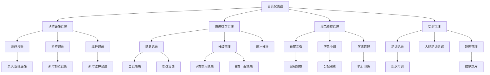

## 1. 产品概述

在线消防安全管理和应急预案编制工具，面向企业安全管理部门，提供消防设施全生命周期管理、隐患排查与整改跟踪、应急预案编制与演练管理、员工消防培训管理等核心功能，实现消防安全管理的数字化、标准化和可追溯化。

- 目标用户：企业安全管理员、消防专员、应急预案编制人员、培训管理员
- 核心价值：将消防安全管理从纸质台账转向数字化平台，提升管理效率、降低火灾风险、确保合规性

## 2. 核心功能

### 2.1 用户角色

| 角色 | 注册方式 | 核心权限 |
|------|----------|----------|
| 系统管理员 | 系统初始化 | 全部模块的增删改查、系统配置 |
| 安全管理员 | 管理员分配 | 消防设施管理、隐患排查、应急预案管理 |
| 培训管理员 | 管理员分配 | 培训记录管理、题库管理、考核管理 |
| 普通员工 | 管理员分配 | 查看个人培训记录、参加考试 |

### 2.2 功能模块

1. **首页仪表盘**：消防安全态势总览、关键指标统计、待办事项提醒、隐患预警
2. **消防设施管理**：设施台账、检查记录、维护更换记录
3. **隐患排查管理**：隐患发现与整改、分级管理、统计分析
4. **应急预案管理**：预案文档管理、应急小组管理、演练管理
5. **培训管理**：培训记录、入职培训追踪、题库管理

### 2.3 页面详情

| 页面名称 | 模块名称 | 功能描述 |
|----------|----------|----------|
| 首页仪表盘 | 态势总览 | 设施总数/正常率/隐患数/整改率等核心指标卡片 |
| 首页仪表盘 | 待办提醒 | 即将到期检查、超期未整改隐患、待参加培训等提醒列表 |
| 首页仪表盘 | 隐患趋势图 | 近6个月隐患发现与整改趋势图表 |
| 首页仪表盘 | 设施状态分布 | 各类设施正常/异常/待检状态饼图 |
| 消防设施管理 - 设施台账 | 台账列表 | 灭火器/消防栓/烟感报警/应急照明/安全出口的位置、数量、状态表格展示，支持筛选和搜索 |
| 消防设施管理 - 设施台账 | 新增设施 | 表单录入设施类型、位置、编号、生产日期、有效期、状态等信息 |
| 消防设施管理 - 设施台账 | 设施详情 | 单个设施的完整信息、历史检查和维护记录时间线 |
| 消防设施管理 - 检查记录 | 检查列表 | 按设施/日期/检查人筛选的检查记录表格 |
| 消防设施管理 - 检查记录 | 新增检查 | 选择设施、填写检查日期/检查人/设施状态/发现问题 |
| 消防设施管理 - 维护记录 | 维护列表 | 灭火器药剂更换/消防水带更换等维护历史记录 |
| 消防设施管理 - 维护记录 | 新增维护 | 填写维护类型/维护日期/维护人/更换部件/费用等 |
| 隐患排查 - 隐患记录 | 隐患列表 | 隐患描述/发现时间/等级/责任人/整改截止/整改状态表格 |
| 隐患排查 - 隐患记录 | 新增隐患 | 填写隐患描述/发现时间/等级(A/B)/整改责任人/整改截止日期 |
| 隐患排查 - 隐患记录 | 整改反馈 | 填写整改结果/整改完成日期/上传整改照片 |
| 隐患排查 - 分级管理 | A类重大隐患 | 筛选展示A类重大隐患列表，突出显示 |
| 隐患排查 - 分级管理 | B类一般隐患 | 筛选展示B类一般隐患列表 |
| 隐患排查 - 统计分析 | 隐患统计 | 按等级/区域/时间维度的隐患统计图表 |
| 隐患排查 - 统计分析 | 整改率分析 | 各类隐患整改完成率、平均整改周期分析 |
| 应急预案 - 预案文档 | 预案列表 | 各类火灾场景应急预案列表，含场景类型/编制日期/版本号 |
| 应急预案 - 预案文档 | 预案详情 | 发现火情/报警/疏散/初期扑救的完整处置流程展示 |
| 应急预案 - 预案文档 | 新增预案 | 选择火灾场景类型、编制处置流程步骤 |
| 应急预案 - 应急小组 | 成员列表 | 应急小组成员名单、职务、职责分工、联系方式 |
| 应急预案 - 应急小组 | 新增成员 | 填写姓名/职务/职责/联系方式/所属小组 |
| 应急预案 - 演练管理 | 演练列表 | 演练计划/执行记录列表，含日期/类型/参与人数/评估结果 |
| 应急预案 - 演练管理 | 新增演练 | 填写演练名称/日期/类型/参与人员/评估总结 |
| 培训管理 - 培训记录 | 培训列表 | 培训时间/培训内容/参训人员/考核结果表格 |
| 培训管理 - 培训记录 | 新增培训 | 填写培训主题/时间/内容/参训人员/考核方式 |
| 培训管理 - 入职培训追踪 | 追踪列表 | 新员工入职消防培训完成情况，含完成率统计 |
| 培训管理 - 题库管理 | 题目列表 | 消防知识测试题库，含题型/难度/分类筛选 |
| 培训管理 - 题库管理 | 新增题目 | 填写题干/选项/正确答案/解析/难度/分类 |

## 3. 核心流程

### 3.1 消防设施管理流程
管理员录入设施台账 → 定期创建检查记录 → 发现问题创建维护记录 → 维护完成更新设施状态

### 3.2 隐患排查整改流程
发现隐患 → 登记隐患(分级) → 分配整改责任人 → 跟踪整改进度 → 整改完成反馈 → 验证关闭

### 3.3 应急预案管理流程
编制预案 → 组建应急小组 → 制定演练计划 → 执行演练 → 评估总结 → 修订预案

### 3.4 培训管理流程
制定培训计划 → 组织培训 → 考核评分 → 入职培训追踪 → 题库维护

## 4. 用户界面设计

### 4.1 设计风格
- **主色调**：深红色(#C41E3A)作为品牌色（呼应消防安全主题），深灰色(#1A1A2E)作为侧边栏背景，白色(#FFFFFF)作为内容区背景
- **辅助色**：橙色(#FF6B35)用于警告/待处理，绿色(#2ECC71)用于正常/已完成，红色(#E74C3C)用于紧急/超期
- **按钮风格**：圆角8px，主按钮深红底白字，次要按钮白底红边，危险操作按钮红色
- **字体**：标题使用 Noto Serif SC（庄重专业感），正文使用 Noto Sans SC
- **布局风格**：左侧固定侧边栏导航 + 右侧内容区，顶部面包屑，卡片式内容展示
- **图标风格**：线性图标搭配填充图标，消防主题定制图标

### 4.2 页面设计概览

| 页面名称 | 模块名称 | UI元素 |
|----------|----------|--------|
| 首页仪表盘 | 态势总览 | 4张指标卡片(深红/橙/绿/蓝渐变背景)，数字动画计数 |
| 首页仪表盘 | 待办提醒 | 带图标的提醒列表，按紧急程度颜色标记 |
| 首页仪表盘 | 隐患趋势图 | 折线图，双线(发现/整改)，鼠标悬浮数据点 |
| 首页仪表盘 | 设施状态分布 | 环形饼图，中心显示总数 |
| 消防设施管理 | 台账列表 | 表格+顶部筛选栏，状态标签彩色标记，支持分页 |
| 消防设施管理 | 新增/编辑弹窗 | 右侧抽屉式弹窗，表单分组，底部操作按钮 |
| 隐患排查 | 隐患列表 | 表格+Tab切换(全部/A类/B类)，超期红色高亮行 |
| 隐患排查 | 统计分析 | 多维度图表组合(柱状图+饼图+趋势线) |
| 应急预案 | 预案详情 | 步骤流程图(垂直时间线)，每个步骤可展开详情 |
| 应急预案 | 演练管理 | 时间线视图+列表视图切换 |
| 培训管理 | 培训记录 | 卡片+列表双视图，考核结果进度条 |
| 培训管理 | 题库管理 | 翻卡式题目预览，难度星级标记 |

### 4.3 响应式设计
- 桌面端优先设计（主要使用场景为办公室电脑）
- 侧边栏在移动端折叠为汉堡菜单
- 表格在窄屏下支持横向滚动
- 图表自适应容器宽度

### 4.4 3D场景
- 不适用
