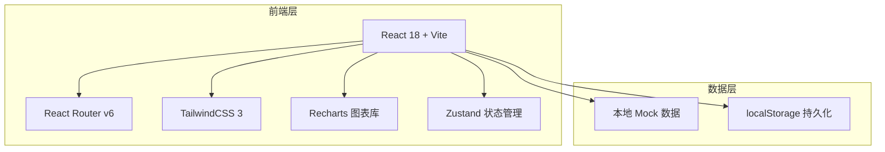
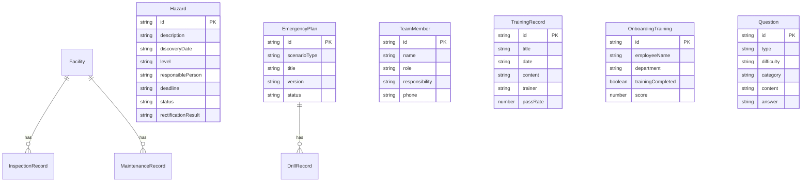

## 1. 架构设计



## 2. 技术说明

- **前端框架**：React@18 + TypeScript
- **样式方案**：TailwindCSS@3 + CSS Modules（自定义主题）
- **构建工具**：Vite
- **路由**：React Router v6
- **图表库**：Recharts
- **状态管理**：Zustand（轻量级状态管理）
- **图标**：Lucide React
- **后端**：无（纯前端，使用 Mock 数据 + localStorage 持久化）
- **数据库**：无（localStorage 模拟数据持久化）

## 3. 路由定义

| 路由 | 用途 |
|------|------|
| `/` | 首页仪表盘 |
| `/facilities` | 消防设施管理 - 设施台账 |
| `/facilities/inspection` | 消防设施管理 - 检查记录 |
| `/facilities/maintenance` | 消防设施管理 - 维护记录 |
| `/hazards` | 隐患排查 - 隐患记录 |
| `/hazards/level-a` | 隐患排查 - A类重大隐患 |
| `/hazards/level-b` | 隐患排查 - B类一般隐患 |
| `/hazards/statistics` | 隐患排查 - 统计分析 |
| `/emergency/plans` | 应急预案 - 预案文档 |
| `/emergency/team` | 应急预案 - 应急小组 |
| `/emergency/drills` | 应急预案 - 演练管理 |
| `/training/records` | 培训管理 - 培训记录 |
| `/training/onboarding` | 培训管理 - 入职培训追踪 |
| `/training/questions` | 培训管理 - 题库管理 |

## 4. API定义

无后端API，使用前端 Mock 数据。所有数据操作通过 Zustand store + localStorage 实现。

### 数据接口定义

```typescript
interface Facility {
  id: string;
  type: 'extinguisher' | 'hydrant' | 'smoke_alarm' | 'emergency_light' | 'exit_sign';
  name: string;
  location: string;
  code: string;
  manufactureDate: string;
  expiryDate: string;
  status: 'normal' | 'abnormal' | 'expired' | 'inspecting';
  lastInspectionDate: string;
}

interface InspectionRecord {
  id: string;
  facilityId: string;
  facilityName: string;
  inspectionDate: string;
  inspector: string;
  status: 'normal' | 'abnormal';
  issues: string;
}

interface MaintenanceRecord {
  id: string;
  facilityId: string;
  facilityName: string;
  type: string;
  maintenanceDate: string;
  maintainer: string;
  parts: string;
  cost: number;
  description: string;
}

interface Hazard {
  id: string;
  description: string;
  discoveryDate: string;
  level: 'A' | 'B';
  responsiblePerson: string;
  deadline: string;
  status: 'pending' | 'in_progress' | 'completed' | 'overdue';
  rectificationResult: string;
  completionDate: string;
  location: string;
}

interface EmergencyPlan {
  id: string;
  scenarioType: string;
  title: string;
  createDate: string;
  version: string;
  steps: PlanStep[];
  status: 'active' | 'draft' | 'archived';
}

interface PlanStep {
  order: number;
  phase: string;
  action: string;
  responsible: string;
  description: string;
}

interface TeamMember {
  id: string;
  name: string;
  role: string;
  responsibility: string;
  phone: string;
  group: string;
}

interface DrillRecord {
  id: string;
  name: string;
  date: string;
  type: string;
  participants: number;
  evaluation: 'excellent' | 'good' | 'average' | 'poor';
  summary: string;
  planId: string;
}

interface TrainingRecord {
  id: string;
  title: string;
  date: string;
  content: string;
  trainer: string;
  participants: string[];
  passRate: number;
  status: 'completed' | 'scheduled';
}

interface OnboardingTraining {
  id: string;
  employeeName: string;
  department: string;
  joinDate: string;
  trainingCompleted: boolean;
  completionDate: string;
  score: number;
}

interface Question {
  id: string;
  type: 'single' | 'multiple' | 'judge';
  difficulty: 'easy' | 'medium' | 'hard';
  category: string;
  content: string;
  options: string[];
  answer: string | string[];
  explanation: string;
}
```

## 5. 服务器架构

无后端服务器，纯前端应用。

## 6. 数据模型

### 6.1 数据模型定义



### 6.2 数据定义语言

使用 TypeScript 接口定义数据结构，Mock 数据通过 JSON 文件初始化，所有数据变更持久化至 localStorage。
