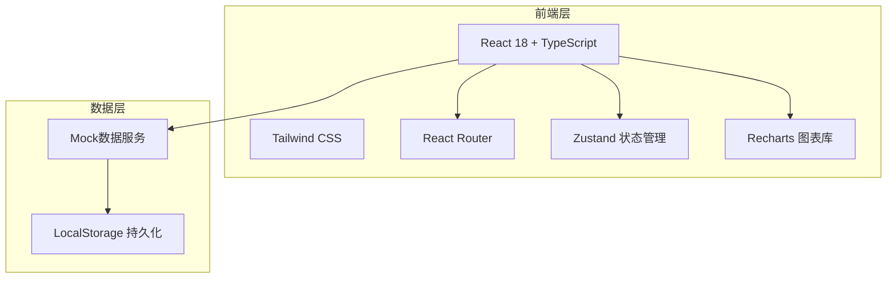
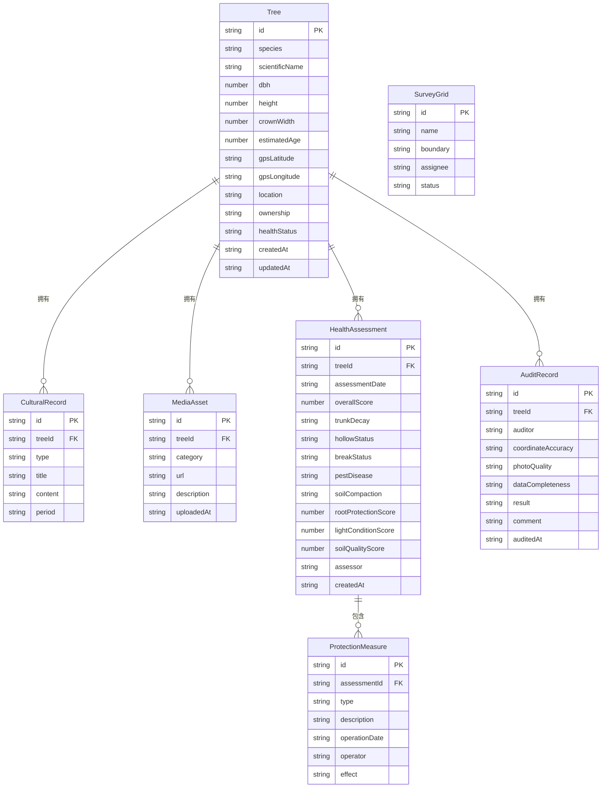

## 1. 架构设计



## 2. 技术说明

- 前端：React@18 + TailwindCSS@3 + Vite
- 初始化工具：vite-init
- 后端：无（纯前端项目，使用Mock数据）
- 数据库：无（使用LocalStorage持久化 + Mock数据）
- 图表：Recharts（数据可视化）
- 地图：简化版SVG地图（无需外部地图API）

## 3. 路由定义

| 路由 | 用途 |
|------|------|
| / | 首页仪表盘，关键数据概览 |
| /archives | 古树档案列表页 |
| /archives/:id | 古树档案详情页 |
| /archives/new | 新增古树档案 |
| /archives/:id/edit | 编辑古树档案 |
| /health | 健康评估列表页 |
| /health/:id | 健康评估详情页 |
| /health/new | 新增健康评估 |
| /survey | 普查网格管理页 |
| /survey/progress | 普查进度追踪页 |
| /survey/review | 数据质量审核页 |
| /analysis | 数据分析总览页 |

## 4. API定义

无后端API，使用前端Mock数据和LocalStorage。

## 5. 服务器架构图

不适用

## 6. 数据模型

### 6.1 数据模型定义



### 6.2 数据定义语言

使用TypeScript类型定义代替SQL DDL：

```typescript
interface Tree {
  id: string;
  species: string;
  scientificName: string;
  dbh: number;
  height: number;
  crownWidth: number;
  estimatedAge: number;
  gpsLatitude: string;
  gpsLongitude: string;
  location: string;
  ownership: string;
  healthStatus: 'excellent' | 'good' | 'fair' | 'poor' | 'critical';
  createdAt: string;
  updatedAt: string;
}

interface CulturalRecord {
  id: string;
  treeId: string;
  type: 'historical' | 'celebrity' | 'legend';
  title: string;
  content: string;
  period: string;
}

interface MediaAsset {
  id: string;
  treeId: string;
  category: 'full' | 'trunk' | 'leaf' | 'fruit' | 'video';
  url: string;
  description: string;
  uploadedAt: string;
}

interface HealthAssessment {
  id: string;
  treeId: string;
  assessmentDate: string;
  overallScore: number;
  trunkDecay: string;
  hollowStatus: string;
  breakStatus: string;
  pestDisease: string;
  soilCompaction: string;
  rootProtectionScore: number;
  lightConditionScore: number;
  soilQualityScore: number;
  assessor: string;
  createdAt: string;
}

interface ProtectionMeasure {
  id: string;
  assessmentId: string;
  type: 'filling' | 'support' | 'fertilization' | 'other';
  description: string;
  operationDate: string;
  operator: string;
  effect: string;
}

interface SurveyGrid {
  id: string;
  name: string;
  boundary: { lat: number; lng: number }[];
  assignee: string;
  status: 'pending' | 'in_progress' | 'completed';
}

interface AuditRecord {
  id: string;
  treeId: string;
  auditor: string;
  coordinateAccuracy: 'accurate' | 'approximate' | 'inaccurate';
  photoQuality: 'clear' | 'acceptable' | 'poor';
  dataCompleteness: 'complete' | 'partial' | 'incomplete';
  result: 'approved' | 'rejected' | 'pending';
  comment: string;
  auditedAt: string;
}
```
