## 1. 产品概述

国际学生留学申请和管理追踪工具是一款面向计划出国留学的学生和留学顾问的全流程管理应用。通过整合申请项目管理、文书管理、材料准备和财务规划四大核心模块，帮助用户系统化地管理从选校到入学的每一个环节，确保不错过任何重要截止日期，提高申请成功率。

- 核心目标：解决留学申请流程中信息分散、进度难以追踪的痛点，提供一站式申请管理解决方案
- 目标用户：准备出国留学的学生、留学咨询顾问、申请辅导老师

---

## 2. 核心功能

### 2.1 用户角色

| 角色 | 注册方式 | 核心权限 |
|------|----------|----------|
| 学生用户 | 邮箱注册/账号密码登录 | 管理个人申请档案、文书、材料和财务计划 |

### 2.2 功能模块

1. **仪表盘首页**：申请总览、关键提醒、进度统计、快捷操作
2. **申请项目管理**：院校档案管理、申请状态全流程追踪、院校要求对比
3. **文书管理**：文书版本管理、写作时间线规划、关键要点提炼
4. **材料准备**：材料清单管理、推荐人管理、提交确认记录
5. **财务规划**：学费生活费预算、奖学金追踪、费用支出记录

### 2.3 页面详情

| 页面名称 | 模块名称 | 功能描述 |
|---------|---------|----------|
| 仪表盘 | 数据概览 | 总申请数统计、各阶段进度环形图、即将到期提醒、最近活动时间线 |
| 仪表盘 | 快捷操作 | 快速添加院校、新增文书、标记材料完成、记录支出 |
| 申请项目 | 院校档案列表 | 卡片式展示所有目标院校，支持筛选和搜索 |
| 申请项目 | 院校详情 | 院校名称/国家/专业/截止日/录取要求/学费/奖学金信息的完整展示 |
| 申请项目 | 状态追踪看板 | 选校/文书准备/材料提交/等待录取/录取结果/签证/入学的阶段管理看板 |
| 申请项目 | 要求对比表 | GPA/语言成绩/推荐信数量等多院校横向对比表格 |
| 文书管理 | 文书列表 | 个人陈述/动机信/研究计划等文书分类展示 |
| 文书管理 | 版本管理 | 针对不同院校的定制版本、版本历史、版本对比 |
| 文书管理 | 时间线规划 | 初稿/修改/导师反馈/终稿各阶段进度条和截止提醒 |
| 文书管理 | 关键要点 | 经历/能力/目标的核心内容提炼和勾选清单 |
| 材料准备 | 材料清单 | 成绩单/语言成绩/推荐信/简历/作品集等材料准备状态追踪 |
| 材料准备 | 推荐人管理 | 推荐人信息、负责学校分配、提醒追踪 |
| 材料准备 | 提交记录 | 各材料提交日期、确认状态、备注记录 |
| 财务规划 | 预算估算 | 各院校学费、生活费年度预算对比 |
| 财务规划 | 奖学金追踪 | 奖学金申请记录、结果状态、金额统计 |
| 财务规划 | 支出记录 | 申请费、签证费等各类费用记录和分类统计 |

---

## 3. 核心流程

用户从注册登录开始，首先在申请项目模块添加目标院校并设定申请阶段，然后在文书模块创建和管理各类申请文书，在材料准备模块追踪各项申请材料和推荐人进度，同时在财务规划模块记录预算和支出，最终通过仪表盘实时监控整体申请进度。

```mermaid
flowchart TD
    A["用户登录"] --> B["添加目标院校"]
    B --> C["设定申请阶段"]
    C --> D["创建申请文书"]
    C --> E["整理申请材料"]
    C --> F["制定财务计划"]
    D --> G["文书版本迭代"]
    G --> H["文书终稿确认"]
    E --> I["材料准备追踪"]
    I --> J["材料提交确认"]
    F --> K["奖学金申请记录"]
    H --> L["材料完整度检查"]
    J --> L
    L --> M["提交申请"]
    M --> N["等待录取结果"]
    N --> O["办理签证"]
    O --> P["准备入学"]
```

---

## 4. 用户界面设计

### 4.1 设计风格

- **主色调**：深蓝 #1e3a8a（专业、可信赖）搭配 琥珀金 #d97706（成就、温暖）
- **辅助色**：青玉绿 #059669（完成、通过）、玫瑰红 #e11d48（紧急、截止）、石灰色 #64748b（中性信息）
- **按钮风格**：圆角中等（8px），主按钮填充，次要按钮描边，悬停微缩放效果
- **字体**：标题使用 "Noto Serif SC"（衬线体，学术感），正文使用 "Noto Sans SC"（易读性）
- **布局风格**：左侧导航栏 + 顶部面包屑 + 主内容卡片式布局
- **图标风格**：Lucide 线性图标，统一24px标准尺寸

### 4.2 页面设计概览

| 页面名称 | 模块名称 | UI 元素 |
|---------|---------|---------|
| 仪表盘 | 数据概览 | 渐变背景统计卡片、环形进度图、横向时间轴、浮动快捷按钮 |
| 申请项目 | 院校列表 | 院校Logo卡片、国家标签、状态徽章、悬停阴影上浮 |
| 申请项目 | 状态追踪 | 横向时间轴看板、拖拽式阶段切换、颜色编码进度条 |
| 申请项目 | 要求对比 | 固定列表格、高亮差异高亮、可折叠详情 |
| 文书管理 | 版本管理 | 版本卡片、差异对比视图、时间线气泡 |
| 文书管理 | 关键要点 | 可勾选要点列表、重要性星级评分 |
| 材料准备 | 材料清单 | 进度追踪条、完成对勾、紧急红色警示 |
| 材料准备 | 推荐人管理 | 头像卡片、发送提醒按钮、状态标签 |
| 财务规划 | 预算对比 | 柱状对比图、分类饼图、总计汇总卡片 |

### 4.3 响应式设计

- 桌面端优先设计（1280px以上）
- 平板端（768-1279px）：导航折叠为图标模式，卡片自适应两列
- 移动端（768px以下）：底部Tab导航，卡片单列布局，表格支持横向滚动

---

