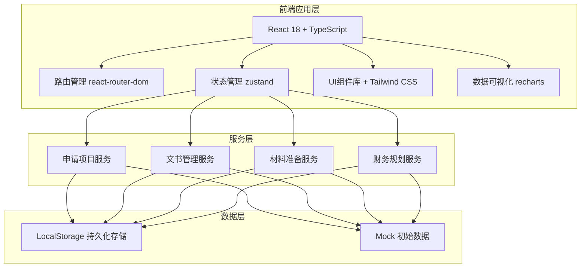
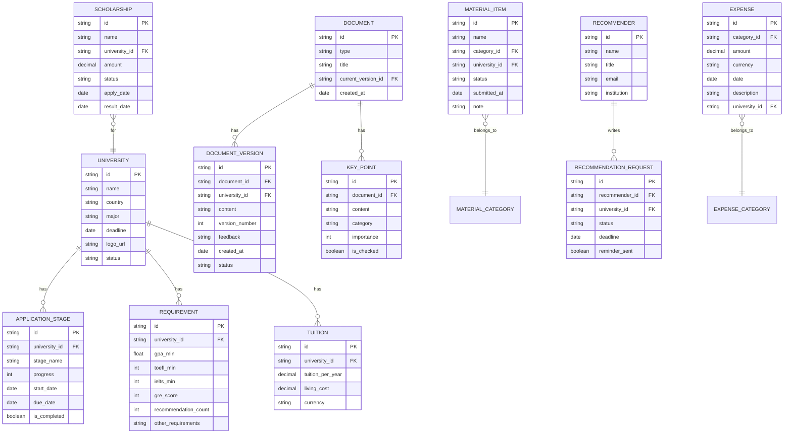

## 1. 架构设计



---

## 2. 技术说明

- **前端框架**：React 18 + TypeScript 5 + Vite 5
- **初始化工具**：vite-init react-ts 模板
- **路由管理**：react-router-dom 6（嵌套路由 + 懒加载）
- **状态管理**：zustand 4（轻量级状态管理，支持持久化）
- **样式方案**：Tailwind CSS 3 + CSS 变量（主题系统）
- **图标库**：lucide-react（线性图标）
- **数据可视化**：recharts 2（图表库：环形图、柱状图、饼图）
- **后端**：无（纯前端应用，使用 LocalStorage 模拟持久化）
- **数据库**：LocalStorage + Mock 初始演示数据
- **代码规范**：TypeScript 严格模式 + ESLint

---

## 3. 路由定义

| 路由路径 | 页面组件 | 用途说明 |
|---------|---------|---------|
| `/` | Dashboard | 仪表盘首页：数据概览、快捷操作 |
| `/applications` | ApplicationList | 申请项目列表页 |
| `/applications/:id` | ApplicationDetail | 单个院校申请详情页 |
| `/applications/compare` | ApplicationCompare | 院校申请要求对比页 |
| `/documents` | DocumentList | 文书管理列表页 |
| `/documents/:id` | DocumentDetail | 文书详情（版本管理+时间线） |
| `/materials` | MaterialList | 材料准备清单页 |
| `/materials/recommenders` | RecommenderList | 推荐人管理页 |
| `/finance` | FinanceOverview | 财务规划总览页 |
| `/finance/scholarships` | ScholarshipList | 奖学金申请追踪页 |
| `/finance/expenses` | ExpenseList | 费用支出记录页 |

---

## 4. 数据模型

### 4.1 数据模型定义（ER图）



### 4.2 TypeScript 类型定义（核心数据结构）

```typescript
// 申请院校
interface University {
  id: string;
  name: string;
  country: string;
  major: string;
  deadline: string;
  logoUrl: string;
  status: 'researching' | 'preparing' | 'submitted' | 'accepted' | 'rejected' | 'enrolled';
  requirements: Requirement;
  tuition: TuitionInfo;
  stages: ApplicationStage[];
}

// 申请阶段
interface ApplicationStage {
  id: string;
  stageName: '选校' | '文书准备' | '材料提交' | '等待录取' | '录取结果' | '签证' | '入学';
  progress: number;
  startDate: string;
  dueDate: string;
  isCompleted: boolean;
}

// 文书
interface Document {
  id: string;
  type: 'personal_statement' | 'motivation_letter' | 'research_proposal' | 'other';
  title: string;
  currentVersionId: string;
  versions: DocumentVersion[];
  keyPoints: KeyPoint[];
  timeline: DocumentTimeline[];
  createdAt: string;
}

// 文书版本
interface DocumentVersion {
  id: string;
  versionNumber: number;
  universityId?: string;
  content: string;
  feedback: string;
  status: 'draft' | 'reviewing' | 'revising' | 'final';
  createdAt: string;
}

// 材料项
interface MaterialItem {
  id: string;
  name: string;
  category: 'transcript' | 'language_score' | 'recommendation' | 'resume' | 'portfolio' | 'other';
  universityId: string;
  status: 'not_started' | 'preparing' | 'completed' | 'submitted';
  submittedAt?: string;
  note: string;
}

// 推荐人
interface Recommender {
  id: string;
  name: string;
  title: string;
  email: string;
  institution: string;
  requests: RecommendationRequest[];
}

// 奖学金
interface Scholarship {
  id: string;
  name: string;
  universityId: string;
  amount: number;
  currency: string;
  status: 'planning' | 'applied' | 'interview' | 'awarded' | 'rejected';
  applyDate?: string;
  resultDate?: string;
}

// 支出记录
interface Expense {
  id: string;
  category: 'application_fee' | 'visa_fee' | 'material_fee' | 'test_fee' | 'other';
  amount: number;
  currency: string;
  date: string;
  description: string;
  universityId?: string;
}
```

---

## 5. 项目目录结构

```
project164/
├── src/
│   ├── components/              # 可复用组件
│   │   ├── layout/             # 布局组件（Sidebar、Header、Breadcrumb）
│   │   ├── ui/                 # 基础UI组件（Button、Card、Modal、Table）
│   │   ├── charts/             # 图表组件（环形图、柱状图、饼图）
│   │   └── common/             # 通用业务组件
│   ├── pages/                  # 页面组件
│   │   ├── Dashboard/
│   │   ├── Applications/
│   │   ├── Documents/
│   │   ├── Materials/
│   │   └── Finance/
│   ├── store/                  # zustand 状态管理
│   │   ├── useApplicationStore.ts
│   │   ├── useDocumentStore.ts
│   │   ├── useMaterialStore.ts
│   │   └── useFinanceStore.ts
│   ├── types/                  # TypeScript 类型定义
│   │   └── index.ts
│   ├── utils/                  # 工具函数
│   │   ├── storage.ts          # LocalStorage 封装
│   │   ├── date.ts             # 日期处理
│   │   └── format.ts           # 格式化函数
│   ├── data/                   # Mock 初始数据
│   │   └── mockData.ts
│   ├── App.tsx
│   ├── main.tsx
│   └── index.css
├── index.html
├── package.json
├── vite.config.ts
├── tailwind.config.js
├── postcss.config.js
└── tsconfig.json
```

---

