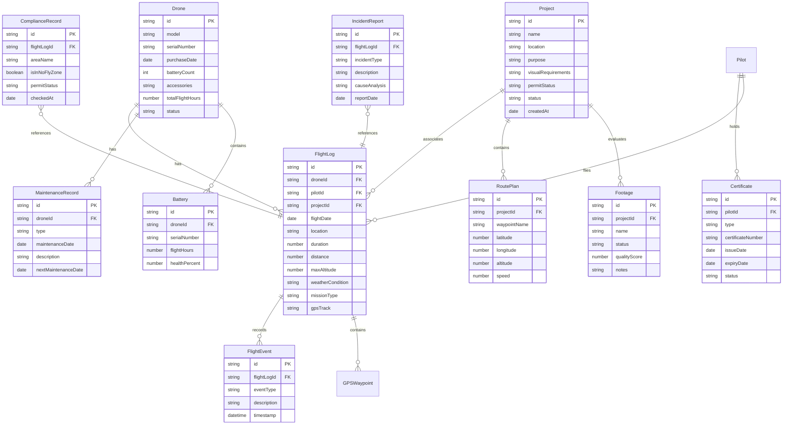

## 1. 架构设计

```mermaid
graph TB
    "前端 React + Vite + Tailwind" --> "状态管理 Zustand"
    "状态管理 Zustand" --> "Mock数据层"
    "前端 React + Vite + Tailwind" --> "路由 React Router"
    "路由 React Router" --> "仪表盘页面"
    "路由 React Router" --> "飞行记录页面"
    "路由 React Router" --> "设备管理页面"
    "路由 React Router" --> "航拍项目页面"
    "路由 React Router" --> "法规合规页面"
```

## 2. 技术说明

- 前端：React@18 + Tailwind CSS@3 + Vite
- 初始化工具：vite-init
- 后端：无（纯前端，使用Mock数据）
- 数据库：无（使用内存数据 + localStorage持久化）
- 状态管理：Zustand
- 图标库：lucide-react

## 3. 路由定义

| 路由 | 用途 |
|------|------|
| / | 仪表盘首页，数据概览 |
| /flights | 飞行记录列表 |
| /flights/new | 新建飞行记录 |
| /flights/:id | 飞行记录详情 |
| /equipment | 设备列表 |
| /equipment/:id | 设备详情 |
| /equipment/:id/maintenance/new | 新增维护记录 |
| /projects | 航拍项目列表 |
| /projects/:id | 项目详情 |
| /projects/new | 新建航拍项目 |
| /compliance | 法规合规总览 |
| /compliance/certificates | 证书管理 |
| /compliance/incidents | 事故报告 |

## 4. API定义

无后端API，使用Mock数据直接在前端管理。

## 5. 服务端架构图

不适用（纯前端项目）

## 6. 数据模型

### 6.1 数据模型定义



### 6.2 数据定义语言

使用TypeScript类型定义替代DDL：

```typescript
interface Drone {
  id: string;
  model: string;
  serialNumber: string;
  purchaseDate: string;
  batteryCount: number;
  accessories: string[];
  totalFlightHours: number;
  status: 'active' | 'maintenance' | 'retired';
}

interface FlightLog {
  id: string;
  droneId: string;
  pilotId: string;
  projectId?: string;
  flightDate: string;
  location: string;
  duration: number;
  distance: number;
  maxAltitude: number;
  weatherCondition: string;
  missionType: 'aerial' | 'mapping' | 'inspection' | 'performance' | 'practice';
  events: FlightEvent[];
  waypoints: GPSWaypoint[];
}

interface FlightEvent {
  id: string;
  eventType: 'signal_interference' | 'fault_alert' | 'accident' | 'other';
  description: string;
  timestamp: string;
}

interface GPSWaypoint {
  id: string;
  latitude: number;
  longitude: number;
  altitude: number;
}

interface Battery {
  id: string;
  droneId: string;
  serialNumber: string;
  flightHours: number;
  healthPercent: number;
}

interface MaintenanceRecord {
  id: string;
  droneId: string;
  type: 'propeller' | 'motor' | 'firmware' | 'other';
  maintenanceDate: string;
  description: string;
  nextMaintenanceDate?: string;
}

interface Project {
  id: string;
  name: string;
  location: string;
  purpose: string;
  visualRequirements: string;
  permitStatus: 'pending' | 'approved' | 'rejected' | 'not_required';
  status: 'planning' | 'shooting' | 'review' | 'completed';
  createdAt: string;
  routePlans: RoutePlan[];
  footages: Footage[];
}

interface RoutePlan {
  id: string;
  projectId: string;
  waypointName: string;
  latitude: number;
  longitude: number;
  altitude: number;
  speed: number;
}

interface Footage {
  id: string;
  projectId: string;
  name: string;
  status: 'usable' | 'reshoot' | 'pending';
  qualityScore: number;
  notes: string;
}

interface Certificate {
  id: string;
  pilotId: string;
  type: string;
  certificateNumber: string;
  issueDate: string;
  expiryDate: string;
  status: 'valid' | 'expiring_soon' | 'expired';
}

interface ComplianceRecord {
  id: string;
  flightLogId: string;
  areaName: string;
  isInNoFlyZone: boolean;
  permitStatus: 'approved' | 'pending' | 'not_required';
  checkedAt: string;
}

interface IncidentReport {
  id: string;
  flightLogId: string;
  incidentType: string;
  description: string;
  causeAnalysis: string;
  reportDate: string;
}
```
