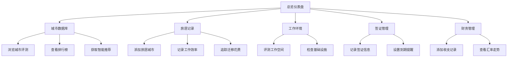

# 数字游牧者生活方式管理工具 - 产品需求文档

## 1. 产品概述

数字游牧者生活方式管理工具是一款面向远程工作者、数字游民群体的一站式城市攻略与旅居生活管理平台。它整合了城市数据库、个人旅居记录、工作环境管理、签证居留管理和多货币财务管理五大核心模块，帮助用户轻松规划、记录和优化全球游牧生活。

- **目标用户**：数字游民、远程工作者、长期旅行者、自由职业者
- **解决痛点**：城市选择信息分散、旅居记录零散、工作环境难以评估、签证管理混乱、多币种财务难以追踪
- **产品价值**：提供数据驱动的城市决策、全周期旅居记录、专业工作环境评测、智能签证提醒、多货币财务看板

---

## 2. 核心功能

### 2.1 用户角色

| 角色 | 注册方式 | 核心权限 |
|------|----------|----------|
| 普通用户 | 直接访问（本地存储） | 浏览所有功能、添加/编辑个人记录、导出数据 |

### 2.2 功能模块

1. **总览仪表盘**：旅居状态概览、当前位置、即将到期签证提醒、财务摘要
2. **城市数据库**：城市评测档案、综合评分排行、群体化智能推荐
3. **旅居记录**：城市居住记录、工作效率对比、城市间迁移追踪
4. **工作环境**：咖啡馆/共享办公/图书馆评测、推荐清单、基础设施检查
5. **签证管理**：签证类型记录、到期提醒、出入境历史
6. **财务管理**：多货币收支、汇率追踪、预算管理

### 2.3 页面详情

| 页面名称 | 模块名称 | 功能描述 |
|-----------|-------------|---------------------|
| 总览仪表盘 | 状态卡片 | 当前城市、居住天数、下次迁移倒计时 |
| 总览仪表盘 | 签证提醒 | 即将到期签证列表、续签进度 |
| 总览仪表盘 | 财务摘要 | 本月收支、多币种余额概览 |
| 总览仪表盘 | 效率趋势 | 近三个月工作效率折线图 |
| 城市数据库 | 城市列表 | 卡片式展示，支持多维度筛选和排序 |
| 城市数据库 | 城市详情 | 完整评测档案、8维度雷达图、用户评论 |
| 城市数据库 | 排行榜 | 综合评分TOP10、各单项维度排行 |
| 城市数据库 | 智能推荐 | 预算有限/网络优先/社群活跃三档推荐 |
| 旅居记录 | 时间线 | 按时间顺序展示所有旅居城市 |
| 旅居记录 | 效率对比 | 不同城市工作产出柱状图对比 |
| 旅居记录 | 迁移记录 | 城市间移动的花费、时间、交通方式 |
| 工作环境 | 评测列表 | 已探索工作空间的详细评测卡片 |
| 工作环境 | 基础设施检查清单 | 远程工作必备设备/网络/工具检查项 |
| 签证管理 | 签证档案 | 各国签证类型、有效期、停留限制 |
| 签证管理 | 到期日历 | 签证到期时间线、续签计划 |
| 签证管理 | 出入境记录 | 出入境日期、国家、盖章记录 |
| 财务管理 | 交易记录 | 多币种收支流水、分类标签 |
| 财务管理 | 汇率看板 | 主要货币实时汇率、历史走势 |

---

## 3. 核心流程

用户从总览仪表盘开始，可导航至任意功能模块。在城市数据库中浏览评测后，可将心仪城市添加到旅居计划；在旅居记录中追踪实际居住体验；通过工作环境模块记录发现的办公空间；签证模块提醒重要日期；财务模块管理全球资产。

---

## 4. 用户界面设计

### 4.1 设计风格

- **主色调**：深青色 (#0F766E) + 琥珀色 (#D97706) 双色系，前者代表探索与稳定，后者代表温暖与活力
- **中性色**：以石板灰 (Slate) 为基础，构建深浅层次分明的界面
- **按钮风格**：圆角中等 (rounded-lg)，微阴影，hover时有轻微上浮和颜色加深效果
- **字体**：展示标题使用 Fraunces (衬线体，优雅有格调)，正文使用 Plus Jakarta Sans (现代无衬线，可读性强)
- **布局风格**：卡片式布局 + 侧边导航，适当留白，信息分区清晰
- **图标**：Lucide 线性图标，配合语义化 emoji 增强识别度
- **视觉元素**：细腻噪点纹理背景、柔和渐变卡片、数据可视化图表

### 4.2 页面设计概览

| 页面名称 | 模块名称 | UI元素 |
|-----------|-------------|---------|
| 总览仪表盘 | 状态卡片 | 渐变背景卡片、大号数字指标、状态标签 |
| 总览仪表盘 | 数据图表 | 雷达图(城市评分)、折线图(效率趋势)、迷你柱状图 |
| 城市数据库 | 城市卡片 | 城市封面图、国旗、评分徽章、关键指标标签 |
| 城市数据库 | 城市详情 | 8维雷达图、详细评测段落、推荐指数条 |
| 旅居记录 | 时间线 | 垂直时间线、城市节点、居住时长标记 |
| 工作环境 | 评测卡片 | 场所类型图标、星级评分、噪音/网速/价格标签 |
| 签证管理 | 到期日历 | 彩色时间条、状态指示灯、倒计时数字 |
| 财务管理 | 汇率看板 | 货币对卡片、涨跌指示箭头、迷你走势图 |

### 4.3 响应式设计

- 桌面端优先设计（1280px+），侧边栏固定导航
- 平板端（768-1024px）：侧边栏收起为图标式，主内容自适应
- 移动端（<768px）：底部标签导航，卡片单列布局，图表简化展示

---

## 5. 数据与存储

所有数据采用浏览器本地存储 (localStorage) 方案，无需后端服务：
- 预置丰富的城市数据库（全球30+数字游民热门城市）
- 用户个人记录本地持久化保存
- 支持数据导出为 JSON 格式备份
