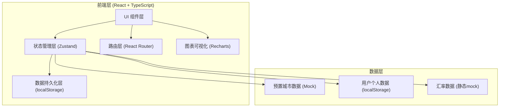
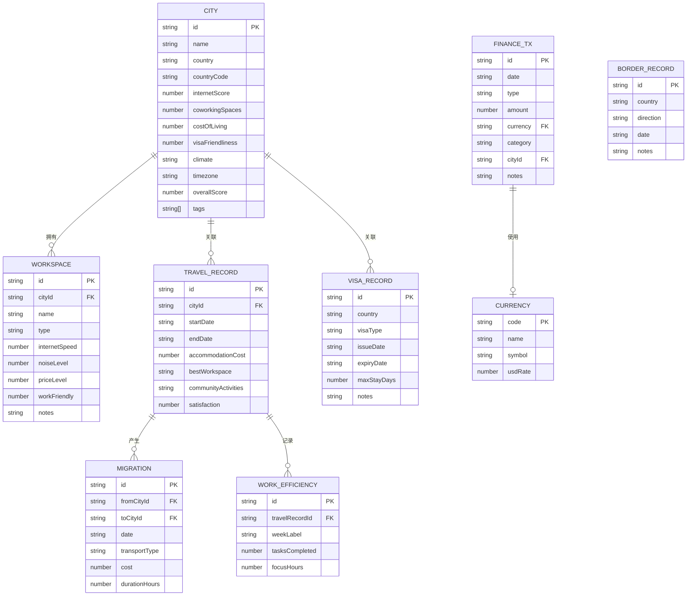

# 数字游牧者生活方式管理工具 - 技术架构文档

## 1. 架构设计



纯前端单页应用架构，无需后端服务。所有用户数据通过 localStorage 持久化，预置数据以 TypeScript 常量形式内嵌。

---

## 2. 技术选型

| 分类 | 技术栈 | 版本 | 说明 |
|------|--------|------|------|
| 前端框架 | React | 18.x | 函数式组件 + Hooks |
| 语言 | TypeScript | 5.x | 类型安全开发 |
| 构建工具 | Vite | 5.x | 快速开发与热更新 |
| 样式方案 | Tailwind CSS | 3.x | 原子化 CSS 框架 |
| 状态管理 | Zustand | 4.x | 轻量级状态管理 |
| 路由 | react-router-dom | 6.x | SPA 客户端路由 |
| 图表 | Recharts | 2.x | React 图表组件库 |
| 图标 | lucide-react | latest | 线性图标库 |
| 日期处理 | date-fns | 3.x | 轻量日期工具库 |

---

## 3. 路由定义

| 路由路径 | 页面组件 | 功能说明 |
|----------|----------|----------|
| `/` | Dashboard | 总览仪表盘 |
| `/cities` | Cities | 城市数据库列表 |
| `/cities/:id` | CityDetail | 城市详情评测 |
| `/travel` | TravelLog | 旅居记录时间线 |
| `/workspace` | Workspace | 工作环境管理 |
| `/visa` | Visa | 签证与居留管理 |
| `/finance` | Finance | 多货币财务管理 |

---

## 4. 目录结构

```
src/
├── components/          # 可复用UI组件
│   ├── layout/          # 布局组件 (Sidebar, Topbar等)
│   ├── charts/          # 图表组件
│   └── ui/              # 通用UI (Card, Badge, Button等)
├── pages/               # 路由页面
│   ├── Dashboard.tsx
│   ├── Cities.tsx
│   ├── CityDetail.tsx
│   ├── TravelLog.tsx
│   ├── Workspace.tsx
│   ├── Visa.tsx
│   └── Finance.tsx
├── store/               # Zustand状态管理
│   ├── cityStore.ts     # 城市数据store
│   ├── travelStore.ts   # 旅居记录store
│   ├── workspaceStore.ts# 工作空间store
│   ├── visaStore.ts     # 签证store
│   └── financeStore.ts  # 财务store
├── data/                # 预置Mock数据
│   ├── cities.ts        # 城市数据库
│   ├── workspaces.ts    # 工作空间示例
│   └── currencies.ts    # 货币与汇率数据
├── types/               # TypeScript类型定义
│   └── index.ts
├── utils/               # 工具函数
│   ├── date.ts          # 日期处理
│   ├── currency.ts      # 货币格式化
│   └── storage.ts       # localStorage封装
├── App.tsx
├── main.tsx
└── index.css            # Tailwind入口 + 全局样式
```

---

## 5. 数据模型

### 5.1 ER图



### 5.2 核心类型定义

```typescript
// 城市
interface City {
  id: string;
  name: string;
  country: string;
  countryCode: string;
  internetScore: number;     // 1-10
  coworkingSpaces: number;
  costOfLiving: number;      // 1-5 (1=极低, 5=极高)
  visaFriendliness: number;  // 1-10
  climate: string;
  timezone: string;
  overallScore: number;      // 0-100
  tags: string[];            // 'budget', 'internet', 'community' ...
}

// 旅居记录
interface TravelRecord {
  id: string;
  cityId: string;
  startDate: string;
  endDate: string;
  accommodationCost: number;
  bestWorkspace: string;
  communityActivities: string;
  satisfaction: number; // 1-5
}

// 工作空间
interface Workspace {
  id: string;
  cityId: string;
  name: string;
  type: 'cafe' | 'coworking' | 'library' | 'other';
  internetSpeed: number;   // 1-10
  noiseLevel: number;      // 1-10 (1=安静, 10=嘈杂)
  priceLevel: number;      // 1-5
  workFriendly: number;    // 1-10
  notes: string;
}

// 签证
interface VisaRecord {
  id: string;
  country: string;
  countryCode: string;
  visaType: 'digital-nomad' | 'tourist' | 'business' | 'other';
  issueDate: string;
  expiryDate: string;
  maxStayDays: number;
  notes: string;
}

// 财务交易
interface FinanceTx {
  id: string;
  date: string;
  type: 'income' | 'expense';
  amount: number;
  currency: string;
  category: string;
  cityId?: string;
  notes: string;
}
```
