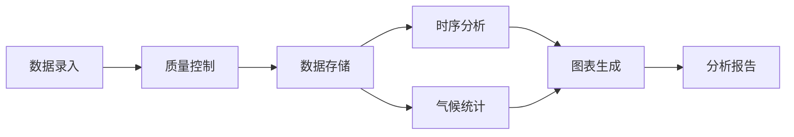

## 1. 产品概述

本产品是一个完整的在线气象观测站数据记录和分析工具，面向气象观测人员、科研人员及气候分析工作者。系统提供气象数据录入、仪器管理、质量控制、时序分析、气候统计及专业图表生成等全流程功能，帮助用户高效管理观测数据并进行深度气候分析。

## 2. 核心功能

### 2.1 用户角色

| 角色 | 注册方式 | 核心权限 |
|------|----------|----------|
| 观测员 | 默认登录 | 数据录入、仪器管理、数据查看 |
| 分析员 | 默认登录 | 全部功能，含高级分析与报告生成 |

### 2.2 功能模块

1. **观测数据管理**：气象要素录入、CSV导入、仪器档案管理、数据质量控制
2. **时序分析**：时间序列可视化、极端天气识别、气候倾向率计算
3. **气候统计**：月/年均值计算、气候距平分析、季节划分判定
4. **图表生成**：风向玫瑰图、降水量柱状图、气温折线图、双轴图、气候描述文本

### 2.3 页面详情

| 页面名称 | 模块名称 | 功能描述 |
|-----------|-------------|---------------------|
| 数据总览仪表盘 | 概览卡片 | 今日气温、湿度、气压、风速、降水、能见度实时展示 |
| 数据总览仪表盘 | 快捷入口 | 快速导航至各功能模块 |
| 观测数据管理 | 手动录入表单 | 气温/湿度/气压/风速风向/降水量/能见度定时录入 |
| 观测数据管理 | CSV导入 | 批量导入历史观测数据，支持格式校验 |
| 观测数据管理 | 数据列表 | 历史数据浏览、编辑、删除、超范围标记 |
| 观测数据管理 | 仪器管理 | 仪器编号、校准记录、误差范围档案 |
| 观测数据管理 | 质量审核 | 可疑值人工审核、数据标记、批量处理 |
| 时序分析 | 时间序列图 | 日变化/月变化/年变化多尺度折线图 |
| 时序分析 | 极端天气识别 | 历史最高温/最低温/最大降水自动统计 |
| 时序分析 | 气候倾向率 | 线性拟合趋势图、长期变化率计算 |
| 气候统计 | 统计摘要 | 月均值、年均值自动计算展示 |
| 气候统计 | 气候距平 | 当月与历年同期对比分析 |
| 气候统计 | 季节划分 | 入春/入夏/入秋/入冬客观判定 |
| 图表中心 | 风向玫瑰图 | 各风向频率及风速分布可视化 |
| 图表中心 | 降水柱状图 | 月/年降水量分布柱状图 |
| 图表中心 | 气温折线图 | 平均/最高/最低气温折线图 |
| 图表中心 | 双轴图 | 温度与降水同时展示 |
| 图表中心 | 报告生成 | 气候特征综合描述文本自动生成 |

## 3. 核心流程

## 4. 用户界面设计

### 4.1 设计风格
- **主色调**：深蓝 (#0c4a6e) 代表专业与信任，搭配青绿 (#0d9488) 作为数据可视化强调色
- **辅助色**：橙红 (#f97316) 用于预警标记，浅灰 (#f1f5f9) 用于背景层次
- **按钮风格**：圆角12px，带微阴影，hover时轻微上浮
- **字体**：标题使用思源黑体，正文使用系统无衬线字体
- **布局风格**：左侧导航 + 顶部面包屑 + 卡片式内容区
- **图标风格**：使用 Lucide 线性图标，统一 24px 尺寸

### 4.2 页面设计概览

| 页面名称 | 模块名称 | UI元素 |
|-----------|-------------|-------------|
| 数据总览 | 概览卡片 | 渐变背景卡片、实时数据数字动效、气象图标 |
| 数据管理 | 录入表单 | 分组表单、数值输入框、下拉选择器、时间选择器 |
| 数据管理 | 数据表格 | 斑马纹、行hover高亮、超范围行红色标记、分页 |
| 时序分析 | 图表区 | 大尺寸Canvas图表、图例交互、时间刻度缩放 |
| 图表中心 | 卡片网格 | 响应式图表卡片、导出按钮、图表类型切换 |

### 4.3 响应式
- 桌面端优先设计（≥1280px），采用12列栅格系统
- 平板端（768-1279px）：导航折叠为汉堡菜单，卡片两列布局
- 移动端（<768px）：单列布局，图表自适应宽度，触摸友好的输入控件
