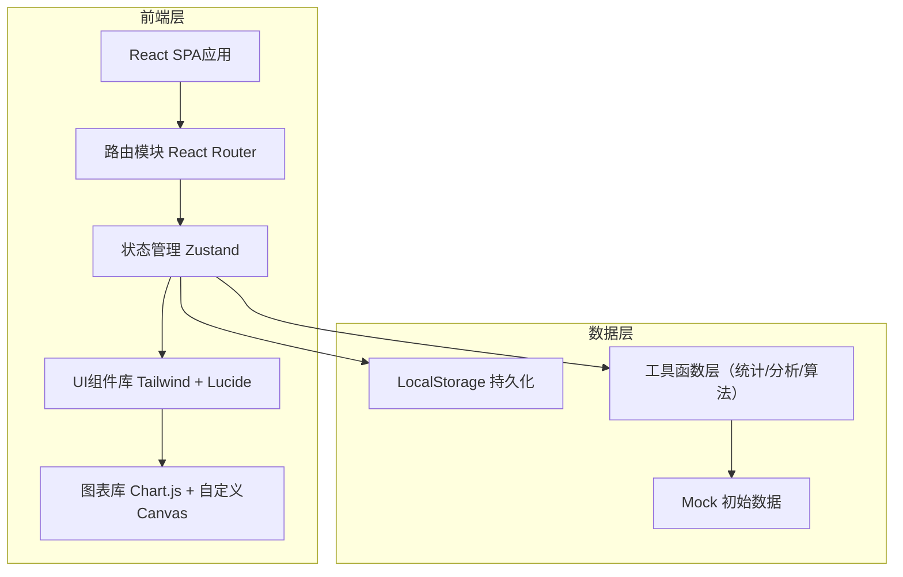
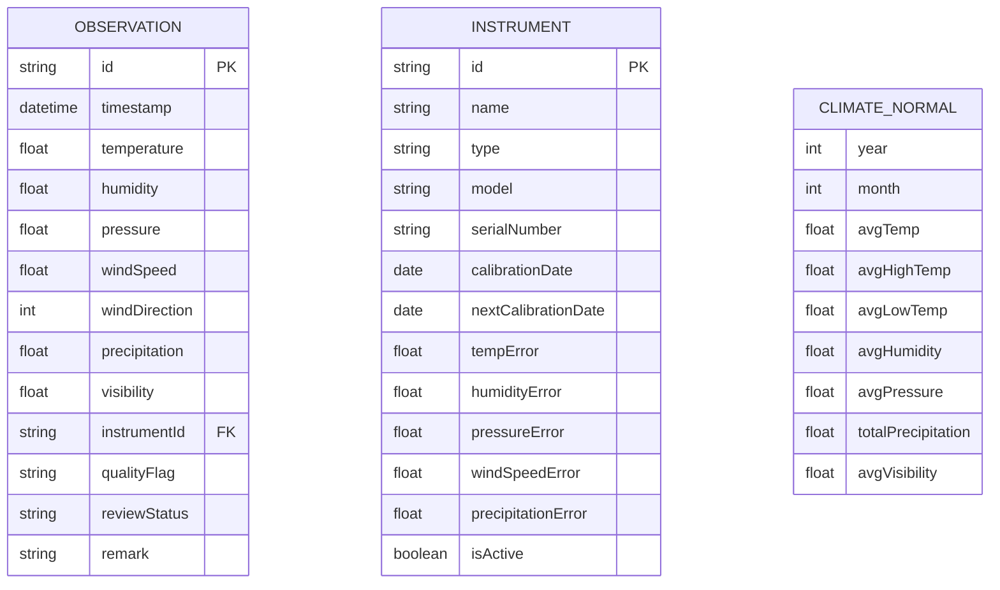

## 1. 架构设计



## 2. 技术描述

- **前端框架**: React@18 + TypeScript@5 + Vite@6
- **样式方案**: TailwindCSS@3
- **路由管理**: react-router-dom@6
- **状态管理**: zustand@4
- **图表绘制**: chart.js@4 + react-chartjs-2@5 + 自定义Canvas（风向玫瑰图）
- **图标库**: lucide-react@0
- **数据持久化**: LocalStorage + JSON序列化
- **无后端**: 纯前端实现，内置Mock演示数据

## 3. 路由定义

| 路由 | 页面用途 |
|-------|---------|
| / | 数据总览仪表盘 |
| /data/entry | 观测数据手动录入 |
| /data/import | CSV数据批量导入 |
| /data/list | 观测数据列表与管理 |
| /data/instruments | 观测仪器档案管理 |
| /data/quality | 数据质量审核 |
| /analysis/timeseries | 时间序列分析 |
| /analysis/extremes | 极端天气识别 |
| /analysis/trend | 气候倾向率分析 |
| /statistics/summary | 月/年均值统计摘要 |
| /statistics/anomaly | 气候距平分析 |
| /statistics/seasons | 季节划分判定 |
| /charts/windrose | 风向玫瑰图 |
| /charts/precipitation | 降水量柱状图 |
| /charts/temperature | 气温折线图 |
| /charts/dualaxis | 温降双轴图 |
| /charts/report | 气候特征报告生成 |

## 4. 数据模型

### 4.1 实体关系图



### 4.2 TypeScript 类型定义

```typescript
// 气象观测记录
interface Observation {
  id: string;
  datetime: string;
  temperature: number | null;
  humidity: number | null;
  pressure: number | null;
  windSpeed: number | null;
  windDirection: number | null;
  precipitation: number | null;
  visibility: number | null;
  instrumentId: string;
  qualityFlag: 'normal' | 'out_of_range' | 'suspect' | 'missing';
  reviewStatus: 'pending' | 'approved' | 'rejected';
  remark?: string;
}

// 观测仪器
interface Instrument {
  id: string;
  name: string;
  type: string;
  model: string;
  serialNumber: string;
  calibrationDate: string;
  nextCalibrationDate: string;
  tempError: number;
  humidityError: number;
  pressureError: number;
  windSpeedError: number;
  precipitationError: number;
  isActive: boolean;
}

// 质量控制范围
interface QualityRanges {
  temperature: { min: number; max: number };
  humidity: { min: number; max: number };
  pressure: { min: number; max: number };
  windSpeed: { min: number; max: number };
  precipitation: { min: number; max: number };
  visibility: { min: number; max: number };
}

// 统计结果
interface MonthlyStats {
  year: number;
  month: number;
  avgTemp: number;
  avgHighTemp: number;
  avgLowTemp: number;
  totalPrecipitation: number;
  avgHumidity: number;
  avgPressure: number;
  avgVisibility: number;
  days: number;
}

// 季节判定结果
interface SeasonTransition {
  season: 'spring' | 'summer' | 'autumn' | 'winter';
  date: string;
  method: string;
  temperatures: number[];
}
```

## 5. 工具函数模块

| 模块文件 | 功能说明 |
|---------|----------|
| src/utils/statistics.ts | 均值、极值、距平、线性回归（气候倾向率）计算 |
| src/utils/quality.ts | 数据质量校验、超范围检测、可疑值识别 |
| src/utils/seasons.ts | 气候学季节划分算法（候温法） |
| src/utils/csv.ts | CSV解析与导出、格式校验 |
| src/utils/wind.ts | 风向角度与方位转换、风向频率统计 |
| src/utils/report.ts | 气候特征自然语言描述生成 |
| src/utils/mock.ts | 模拟气象数据生成器（演示用） |
