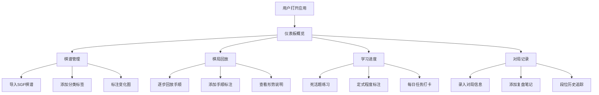

## 1. 产品概述

本产品是一款面向围棋爱好者的在线棋谱收藏和围棋学习追踪工具，帮助用户系统化地管理棋谱、追踪学习进度、记录对局历史。

- 主要目的：为围棋学习者提供一站式的棋谱管理、棋局回放、学习进度追踪和对局记录功能，辅助用户系统性提升棋艺水平。
- 目标用户：围棋爱好者、围棋学员、围棋教师。
- 产品价值：将分散的棋谱资源统一管理，通过结构化的学习追踪功能，帮助用户有计划、有方向地提升围棋水平。

## 2. 核心功能

### 2.1 用户角色

本产品为单用户模式，无需注册登录，数据存储于浏览器本地。

| 角色 | 注册方式 | 核心权限 |
|------|----------|---------|
| 围棋学习者 | 无需注册 | 所有功能访问，本地数据存储 |

### 2.2 功能模块

1. **仪表板主页：学习概览、今日任务、快速入口、统计数据
2. **棋谱管理页**：SGF导入、棋谱列表、分类标签、变化图管理
3. **棋局回放页**：棋盘展示、手顺控制、标注系统、提示信息
4. **学习进度页**：死活题练习、定式掌握、每日任务、学习统计
5. **对局记录页**：对局存档、复盘笔记、段位历史

### 2.3 页面详情

| 页面名称 | 模块名称 | 功能描述 |
|---------|---------|----------|
| 仪表板主页 | 学习概览卡片 | 显示总学习时长、累计对局数、当前段位、连续学习天数 |
| 仪表板主页 | 今日任务列表 | 展示今日待完成的学习任务及完成进度条 |
| 仪表板主页 | 快捷入口导航 | 快速进入各功能模块的卡片式导航 |
| 仪表板主页 | 最近活动时间线 | 显示最近的学习记录和对局记录 |
| 棋谱管理页 | SGF导入区 | 文件上传或文本粘贴方式导入SGF棋谱 |
| 棋谱管理页 | 棋谱列表 | 网格/列表切换展示，支持搜索和筛选 |
| 棋谱管理页 | 分类标签系统 | 定式/死活题/名局/自己对局/教学棋谱五大类，支持自定义标签 |
| 棋谱管理页 | 变化图管理 | 关键变化图标注，主要变化和次要变化的分叉树展示 |
| 棋局回放页 | 围棋棋盘组件 | 19路标准棋盘，黑白棋子渲染，坐标标识 |
| 棋局回放页 | 手顺控制栏 | 首手/上一手/下一手/末手/跳转指定手数/自动播放 |
| 棋局回放页 | 标注功能面板 | 关键点/疑问手/好手等标注的添加、编辑、删除 |
| 棋局回放页 | 形势说明区 | 当前手的形势分析文字说明、节点注释显示 |
| 棋局回放页 | 变化图选择器 | 变化分支列表，点击切换不同变化图 |
| 学习进度页 | 死活题练习区 | 题目列表、难度分级、练习记录、答题界面 |
| 学习进度页 | 定式掌握面板 | 定系列表、掌握程度标注（知道不熟练/可背出/理解变化） |
| 学习进度页 | 每日任务管理 | 任务创建、完成标记、连续打卡统计 |
| 学习进度页 | 学习统计图表 | 周/月学习时长、题目正确率、定式掌握进度图表 |
| 对局记录页 | 对局存档列表 | 对手级别/胜负/执黑白/让子数/对局时间筛选展示 |
| 对局记录页 | 复盘笔记编辑器 | 关键时刻选择记录、自我反思笔记 |
| 对局记录页 | 段位历史追踪 | 段位变化时间轴图表、升降级记录 |
| 对局记录页 | 新建对局表单 | 录入对局详细信息的表单界面 |

## 3. 核心流程

用户打开应用后，首先进入仪表板查看学习概览，可通过快捷入口进入各功能模块。

### 主要用户流程：

**棋谱管理流程**：用户进入棋谱管理→导入SGF文件→系统解析SGF→添加分类标签→标注关键变化图→进入回放页面查看。

**棋局学习流程**：用户选择棋谱→进入回放页面→逐步回放棋局→在关键手添加标注→查看形势说明→切换变化分支。

**学习追踪流程**：用户进入学习进度→完成每日死活题练习→更新定式掌握程度→查看学习统计。

**对局记录流程**：用户新建对局记录→录入对局信息→保存后添加复盘笔记→查看段位历史变化。

## 4. 用户界面设计

### 4.1 设计风格

- **主色调**：深木色 `#5D4037`（棋盘木纹感）、象牙白 `#F5E6C8`（棋盘底色）、墨黑 `#1A1A1A`（棋子黑色）、云白 `#FAFAFA`（棋子白色）
- **辅助色**：竹青 `#7CB342`（强调色）、朱红 `#D32F2F`（警示/疑问手）、琥珀金 `#FF8F00`（关键点）、深青 `#0288D1`（好手）
- **按钮风格**：圆角方形按钮，轻微阴影，悬停时浮起效果，按下时轻微下沉
- **字体**：标题使用 "Noto Serif SC"（宋体衬线，体现传统韵味），正文使用 "Noto Sans SC"（无衬线易读）
- **布局风格**：卡片式布局，顶部导航栏 + 侧边菜单，棋盘居中突出，传统中式雅致风格
- **图标风格**：使用线条图标配合轻微填充，围棋元素图标（棋子、棋盘、星位等）

### 4.2 页面设计概览

| 页面名称 | 模块名称 | UI元素 |
|---------|---------|--------|
| 仪表板主页 | 学习概览卡片 | 木纹背景卡片，渐变填充，大数字展示统计数据，柔和阴影，悬浮微动画 |
| 仪表板主页 | 今日任务列表 | 卡片式任务项，复选框+进度条，完成时划线动画 |
| 仪表板主页 | 快捷入口导航 | 2x2网格卡片，图标+标题+副标题，点击缩放效果 |
| 仪表板主页 | 最近活动时间线 | 左侧时间轴线条，右侧事件卡片，交替配色 |
| 棋谱管理页 | SGF导入区 | 拖拽上传区域，虚线边框，悬停变色，文件图标 |
| 棋谱管理页 | 棋谱列表 | 卡片网格布局，封面缩略图棋盘，悬停浮起，标签色块 |
| 棋谱管理页 | 分类标签系统 | 顶部标签栏，活跃标签高亮，自定义标签输入 |
| 棋谱管理页 | 变化图管理 | 树形结构展示，主分支加粗，次分支缩进 |
| 棋局回放页 | 围棋棋盘组件 | 木纹背景纹理，线条交叉点，星位标记，棋子阴影立体感 |
| 棋局回放页 | 手顺控制栏 | 左侧播放按钮组，中间手数滑块，右侧手数显示 |
| 棋局回放页 | 标注功能面板 | 右侧抽屉面板，颜色编码标注类型，标注列表 |
| 棋局回放页 | 形势说明区 | 棋盘下方文字区域，淡入动画，可折叠 |
| 棋局回放页 | 变化图选择器 | 面包屑导航风格，分支切换动画 |
| 学习进度页 | 死活题练习区 | 左侧题目列表，右侧答题棋盘，难度星级显示 |
| 学习进度页 | 定式掌握面板 | 进度条式掌握程度，三档状态切换按钮 |
| 学习进度页 | 每日任务管理 | 任务卡片，完成打勾动画，连续打卡日历 |
| 学习进度页 | 学习统计图表 | 柱状图+折线图组合，渐变填充 |
| 对局记录页 | 对局存档列表 | 表格+卡片双视图，胜负颜色编码 |
| 对局记录页 | 复盘笔记编辑器 | 富文本编辑区，关键时刻时间点标记 |
| 对局记录页 | 段位历史追踪 | 时间轴+折线图，段位徽章展示 |
| 对局记录页 | 新建对局表单 | 分组表单，下拉选择，日期选择器 |

### 4.3 响应式设计

- 桌面端优先（1280px+）：侧边栏+主内容区布局
- 平板端（768px-1279px）：顶部导航折叠，侧边栏变抽屉
- 移动端（<768px）：单列布局，底部标签导航，棋盘自适应缩放

### 4.4 动效设计

- 页面加载：卡片元素交错淡入动画（staggered fade-in）
- 棋子落子：棋子落下的弹跳动画
- 导航切换：平滑过渡动画
- 标注添加：标注图标弹出动画
- 进度更新：进度条增长动画
