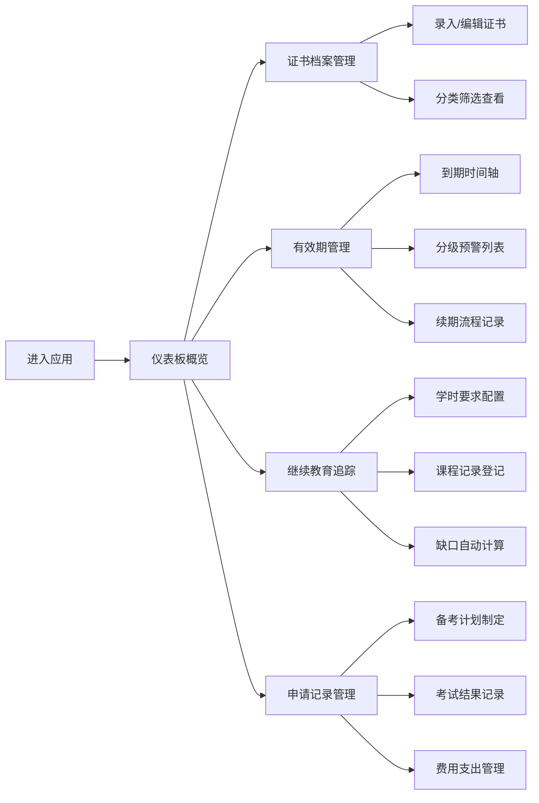

## 1. 产品概述
在线职业技能证书和资质管理工具，帮助用户集中管理各类职业证书、追踪有效期、规划继续教育和考试申请。
- 解决用户证书分散管理、到期遗忘、学时不足等痛点，面向职场人士、专业技术人员
- 提升证书管理效率，确保证书有效性，助力职业发展

## 2. 核心功能

### 2.1 用户角色
| 角色 | 注册方式 | 核心权限 |
|------|---------|---------|
| 普通用户 | 本地存储/无需注册 | 所有证书管理功能，数据本地持久化 |

### 2.2 功能模块
1. **仪表板**：证书概览统计、到期预警、快速操作入口
2. **证书档案**：证书录入、分类管理、扫描件存档
3. **有效期管理**：时间轴到期提醒、分级预警、续期流程记录
4. **继续教育追踪**：学时要求管理、课程记录、缺口计算
5. **申请记录**：备考计划、考试记录、费用管理

### 2.3 页面详情
| 页面名称 | 模块名称 | 功能描述 |
|---------|---------|---------|
| 仪表板 | 概览卡片 | 证书总数、即将到期数、年度学时进度统计 |
| 仪表板 | 预警区域 | 按紧急程度展示即将到期证书Top5 |
| 证书档案 | 证书列表 | 支持按分类筛选、搜索、排序的证书卡片列表 |
| 证书档案 | 证书录入 | 表单录入证书名称/机构/编号/时间/有效期/分类/扫描件 |
| 证书档案 | 分类管理 | 四大分类（专业资质/技能等级/学历证明/行业认证）管理 |
| 有效期管理 | 到期时间轴 | 按时间顺序排列所有证书到期日期 |
| 有效期管理 | 分级预警 | 90天/60天/30天到期和已过期专项列表 |
| 有效期管理 | 续期记录 | 续期材料清单、办理地点、办理状态追踪 |
| 继续教育追踪 | 学时管理 | 各证书年度学时要求配置 |
| 继续教育追踪 | 课程记录 | 已完成课程的录入（课程名/学时/日期/证明） |
| 继续教育追踪 | 缺口计算 | 自动计算各证书还需完成的学时数 |
| 申请记录 | 备考计划 | 考试时间、备考进度百分比、学习资源链接 |
| 申请记录 | 考试记录 | 历次考试通过/未通过状态、成绩单存档 |
| 申请记录 | 费用记录 | 报名费、培训费等费用支出记录 |

## 3. 核心流程

用户打开应用 → 查看仪表板概览和预警 → 按需进入各模块操作
- 新增证书：进入证书档案 → 点击新增 → 填写表单并上传扫描件 → 保存
- 处理到期提醒：进入有效期管理 → 查看分级预警 → 记录续期材料和流程 → 更新状态
- 登记继续教育：进入继续教育模块 → 选择对应证书 → 新增课程记录 → 系统自动计算缺口
- 规划考试申请：进入申请记录 → 创建备考计划 → 更新学习进度 → 记录考试结果

## 4. 用户界面设计

### 4.1 设计风格
- **主色调**：深海蓝 (#1e3a5f) - 专业、可信赖
- **辅助色**：翡翠绿 (#10b981) - 有效/正常、琥珀橙 (#f59e0b) - 预警、玫瑰红 (#ef4444) - 已过期
- **按钮风格**：圆角矩形 (8px)，悬浮微放大动画
- **字体**：标题使用 Noto Serif SC（衬线，专业感），正文使用 JetBrains Mono（等宽，清晰易读）
- **布局风格**：左侧固定导航 + 右侧内容区，卡片式布局，适度留白
- **图标风格**：简约线性图标，配合色彩区分状态

### 4.2 页面设计概述
| 页面名称 | 模块名称 | UI 元素 |
|---------|---------|---------|
| 仪表板 | 概览卡片 | 渐变背景卡片，大数字展示，悬浮动效 |
| 仪表板 | 预警区域 | 三色标签（红/橙/绿），倒计时显示 |
| 证书档案 | 证书列表 | 网格布局卡片，带分类标签，支持拖拽排序 |
| 有效期管理 | 时间轴 | 垂直时间轴，节点带状态颜色，悬浮展示详情 |
| 有效期管理 | 分级预警 | 分Tab展示，列表行带进度条 |
| 继续教育追踪 | 进度展示 | 环形进度图，缺口数字高亮 |
| 申请记录 | 备考进度 | 水平进度条，里程碑节点标记 |

### 4.3 响应式
- 桌面端优先（1280px+），主内容区最大宽度1440px
- 平板端（768-1280px）：导航折叠为汉堡菜单，卡片网格自适应列数
- 移动端（<768px）：单列布局，底部Tab导航，触摸友好的点击区域（44px+）

### 4.4 动效设计
- 页面加载：元素交错淡入（staggered fade-in）
- 卡片悬浮：轻微上浮 + 阴影增强
- 数据更新：数字滚动动画
- 状态变化：颜色平滑过渡
- 模态框：缩放 + 淡入淡出
