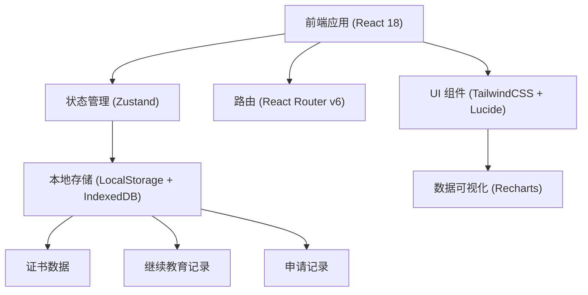
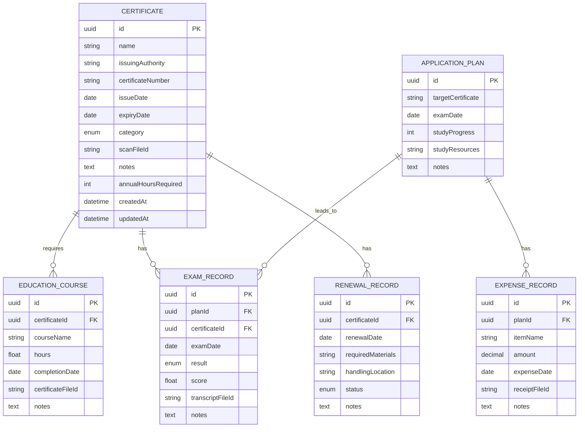

## 1. 架构设计



## 2. 技术描述

- **前端框架**: React@18.2.0 + TypeScript@5.3.3
- **构建工具**: Vite@5.0.10
- **样式方案**: TailwindCSS@3.4.1
- **状态管理**: Zustand@4.4.7
- **路由管理**: React Router Dom@6.21.1
- **图标库**: Lucide React@0.294.0
- **图表库**: Recharts@2.10.3
- **数据持久化**: LocalStorage (元数据) + IndexedDB (扫描件/证明文件)
- **后端**: 无后端，纯前端应用，数据全部本地存储

## 3. 路由定义

| 路由路径 | 页面名称 | 功能说明 |
|---------|---------|---------|
| / | 仪表板 | 概览统计、预警提醒、快速操作 |
| /certificates | 证书档案 | 证书列表、新增/编辑/删除、分类筛选 |
| /certificates/:id | 证书详情 | 单证书完整信息、相关记录 |
| /validity | 有效期管理 | 到期时间轴、分级预警、续期记录 |
| /education | 继续教育 | 学时管理、课程记录、缺口计算 |
| /applications | 申请记录 | 备考计划、考试记录、费用管理 |

## 4. 数据模型

### 4.1 实体关系图



### 4.2 TypeScript 类型定义

```typescript
export type CertificateCategory = 'professional' | 'skill' | 'education' | 'industry';

export type RenewalStatus = 'pending' | 'in_progress' | 'completed' | 'cancelled';

export type ExamResult = 'passed' | 'failed' | 'pending';

export interface Certificate {
  id: string;
  name: string;
  issuingAuthority: string;
  certificateNumber: string;
  issueDate: string;
  expiryDate: string;
  category: CertificateCategory;
  scanFileId?: string;
  notes?: string;
  annualHoursRequired: number;
  createdAt: string;
  updatedAt: string;
}

export interface EducationCourse {
  id: string;
  certificateId: string;
  courseName: string;
  hours: number;
  completionDate: string;
  certificateFileId?: string;
  notes?: string;
}

export interface RenewalRecord {
  id: string;
  certificateId: string;
  renewalDate: string;
  requiredMaterials: string[];
  handlingLocation: string;
  status: RenewalStatus;
  notes?: string;
}

export interface ApplicationPlan {
  id: string;
  targetCertificate: string;
  examDate: string;
  studyProgress: number;
  studyResources: string[];
  notes?: string;
}

export interface ExamRecord {
  id: string;
  planId?: string;
  certificateId?: string;
  examDate: string;
  result: ExamResult;
  score?: number;
  transcriptFileId?: string;
  notes?: string;
}

export interface ExpenseRecord {
  id: string;
  planId: string;
  itemName: string;
  amount: number;
  expenseDate: string;
  receiptFileId?: string;
  notes?: string;
}
```

### 4.3 初始化数据

应用首次加载时，预置以下示例数据：
- 3-5个不同分类的证书示例
- 2-3条继续教育记录
- 1-2条续期记录
- 1个备考计划示例
- 2-3条考试记录
- 若干费用记录

## 5. 项目目录结构

```
src/
├── assets/              # 静态资源
├── components/          # 通用组件
│   ├── layout/         # 布局组件 (Sidebar, Header)
│   ├── ui/             # 基础UI组件 (Button, Card, Modal, Form)
│   └── features/       # 业务组件
├── hooks/              # 自定义Hooks
├── store/              # Zustand状态管理
│   ├── useCertificateStore.ts
│   ├── useEducationStore.ts
│   ├── useValidityStore.ts
│   └── useApplicationStore.ts
├── pages/              # 页面组件
│   ├── Dashboard.tsx
│   ├── Certificates.tsx
│   ├── CertificateDetail.tsx
│   ├── ValidityManagement.tsx
│   ├── EducationTracking.tsx
│   └── ApplicationRecords.tsx
├── types/              # TypeScript类型定义
├── utils/              # 工具函数
│   ├── dateUtils.ts    # 日期计算、到期预警
│   ├── storage.ts      # 本地存储操作
│   └── fileUtils.ts    # 文件上传/预览
├── data/               # Mock数据
├── App.tsx
├── main.tsx
└── index.css           # TailwindCSS入口 + 全局样式
```

## 6. 关键技术实现点

1. **到期预警计算**：基于当前日期与有效期计算剩余天数，分为4个等级（已过期、<30天、<60天、<90天、正常）
2. **学时缺口计算**：按自然年度统计已完成学时，与年度要求对比计算缺口
3. **文件存储**：使用IndexedDB存储扫描件等二进制文件，LocalStorage存储元数据
4. **数据导出/导入**：支持JSON格式的全量数据备份和恢复
5. **响应式布局**：TailwindCSS断点实现多端适配
