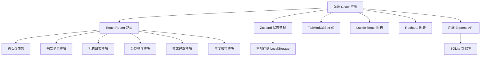
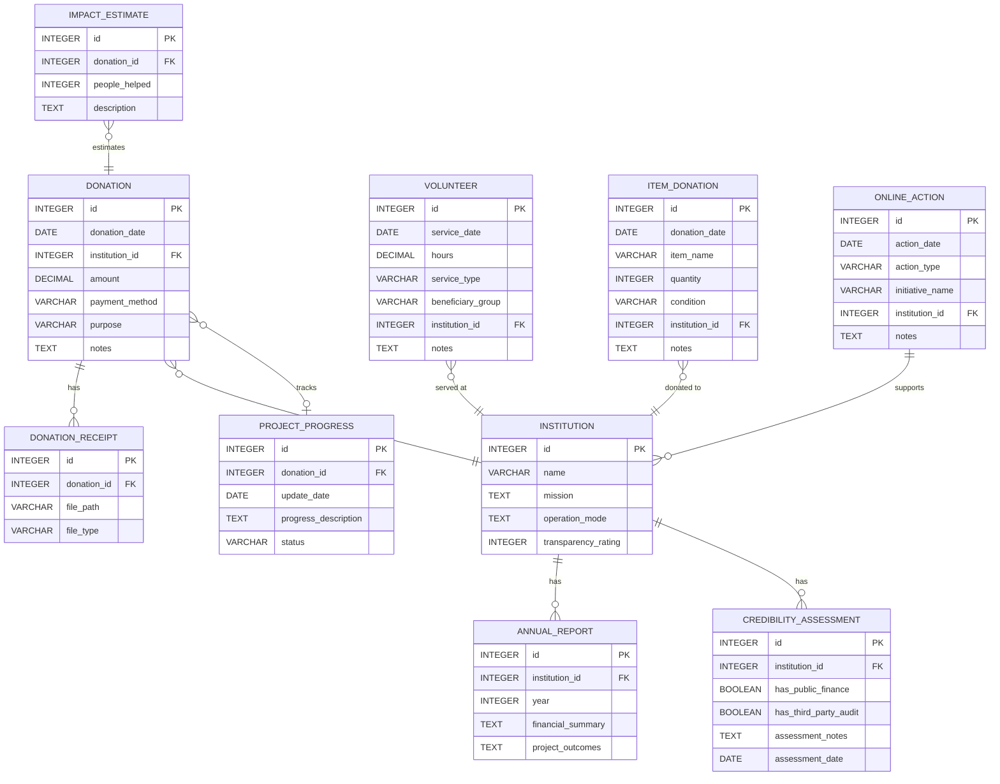

## 1. 架构设计



## 2. 技术描述

- 前端：React@18 + TypeScript + TailwindCSS@3 + Vite
- 初始化工具：vite-init
- 后端：Express@4 + TypeScript
- 数据库：SQLite + better-sqlite3
- 状态管理：Zustand
- 路由：React Router DOM
- 图标：lucide-react
- 图表：recharts
- 路由管理：Vite 代理 + Express API

## 3. 路由定义

| 前端路由 | 页面用途 |
|---------|----------|
| / | 首页仪表盘 |
| /donations | 捐款记录列表 |
| /donations/new | 新增捐款记录 |
| /donations/statistics | 机构捐款统计 |
| /institutions | 机构列表 |
| /institutions/new | 新增机构档案 |
| /institutions/:id | 机构详情 |
| /participation/volunteer | 志愿服务记录 |
| /participation/items | 捐物记录 |
| /participation/online | 线上公益行动 |
| /tracking/progress | 项目进展追踪 |
| /tracking/impact | 影响力估算 |
| /report | 年度公益报告 |

后端 API 路由：

| 路由 | 方法 | 用途 |
|------|------|------|
| /api/donations | GET | 获取捐款记录列表 |
| /api/donations | POST | 创建捐款记录 |
| /api/donations/:id | PUT | 更新捐款记录 |
| /api/donations/:id | DELETE | 删除捐款记录 |
| /api/donations/statistics | GET | 获取机构捐款统计 |
| /api/institutions | GET | 获取机构列表 |
| /api/institutions | POST | 创建机构档案 |
| /api/institutions/:id | GET | 获取机构详情 |
| /api/institutions/:id | PUT | 更新机构档案 |
| /api/institutions/:id | DELETE | 删除机构档案 |
| /api/volunteer | GET | 获取志愿服务记录 |
| /api/volunteer | POST | 创建志愿服务记录 |
| /api/items | GET | 获取捐物记录 |
| /api/items | POST | 创建捐物记录 |
| /api/online-actions | GET | 获取线上行动记录 |
| /api/online-actions | POST | 创建线上行动记录 |
| /api/progress | GET | 获取项目进展 |
| /api/progress | POST | 创建项目进展 |
| /api/impact | GET | 获取影响力估算 |
| /api/report/annual | GET | 获取年度报告数据 |

## 4. 数据模型

### 6.1 数据模型定义



### 6.2 数据定义语言

```sql
CREATE TABLE institutions (
    id INTEGER PRIMARY KEY AUTOINCREMENT,
    name VARCHAR(255) NOT NULL,
    mission TEXT,
    operation_mode TEXT,
    transparency_rating INTEGER CHECK (transparency_rating BETWEEN 1 AND 5),
    created_at DATETIME DEFAULT CURRENT_TIMESTAMP
);

CREATE TABLE donations (
    id INTEGER PRIMARY KEY AUTOINCREMENT,
    donation_date DATE NOT NULL,
    institution_id INTEGER REFERENCES institutions(id),
    amount DECIMAL(10,2) NOT NULL,
    payment_method VARCHAR(100),
    purpose VARCHAR(255),
    notes TEXT,
    created_at DATETIME DEFAULT CURRENT_TIMESTAMP
);

CREATE TABLE donation_receipts (
    id INTEGER PRIMARY KEY AUTOINCREMENT,
    donation_id INTEGER REFERENCES donations(id),
    file_path VARCHAR(500) NOT NULL,
    file_type VARCHAR(50),
    created_at DATETIME DEFAULT CURRENT_TIMESTAMP
);

CREATE TABLE annual_reports (
    id INTEGER PRIMARY KEY AUTOINCREMENT,
    institution_id INTEGER REFERENCES institutions(id),
    year INTEGER NOT NULL,
    financial_summary TEXT,
    project_outcomes TEXT,
    created_at DATETIME DEFAULT CURRENT_TIMESTAMP
);

CREATE TABLE credibility_assessments (
    id INTEGER PRIMARY KEY AUTOINCREMENT,
    institution_id INTEGER REFERENCES institutions(id),
    has_public_finance BOOLEAN DEFAULT 0,
    has_third_party_audit BOOLEAN DEFAULT 0,
    assessment_notes TEXT,
    assessment_date DATE,
    created_at DATETIME DEFAULT CURRENT_TIMESTAMP
);

CREATE TABLE volunteer_records (
    id INTEGER PRIMARY KEY AUTOINCREMENT,
    service_date DATE NOT NULL,
    hours DECIMAL(5,2) NOT NULL,
    service_type VARCHAR(100),
    beneficiary_group VARCHAR(255),
    institution_id INTEGER REFERENCES institutions(id),
    notes TEXT,
    created_at DATETIME DEFAULT CURRENT_TIMESTAMP
);

CREATE TABLE item_donations (
    id INTEGER PRIMARY KEY AUTOINCREMENT,
    donation_date DATE NOT NULL,
    item_name VARCHAR(255) NOT NULL,
    quantity INTEGER DEFAULT 1,
    condition VARCHAR(50),
    institution_id INTEGER REFERENCES institutions(id),
    notes TEXT,
    created_at DATETIME DEFAULT CURRENT_TIMESTAMP
);

CREATE TABLE online_actions (
    id INTEGER PRIMARY KEY AUTOINCREMENT,
    action_date DATE NOT NULL,
    action_type VARCHAR(100),
    initiative_name VARCHAR(255),
    institution_id INTEGER REFERENCES institutions(id),
    notes TEXT,
    created_at DATETIME DEFAULT CURRENT_TIMESTAMP
);

CREATE TABLE project_progress (
    id INTEGER PRIMARY KEY AUTOINCREMENT,
    donation_id INTEGER REFERENCES donations(id),
    update_date DATE NOT NULL,
    progress_description TEXT NOT NULL,
    status VARCHAR(50),
    created_at DATETIME DEFAULT CURRENT_TIMESTAMP
);

CREATE TABLE impact_estimates (
    id INTEGER PRIMARY KEY AUTOINCREMENT,
    donation_id INTEGER REFERENCES donations(id),
    people_helped INTEGER,
    description TEXT,
    created_at DATETIME DEFAULT CURRENT_TIMESTAMP
);
```
