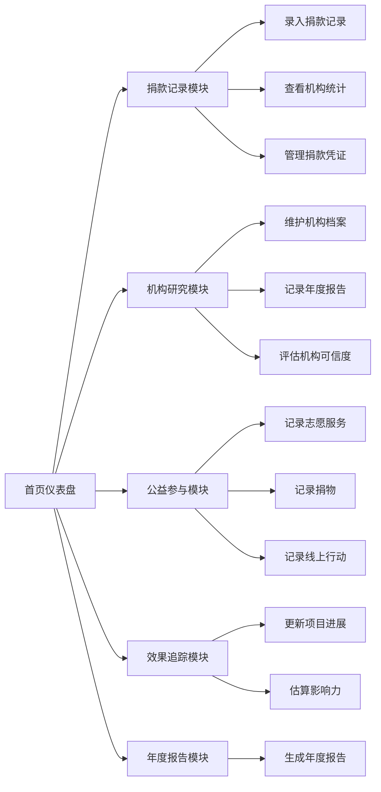

## 1. 产品概述

本产品是一款完整的在线慈善捐款记录和公益参与管理工具，帮助用户系统化管理个人公益行为，追踪捐款去向和影响力。

- 解决用户在公益捐赠和志愿服务过程中记录分散、难以追踪效果、缺乏年度汇总等痛点
- 目标用户为有公益捐赠习惯、关注公益机构透明度、参与志愿服务的个人用户
- 产品价值在于建立个人公益行为的可追溯性、可视化和年度总结

## 2. 核心功能

### 2.1 用户角色

| 角色 | 注册方式 | 核心权限 |
|------|----------|----------|
| 个人用户 | 本地数据存储（无需注册） | 所有功能完整访问，数据本地持久化 |

### 2.2 功能模块

1. **首页仪表盘**：数据概览、快捷操作入口、年度进度
2. **捐款记录模块**：捐款录入、机构合并统计、凭证存档
3. **机构研究模块**：机构档案管理、年度报告摘录、可信度评估
4. **公益参与记录模块**：志愿服务追踪、捐物记录、线上行动记录
5. **捐款效果追踪模块**：项目进展更新、影响力量化估算
6. **年度公益报告模块**：全年捐款和志愿服务汇总

### 2.3 页面详情

| 页面名称 | 模块名称 | 功能描述 |
|---------|----------|----------|
| 首页 | 仪表盘 | 总览年度捐款总额、志愿服务时长、机构数量等关键指标 |
| 捐款记录 | 捐款列表 | 展示历次捐款记录，支持筛选排序 |
| 捐款记录 | 捐款录入表单 | 录入捐款时间、机构、金额、方式、用途 |
| 捐款记录 | 机构统计 | 按机构合并统计累计捐款金额 |
| 捐款记录 | 凭证管理 | 上传/查看捐款收据扫描件或截图 |
| 机构研究 | 机构列表 | 展示关注的公益机构列表 |
| 机构研究 | 机构档案 | 机构名称、使命、运作方式、透明度评级 |
| 机构研究 | 年度报告 | 资金使用情况、项目成果记录 |
| 机构研究 | 可信度评估 | 财务公开、第三方审计记录 |
| 公益参与 | 志愿服务 | 记录服务时长、类型、受益群体 |
| 公益参与 | 捐物记录 | 记录捐赠物品、接收机构 |
| 公益参与 | 线上行动 | 记录网络倡议、公益活动参与 |
| 效果追踪 | 项目进展 | 跟踪捐款用途的后续反馈 |
| 效果追踪 | 影响力估算 | 量化估算捐款帮助人数 |
| 年度报告 | 年度汇总 | 全年捐款总额、志愿服务时长汇总 |
| 年度报告 | 数据可视化 | 图表展示全年公益行为分布 |

## 3. 核心流程

用户进入首页查看数据概览 → 通过导航进入各功能模块 → 录入/查看/编辑相关记录 → 年底生成年度公益报告

## 4. 用户界面设计

### 4.1 设计风格

- 主色调：温暖的赤陶色 #E07A5F，传递公益温暖感
- 辅助色：深森林绿 #3D405B，代表信任与成长
- 中性色：米白色 #F4F1DE，柔和舒适
- 按钮风格：圆润边角，微立体阴影，hover时有轻微上浮效果
- 字体：标题使用 "Playfair Display"，正文使用 "Source Sans Pro"
- 布局风格：卡片式布局，顶部导航，内容区左右分栏
- 图标：使用 lucide-react 线性图标，简约现代

### 4.2 页面设计概览

| 页面名称 | 模块名称 | UI 元素 |
|-----------|----------|----------|
| 首页 | 仪表盘 | 大卡片展示关键指标，数据渐变色背景，轻微动画入场 |
| 捐款记录 | 列表 | 表格展示，行hover高亮，筛选栏固定顶部 |
| 表单弹窗 | 表单 | 半透明毛玻璃背景，表单元素优雅过渡 |
| 机构研究 | 卡片网格 | 悬停放大效果，透明度评级用色块标识 |
| 年度报告 | 图表区 | 环形图、柱状图数据可视化 |

### 4.3 响应式设计

- 桌面端（>1024px)：三栏布局，左侧导航，中间主内容，右侧详情
- 平板端（768-1024px)：两栏布局，顶部导航栏，主内容自适应
- 移动端（<768px)：单栏布局，底部Tab导航，卡片堆叠
- 触摸优化：按钮最小44px，滑动删除操作
