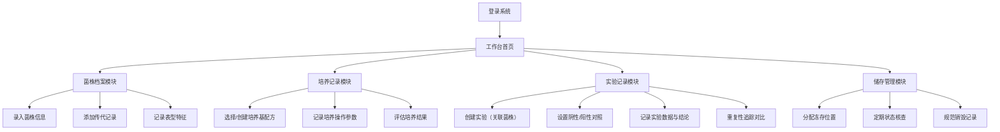

## 1. 产品概述

微生物培养和实验室菌株管理工具，为科研实验室提供完整的菌株全生命周期数字化管理解决方案。
- 解决实验室菌株信息分散、传代追溯困难、培养记录不规范、储存管理混乱等问题
- 服务于微生物学、生物技术、医药等领域的科研人员和实验管理人员

## 2. 核心功能

### 2.1 用户角色

| 角色 | 注册方式 | 核心权限 |
|------|----------|----------|
| 管理员 | 系统创建 | 全部功能、用户管理、系统配置 |
| 实验人员 | 管理员邀请 | 菌株录入/查询、培养记录、实验记录、储存操作 |
| 访客 | 无（只读） | 信息浏览、数据查询 |

### 2.2 功能模块

1. **工作台首页**：数据概览、快捷操作、待办提醒、统计图表
2. **菌株档案模块**：菌株基本信息、传代记录、表型特征记录
3. **培养记录模块**：培养基配方管理、培养操作记录、培养结果评估
4. **实验记录模块**：实验全流程记录、重复性追踪、对照记录
5. **储存管理模块**：冻存位置管理、状态核查、销毁记录

### 2.3 页面详情

| 页面名称 | 模块名称 | 功能描述 |
|----------|----------|----------|
| 工作台首页 | 数据概览卡片 | 菌株总数、培养中数量、冻存数量、本月新增统计 |
| 工作台首页 | 快捷操作区 | 快速添加入口（新建菌株/培养/实验/入库） |
| 工作台首页 | 待办提醒列表 | 冻存核查提醒、传代提醒、近期实验安排 |
| 工作台首页 | 统计图表 | 菌株分类分布、月度增长趋势、安全等级分布 |
| 菌株档案页 | 菌株列表 | 筛选、搜索、分页、导出功能 |
| 菌株档案页 | 菌株详情 | 基本信息、传代记录、表型特征三大标签页 |
| 菌株档案页 | 新增/编辑 | 完整表单录入（名称/来源/分类/培养条件/安全等级/冻存位置） |
| 菌株档案页 | 传代记录管理 | 时间、传代次数、操作人、备注的增删改查 |
| 菌株档案页 | 表型特征记录 | 菌落形态、革兰氏染色、运动性、大小、形状、颜色等 |
| 培养记录页 | 培养基配方库 | 配方列表、成分配比、灭菌方法、pH调节记录 |
| 培养记录页 | 培养操作记录 | 接种量、温度、时间、通气条件、培养基选择 |
| 培养记录页 | 培养结果评估 | 生长速度、形态观察、密度测量、异常记录 |
| 实验记录页 | 实验列表 | 按菌株/日期/类型筛选，实验状态标签 |
| 实验记录页 | 实验详情 | 实验目的、方案、原始数据、结论标准格式 |
| 实验记录页 | 重复性追踪 | 相同实验多次重复的数据对比、一致性评分 |
| 实验记录页 | 对照记录 | 阴性对照、阳性对照的设置和结果记录 |
| 储存管理页 | 位置可视化 | 冰箱→冻存盒→位置的层级树形结构 |
| 储存管理页 | 冻存状态核查 | 活性检测记录、下次核查日期、补充提醒 |
| 储存管理页 | 销毁记录 | 销毁原因、操作人、审批流程、日期归档 |

## 3. 核心流程

主要用户流程：实验人员登录后，可从工作台快速进入各模块。新建菌株时，录入完整档案信息，分配冻存位置；进行培养实验时，选择培养基配方，记录培养参数和结果；开展实验时，以菌株为对象记录完整实验流程，设置对照组并追踪重复性；定期进行冻存状态核查，必要时补充传代或规范销毁。

## 4. 用户界面设计

### 4.1 设计风格
- **主色调**：科技蓝（#165DFF）作为主色，搭配青绿（#00B42A）作为生长/成功色，橙红（#F53F3F）作为危险/警告色
- **辅助色**：灰色系（#4E5969 / #86909C），浅灰背景（#F2F3F5）
- **按钮样式**：圆角8px，主按钮实心带轻微阴影，次要按钮描边式，禁用态灰色
- **字体**：标题使用思源黑体（Noto Sans SC）700粗体，正文使用思源黑体400/500，数据展示使用等宽字体JetBrains Mono
- **布局风格**：左侧导航栏 + 顶部面包屑 + 内容区卡片式布局，信息密集但层次清晰
- **图标风格**：线性图标（stroke-width 1.5px），配合微生物主题元素（培养皿、DNA链、显微镜图标）

### 4.2 页面设计概览

| 页面名称 | 模块名称 | UI元素 |
|----------|----------|--------|
| 工作台首页 | 数据概览 | 4张统计卡片（渐变图标+数字+环比），2x2网格 |
| 工作台首页 | 快捷操作 | 4个圆角按钮（带图标+文字），横向排列 |
| 工作台首页 | 待办提醒 | 列表卡片，带状态标签和日期标记，支持勾选完成 |
| 工作台首页 | 统计图表 | 柱状图+饼图并排，浅背景，动画加载 |
| 菌株档案页 | 列表区 | 表格视图，斑马纹，行悬停高亮，支持列筛选 |
| 菌株档案页 | 详情抽屉 | 右侧滑出面板，三标签页切换，表单分组 |
| 培养记录页 | 配方卡片 | 网格布局，成分标签展示，灭菌方式徽章 |
| 培养记录页 | 时间线 | 培养操作记录时间线可视化，关键节点标记 |
| 实验记录页 | 对照面板 | 左右分栏对比（阴性/阳性/实验组），差异高亮 |
| 储存管理页 | 位置树 | 可展开层级树，冰箱→盒→格三级，空/满状态颜色区分 |

### 4.3 响应式设计
- 桌面端（≥1280px）：左侧固定导航（240px）+ 内容区全功能展示
- 平板端（768-1279px）：导航可折叠为图标模式，表格横向滚动
- 移动端（<768px）：顶部汉堡菜单导航，卡片单列布局，关键信息优先展示

### 4.4 交互细节
- 页面切换：0.3s淡入+轻微Y轴位移动画
- 数据加载：骨架屏占位，内容渐显
- 表格行：悬停时背景微变+左侧边框高亮
- 表单验证：实时校验，错误提示红边框+抖动动画
- 按钮点击：0.1s缩放反馈
