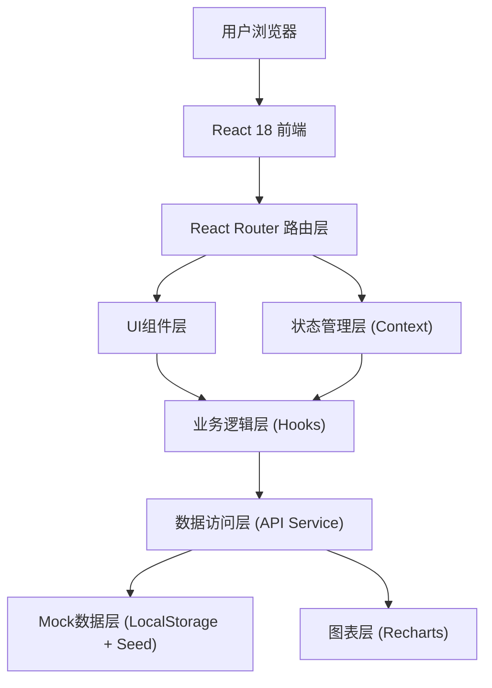
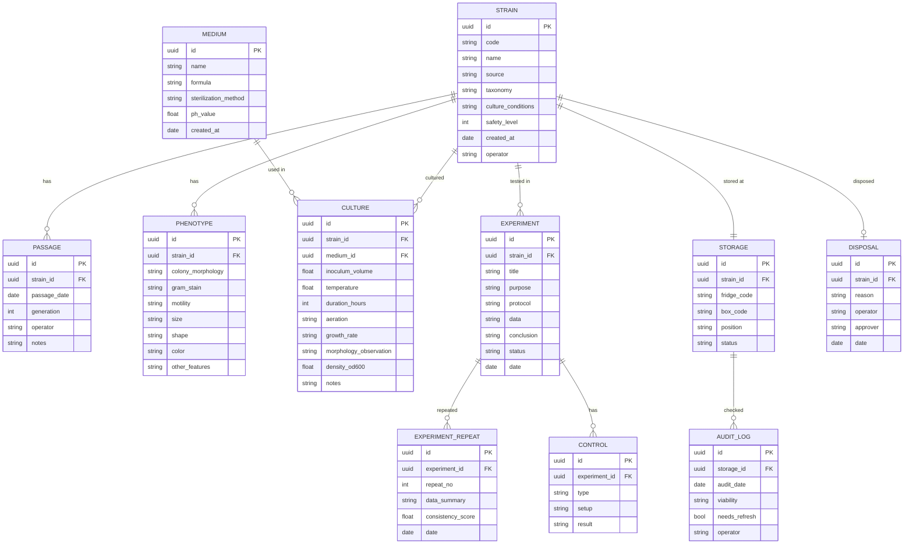

## 1. 架构设计



## 2. 技术描述

- **前端框架**：React@18 + TypeScript + Vite@5
- **样式方案**：TailwindCSS@3 + CSS Variables
- **路由管理**：React Router DOM@6
- **UI组件**：自定义组件库（基于TailwindCSS封装）
- **图表库**：Recharts@2（数据可视化图表）
- **图标库**：Lucide React（线性图标，符合设计规范）
- **状态管理**：React Context + useReducer（轻量级全局状态）
- **数据持久化**：LocalStorage + 内置Mock种子数据
- **表单处理**：React Hook Form + Zod验证
- **初始化工具**：npm create vite@latest

## 3. 路由定义

| 路由路径 | 页面名称 | 用途 |
|----------|----------|------|
| / | 工作台首页 | 数据概览、快捷操作、待办提醒、统计图表 |
| /strains | 菌株档案列表 | 菌株搜索、筛选、分页、列表展示 |
| /strains/:id | 菌株详情页 | 基本信息/传代记录/表型特征标签页 |
| /strains/new | 新增菌株 | 完整表单录入菌株信息 |
| /cultures | 培养记录首页 | 培养基配方库+培养记录时间线 |
| /cultures/media/new | 新增培养基配方 | 成分配比、灭菌方法、pH记录 |
| /cultures/new | 新增培养记录 | 接种参数、条件、结果评估 |
| /experiments | 实验记录列表 | 实验列表、筛选、状态标签 |
| /experiments/:id | 实验详情页 | 实验全流程+对照记录+重复性追踪 |
| /experiments/new | 新建实验 | 标准格式录入实验信息 |
| /storage | 储存管理首页 | 位置树可视化+冻存状态一览 |
| /storage/audit | 冻存核查记录 | 活性检测历史、补充记录 |
| /storage/disposal | 销毁记录 | 销毁申请、审批、归档列表 |

## 4. 数据模型

### 4.1 ER图



### 4.2 种子数据结构

应用启动时自动注入以下Mock数据：
- 8-10株典型菌株（大肠杆菌、枯草芽孢杆菌、金黄色葡萄球菌、酿酒酵母等）
- 每个菌株2-3条传代记录
- 5-6种常用培养基配方（LB、TSA、PDA、NB、SA、YPD）
- 10-12条培养操作记录
- 4-5个完整实验记录（含对照组和重复性数据）
- 完整的冰箱-冻存盒-位置层级（2台冰箱×3个盒子×25格）
- 6-8条核查记录
- 2-3条销毁记录示例

## 5. 核心模块分层

```
src/
├── assets/          # 静态资源
├── components/      # 通用UI组件
│   ├── Layout/      # 导航、侧边栏、面包屑
│   ├── Cards/       # 统计卡片、信息卡片
│   ├── Forms/       # 表单组件封装
│   ├── Tables/      # 数据表格组件
│   └── Common/      # Button, Modal, Badge, Tag
├── pages/           # 页面级组件（按路由划分）
│   ├── Dashboard/
│   ├── Strains/
│   ├── Cultures/
│   ├── Experiments/
│   └── Storage/
├── contexts/        # 全局状态Context
├── hooks/           # 业务逻辑自定义Hooks
├── services/        # 数据访问服务层
├── types/           # TypeScript类型定义
├── utils/           # 工具函数
└── mock/            # Mock数据种子
```
