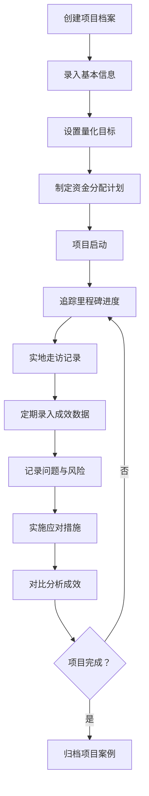

## 1. 产品概述

乡村振兴项目管理和成效追踪工具是一套专为乡村振兴战略实施设计的数字化管理平台，旨在帮助各级政府部门、乡镇干部和项目管理者高效管理乡村振兴项目的全生命周期，实现项目信息透明化、进度可视化、成效可量化、风险可预警。

- **核心目标**：解决乡村振兴项目管理中信息分散、进度难追踪、成效难衡量、风险难预警等痛点问题
- **目标用户**：乡镇干部、乡村振兴工作队员、政府相关部门管理人员、项目实施负责人
- **产品价值**：提升项目管理效率，确保项目落地见效，为政策决策提供数据支撑

## 2. 核心功能

### 2.1 用户角色

| 角色 | 注册方式 | 核心权限 |
|------|----------|----------|
| 系统管理员 | 后台创建 | 用户管理、系统配置、所有模块完整权限 |
| 项目管理员 | 账号注册/后台创建 | 项目档案管理、进度追踪、成效数据录入、风险问题管理 |
| 数据录入员 | 账号注册 | 走访记录、成效数据、问题记录的录入和编辑 |
| 领导查看 | 后台创建 | 所有数据只读权限、数据报表查看 |

### 2.2 功能模块

1. **项目档案模块**：项目基本信息管理、量化目标管理、资金分配计划
2. **实施进度模块**：里程碑追踪、实地走访记录、项目照片时间轴
3. **成效数据模块**：量化指标定期录入、基线与进展对比分析、受益农户案例
4. **问题风险管理模块**：问题记录追踪、风险预警、应对措施管理
5. **数据仪表板**：项目概览、关键指标统计、进度图表展示

### 2.3 页面详情

| 页面名称 | 模块名称 | 功能描述 |
|----------|----------|----------|
| 首页仪表板 | 数据概览 | 项目总数、在建项目数、完成项目数、关键成效指标、风险预警提醒、最新动态列表 |
| 项目档案 | 项目列表 | 项目卡片列表、搜索筛选、分页、新建项目入口 |
| 项目档案 | 项目详情 | 项目基本信息展示与编辑、量化目标表、资金分配进度饼图 |
| 项目档案 | 新建/编辑项目 | 表单录入项目基本信息、量化目标、资金分配子项 |
| 实施进度 | 里程碑管理 | 时间线展示里程碑节点、进度状态标记、完成百分比 |
| 实施进度 | 走访记录 | 走访记录表、新建走访、问题与措施关联 |
| 实施进度 | 照片时间轴 | 施工前/中/后对比照片、时间轴浏览、照片上传 |
| 成效数据 | 指标录入 | 定期数据录入表单、历史数据列表、数据趋势图 |
| 成效数据 | 对比分析 | 基线数据与最新数据对比表、变化百分比、柱状图展示 |
| 成效数据 | 受益案例 | 案例卡片列表、案例详情、新建案例表单 |
| 问题风险 | 问题管理 | 问题列表、状态流转、问题详情与处理记录 |
| 问题风险 | 风险预警 | 风险等级标识、预警列表、应对措施关联 |
| 问题风险 | 风险登记 | 风险评估表单、影响分析、应对计划录入 |

## 3. 核心流程

### 3.1 项目全生命周期管理流程

### 3.2 主要用户操作流程

1. **项目管理员**：登录 → 仪表板 → 新建项目 → 录入档案 → 追踪进度 → 录入成效 → 管理风险 → 查看分析报告
2. **数据录入员**：登录 → 选择项目 → 录入走访记录 → 上传项目照片 → 录入成效指标数据
3. **领导查看**：登录 → 仪表板总览 → 查看项目列表 → 查看详细进度与成效 → 导出分析报告

## 4. 用户界面设计

### 4.1 设计风格

- **设计基调**：自然、清新、富有乡村特色的现代简约风格，传递乡村振兴的生机与活力
- **主色调**：翠绿色（#2E7D32）作为主色，象征农业和生机；暖橙色（#FF8F00）作为辅助色，象征丰收和希望
- **配色方案**：
  - 主色：#2E7D32（深翠绿）
  - 次色：#66BB6A（浅翠绿）、#FF8F00（暖橙）
  - 背景：#F8F9F5（浅米绿）
  - 文本：#1B5E20（深绿标题）、#37474F（深灰正文）
- **按钮风格**：圆角矩形（border-radius: 8px），主色填充，悬停时微亮变亮，点击时微缩
- **卡片风格**：白色背景 + 轻微阴影 + 8px圆角，hover时阴影加深
- **字体**：
  - 标题："Noto Serif SC"（思源宋体），传递稳重专业感
  - 正文："Noto Sans SC"（思源黑体），保证可读性
  - 大小：主标题24-28px，副标题18-20px，正文14px
- **布局风格**：顶部导航栏 + 左侧边栏菜单 + 右侧内容区的经典管理后台布局
- **图标风格**：线性图标（Material Icons），结合乡村元素（稻穗、房屋、农田等）
- **数据可视化**：使用ECharts绘制进度条、饼图、折线图、柱状图，配色与主色调协调

### 4.2 页面设计概述

| 页面名称 | 模块名称 | UI元素 |
|----------|----------|--------|
| 首页仪表板 | 数据概览 | 顶部统计卡片（4个关键指标，带渐变背景和图标）、折线图（项目数量趋势）、进度环（整体完成率）、风险预警列表（红色/黄色标签）、最新动态时间轴 |
| 项目档案 | 项目列表 | 搜索栏 + 筛选标签 + 网格卡片布局，每张卡片显示项目名称、村庄、类型、状态标签、进度条、负责人 |
| 项目档案 | 项目详情 | Tab切换（基本信息/目标/资金），基本信息采用左右两栏布局，目标用表格展示，资金用环形进度图展示 |
| 实施进度 | 里程碑 | 垂直时间轴布局，节点用不同颜色标记状态（绿=完成/蓝=进行中/灰=未开始），带进度条和完成日期 |
| 实施进度 | 照片时间轴 | 水平时间轴，按时间排列照片组，每组展示前中后对比照片，支持点击放大查看 |
| 成效数据 | 对比分析 | 左右两栏布局：左侧基线数据表，右侧最新数据表，中间用箭头指示变化方向和百分比，下方柱状图对比 |
| 成效数据 | 受益案例 | 卡片瀑布流布局，卡片展示农户照片、姓名、村庄、受益摘要，点击展开完整故事 |
| 问题风险 | 风险预警 | 看板布局（三列：高/中/低风险），卡片带风险等级色条，显示风险类型、影响程度、应对状态 |

### 4.3 响应式设计

- **设计原则**：Desktop-first，向下适配平板和移动端
- **断点设置**：
  - Desktop：≥1280px，完整三栏布局
  - Tablet：768px-1279px，侧边栏可折叠，内容区自适应
  - Mobile：<768px，顶部汉堡菜单，内容区单列布局，表格可横向滚动
- **移动端优化**：
  - 导航改为底部Tab栏
  - 表格数据转为卡片列表展示
  - 按钮尺寸≥44×44px，便于触控
  - 图表支持双指缩放

### 4.4 交互动效

- **页面加载**：元素按顺序淡入（animation-delay: 0.1s间隔）
- **卡片悬停**：向上微移2px + 阴影加深 + 边框高亮
- **按钮点击**：scale(0.97)微缩效果
- **数据更新**：数值变化时滚动动画
- **侧边栏**：展开/收起滑入动画（ease-out 0.3s）
- **进度条**：加载时从0到目标值的填充动画
- **风险预警**：高风险项轻微脉冲动画提示
