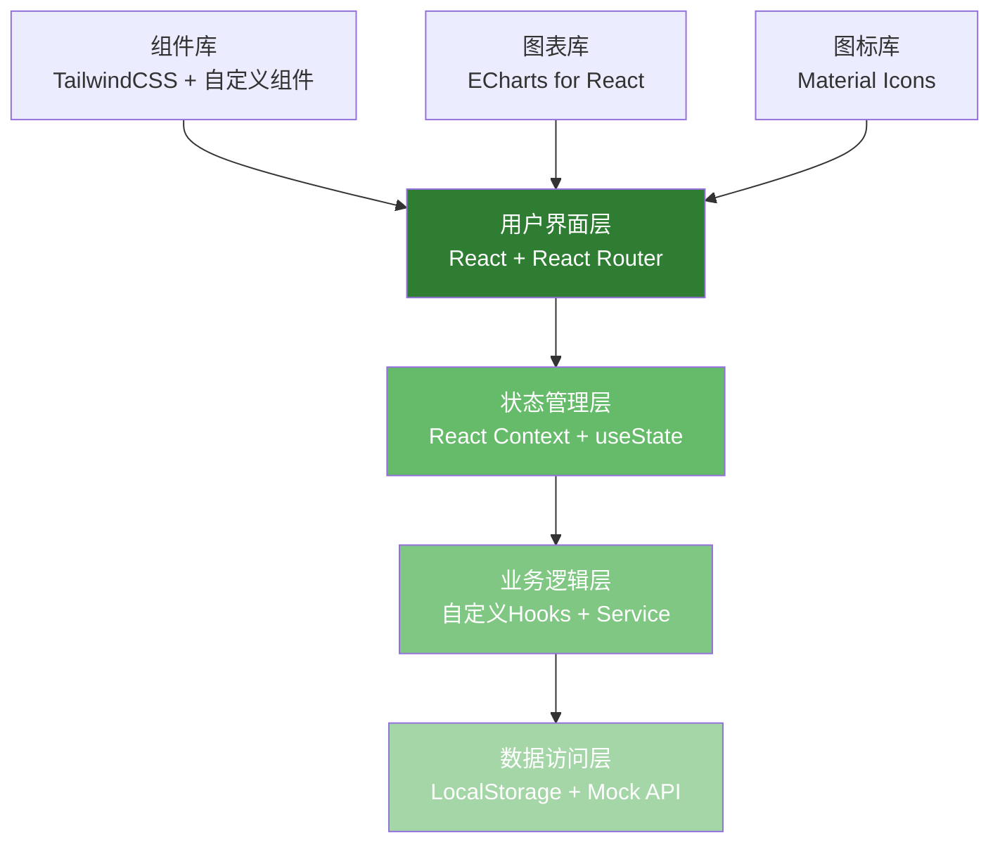
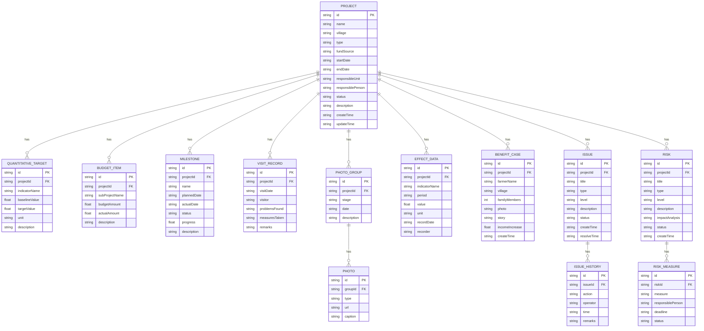

## 1. 架构设计



## 2. 技术描述

- **前端框架**：React@18 + TypeScript，提供类型安全和更好的开发体验
- **构建工具**：Vite@5，提供快速的开发服务器和构建性能
- **样式方案**：TailwindCSS@3，原子化CSS，快速构建UI
- **路由管理**：React Router@6，单页应用路由导航
- **图表可视化**：echarts@5 + echarts-for-react，数据图表展示
- **图标方案**：@mui/icons-material + @mui/material，Material Design图标库
- **状态管理**：React Context + useState，轻量级状态管理
- **数据持久化**：LocalStorage，前端本地存储
- **UI组件**：基于TailwindCSS自定义组件库
- **日期处理**：dayjs，轻量级日期处理库
- **后端**：无后端，使用Mock数据 + LocalStorage模拟数据持久化

## 3. 路由定义

| 路由路径 | 页面名称 | 模块归属 |
|----------|----------|----------|
| / | 首页仪表板 | 数据概览 |
| /projects | 项目列表 | 项目档案 |
| /projects/new | 新建项目 | 项目档案 |
| /projects/:id | 项目详情 | 项目档案 |
| /projects/:id/edit | 编辑项目 | 项目档案 |
| /projects/:id/progress | 实施进度 | 实施进度 |
| /projects/:id/milestones | 里程碑管理 | 实施进度 |
| /projects/:id/visits | 走访记录 | 实施进度 |
| /projects/:id/photos | 照片时间轴 | 实施进度 |
| /projects/:id/effects | 成效数据 | 成效数据 |
| /projects/:id/effects/input | 指标录入 | 成效数据 |
| /projects/:id/effects/analysis | 对比分析 | 成效数据 |
| /projects/:id/effects/cases | 受益案例 | 成效数据 |
| /projects/:id/risks | 问题与风险 | 问题风险 |
| /projects/:id/risks/issues | 问题管理 | 问题风险 |
| /projects/:id/risks/warnings | 风险预警 | 问题风险 |

## 4. 数据模型

### 4.1 数据模型定义



### 4.2 数据结构定义（TypeScript）

```typescript
// 项目基本信息
interface Project {
  id: string;
  name: string;
  village: string;
  type: 'infrastructure' | 'industry' | 'training' | 'environment' | 'other';
  fundSource: string;
  startDate: string;
  endDate: string;
  responsibleUnit: string;
  responsiblePerson: string;
  status: 'planning' | 'ongoing' | 'completed' | 'suspended';
  description: string;
  createTime: string;
  updateTime: string;
}

// 量化目标
interface QuantitativeTarget {
  id: string;
  projectId: string;
  indicatorName: string;
  baselineValue: number;
  targetValue: number;
  unit: string;
  description: string;
}

// 预算分配
interface BudgetItem {
  id: string;
  projectId: string;
  subProjectName: string;
  budgetAmount: number;
  actualAmount: number;
  description: string;
}

// 里程碑
interface Milestone {
  id: string;
  projectId: string;
  name: string;
  plannedDate: string;
  actualDate: string | null;
  status: 'pending' | 'in_progress' | 'completed' | 'delayed';
  progress: number;
  description: string;
}

// 走访记录
interface VisitRecord {
  id: string;
  projectId: string;
  visitDate: string;
  visitor: string;
  problemsFound: string;
  measuresTaken: string;
  remarks: string;
}

// 照片
interface Photo {
  id: string;
  groupId: string;
  type: 'before' | 'during' | 'after';
  url: string;
  caption: string;
}

// 照片组
interface PhotoGroup {
  id: string;
  projectId: string;
  stage: string;
  date: string;
  description: string;
  photos: Photo[];
}

// 成效数据
interface EffectData {
  id: string;
  projectId: string;
  indicatorName: string;
  period: string;
  value: number;
  unit: string;
  recordDate: string;
  recorder: string;
}

// 受益案例
interface BenefitCase {
  id: string;
  projectId: string;
  farmerName: string;
  village: string;
  familyMembers: number;
  photo: string;
  story: string;
  incomeIncrease: number;
  createTime: string;
}

// 问题记录
interface Issue {
  id: string;
  projectId: string;
  title: string;
  type: 'policy' | 'fund' | 'participation' | 'technology' | 'other';
  level: 'high' | 'medium' | 'low';
  description: string;
  status: 'open' | 'processing' | 'resolved' | 'closed';
  createTime: string;
  resolveTime: string | null;
  history: IssueHistory[];
}

// 问题处理历史
interface IssueHistory {
  id: string;
  issueId: string;
  action: string;
  operator: string;
  time: string;
  remarks: string;
}

// 风险
interface Risk {
  id: string;
  projectId: string;
  title: string;
  type: 'policy' | 'economic' | 'natural' | 'social' | 'other';
  level: 'high' | 'medium' | 'low';
  description: string;
  impactAnalysis: string;
  status: 'identified' | 'monitoring' | 'mitigated' | 'occurred';
  createTime: string;
  measures: RiskMeasure[];
}

// 风险应对措施
interface RiskMeasure {
  id: string;
  riskId: string;
  measure: string;
  responsiblePerson: string;
  deadline: string;
  status: 'pending' | 'in_progress' | 'completed';
}
```

### 4.3 Mock数据初始化

```typescript
// 初始Mock数据 - 示例项目
const mockProjects: Project[] = [
  {
    id: '1',
    name: '生态农业示范基地建设',
    village: '和平村',
    type: 'industry',
    fundSource: '中央财政乡村振兴专项资金',
    startDate: '2024-03-01',
    endDate: '2025-12-31',
    responsibleUnit: '县农业农村局',
    responsiblePerson: '张三',
    status: 'ongoing',
    description: '建设1000亩生态农业示范基地，推广有机种植技术，带动村民增收。',
    createTime: '2024-02-15',
    updateTime: '2024-06-10'
  }
];
```

## 5. 项目目录结构

```
project173/
├── .trae/
│   └── documents/
├── src/
│   ├── components/           # 公共组件
│   │   ├── Layout/          # 布局组件
│   │   ├── UI/              # 基础UI组件
│   │   └── Charts/          # 图表组件
│   ├── pages/               # 页面组件
│   │   ├── Dashboard/       # 首页仪表板
│   │   ├── Project/         # 项目档案模块
│   │   ├── Progress/        # 实施进度模块
│   │   ├── Effect/          # 成效数据模块
│   │   └── Risk/            # 问题风险模块
│   ├── context/             # React Context
│   ├── hooks/               # 自定义Hooks
│   ├── types/               # TypeScript类型定义
│   ├── data/                # Mock数据
│   ├── utils/               # 工具函数
│   ├── App.tsx
│   ├── main.tsx
│   └── index.css
├── public/
├── package.json
├── tsconfig.json
├── vite.config.ts
└── tailwind.config.js
```
