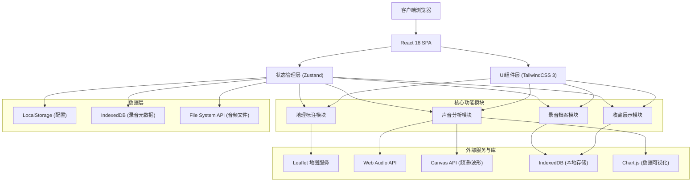
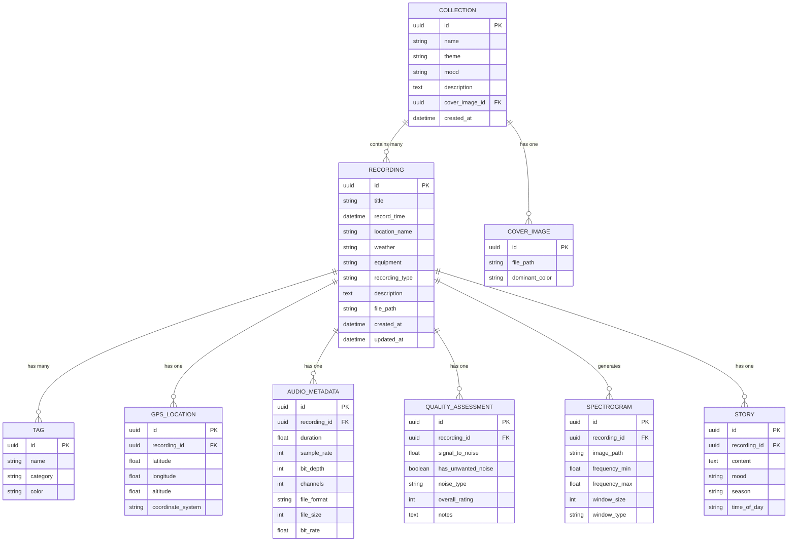

## 1. 架构设计



## 2. 技术描述

### 2.1 技术栈选型

| 层级 | 技术选择 | 版本 | 用途说明 |
|------|----------|------|----------|
| 前端框架 | React | 18.2.0 | 组件化UI开发，使用Hooks |
| 构建工具 | Vite | 5.x | 快速开发与生产构建 |
| 编程语言 | TypeScript | 5.x | 类型安全保障 |
| 样式方案 | TailwindCSS | 3.4.x | 原子化CSS框架 |
| 状态管理 | Zustand | 4.x | 轻量级全局状态管理 |
| 路由管理 | React Router | 6.x | SPA路由导航 |
| 地图服务 | Leaflet | 1.9.x | 交互式地图组件 |
| React-Leaflet | React-Leaflet | 4.2.x | React封装的Leaflet |
| 图表库 | Chart.js | 4.x + react-chartjs-2 | 数据可视化图表 |
| 图标库 | Lucide React | 0.344.x | 现代矢量图标 |
| 本地存储 | IndexedDB (Dexie.js) | 4.x | 结构化数据持久化 |
| 音频处理 | Web Audio API | 原生 | 音频解码、频谱分析 |

### 2.2 项目初始化

- 使用 `npm create vite@latest` 初始化React+TypeScript项目
- 配置 TailwindCSS 3.x 与自定义主题
- 配置路径别名 `@/` 指向 `src/` 目录
- 配置 ESLint + Prettier 代码规范

## 3. 路由定义

| 路由路径 | 页面名称 | 组件文件 |
|----------|----------|----------|
| `/` | 首页仪表板 | `@/pages/Dashboard.tsx` |
| `/archive` | 录音档案列表 | `@/pages/ArchiveList.tsx` |
| `/archive/:id` | 录音详情页 | `@/pages/ArchiveDetail.tsx` |
| `/archive/new` | 新建录音档案 | `@/pages/ArchiveNew.tsx` |
| `/map` | 地图中心 | `@/pages/MapCenter.tsx` |
| `/heatmap` | 声音热力图 | `@/pages/Heatmap.tsx` |
| `/analysis` | 声音分析 | `@/pages/Analysis.tsx` |
| `/analysis/:id` | 单条录音分析 | `@/pages/AnalysisDetail.tsx` |
| `/collections` | 收藏展示 | `@/pages/Collections.tsx` |
| `/collections/:id` | 播放列表详情 | `@/pages/CollectionDetail.tsx` |
| `/journey` | 声音旅行 | `@/pages/SoundJourney.tsx` |

## 4. 数据模型

### 4.1 实体关系图



### 4.2 核心TypeScript类型定义

```typescript
// 录音档案核心类型
interface Recording {
  id: string;
  title: string;
  recordTime: Date;
  locationName: string;
  weather: WeatherType;
  equipment: string;
  recordingType: RecordingType;
  description: string;
  filePath: string;
  tags: Tag[];
  gpsLocation?: GPSLocation;
  audioMetadata?: AudioMetadata;
  qualityAssessment?: QualityAssessment;
  spectrogram?: Spectrogram;
  story?: Story;
  createdAt: Date;
  updatedAt: Date;
}

// 分类标签
type TagCategory = 'birdsong' | 'water' | 'wind' | 'insects' | 'urban' | 'other';
interface Tag {
  id: string;
  name: string;
  category: TagCategory;
  color: string;
}

// GPS位置
interface GPSLocation {
  id: string;
  recordingId: string;
  latitude: number;
  longitude: number;
  altitude?: number;
}

// 音频元数据
interface AudioMetadata {
  id: string;
  recordingId: string;
  duration: number;
  sampleRate: number;
  bitDepth: number;
  channels: number;
  fileFormat: string;
  fileSize: number;
  bitRate: number;
}

// 质量评估
interface QualityAssessment {
  id: string;
  recordingId: string;
  signalToNoise: number;
  hasUnwantedNoise: boolean;
  noiseType?: string;
  overallRating: number;
  notes?: string;
}

// 频谱图
interface Spectrogram {
  id: string;
  recordingId: string;
  imageData: string;
  frequencyMin: number;
  frequencyMax: number;
}

// 录音故事
interface Story {
  id: string;
  recordingId: string;
  content: string;
  mood: string;
  season: string;
  timeOfDay: string;
}

// 收藏集
interface Collection {
  id: string;
  name: string;
  theme: string;
  mood: string;
  description: string;
  recordingIds: string[];
  coverImage?: string;
  createdAt: Date;
}

// 热力图数据点
interface HeatmapPoint {
  lat: number;
  lng: number;
  intensity: number;
  recordingCount: number;
  speciesCount: number;
}

// 时间分布数据
interface TimeDistribution {
  hour: number;
  count: number;
  recordings: string[];
}

// 应用状态
interface AppState {
  recordings: Recording[];
  collections: Collection[];
  tags: Tag[];
  currentRecording: Recording | null;
  isPlaying: boolean;
  currentTime: number;
  activeTab: string;
  mapCenter: [number, number];
  mapZoom: number;
}
```

## 5. 目录结构

```
src/
├── assets/                 # 静态资源
│   ├── fonts/             # 自定义字体
│   ├── icons/             # 图标资源
│   └── textures/          # 背景纹理
├── components/            # 可复用组件
│   ├── audio/             # 音频相关组件
│   │   ├── AudioPlayer.tsx
│   │   ├── Waveform.tsx
│   │   └── Spectrogram.tsx
│   ├── map/               # 地图相关组件
│   │   ├── MapView.tsx
│   │   ├── HeatmapLayer.tsx
│   │   └── RecordingMarker.tsx
│   ├── ui/                # 基础UI组件
│   │   ├── Button.tsx
│   │   ├── Card.tsx
│   │   ├── Input.tsx
│   │   ├── Modal.tsx
│   │   ├── Tabs.tsx
│   │   └── Tag.tsx
│   └── layout/            # 布局组件
│       ├── Header.tsx
│       ├── Sidebar.tsx
│       └── Footer.tsx
├── pages/                 # 页面组件
│   ├── Dashboard.tsx
│   ├── ArchiveList.tsx
│   ├── ArchiveDetail.tsx
│   ├── ArchiveNew.tsx
│   ├── MapCenter.tsx
│   ├── Heatmap.tsx
│   ├── Analysis.tsx
│   ├── AnalysisDetail.tsx
│   ├── Collections.tsx
│   ├── CollectionDetail.tsx
│   └── SoundJourney.tsx
├── store/                 # 状态管理
│   ├── useRecordingStore.ts
│   ├── useCollectionStore.ts
│   ├── usePlayerStore.ts
│   └── useMapStore.ts
├── hooks/                 # 自定义Hooks
│   ├── useAudioAnalysis.ts
│   ├── useGeolocation.ts
│   ├── useIndexedDB.ts
│   └── useWaveform.ts
├── utils/                 # 工具函数
│   ├── audio.ts           # 音频处理
│   ├── geo.ts             # 地理计算
│   ├── color.ts           # 颜色处理
│   └── date.ts            # 日期处理
├── types/                 # 类型定义
│   ├── index.ts
│   ├── recording.ts
│   ├── map.ts
│   └── audio.ts
├── data/                  # Mock数据
│   ├── recordings.ts
│   ├── collections.ts
│   └── tags.ts
├── App.tsx
├── main.tsx
├── index.css
└── vite-env.d.ts
```

## 6. 关键技术方案

### 6.1 音频分析方案

1. **Web Audio API 频谱分析**：
   - 使用 `AnalyserNode` 获取频域数据
   - FFT大小设为2048，平滑时间常数0.8
   - 支持实时和离线分析两种模式

2. **频谱图生成**：
   - Canvas 2D API绘制热力频谱图
   - 颜色映射：使用HSL色彩空间从蓝(低频)到红(高频)
   - 支持缩放和平移交互

3. **波形可视化**：
   - 解码音频文件获取PCM数据
   - 降采样处理以提高性能
   - 支持选区播放和时间戳标记

### 6.2 地图可视化方案

1. **Leaflet地图集成**：
   - 使用 OpenStreetMap 底图
   - 自定义录音标记点（声波形图标）
   - 支持聚合标记（MarkerCluster）

2. **热力图实现**：
   - 基于录音点密度计算热力值
   - 支持按标签/季节/时间过滤
   - 渐变色彩：绿色(低密度) → 黄色 → 红色(高密度)

3. **时间对比功能**：
   - 双地图同步视图
   - 时间轴滑块控制
   - 季节切换动画

### 6.3 数据持久化方案

1. **IndexedDB (Dexie.js)**：
   - 存储录音元数据、标签、收藏集
   - 支持复杂查询和索引
   - 大容量存储（>50MB）

2. **File System Access API**：
   - 音频文件本地管理
   - 增量导入导出

3. **LocalStorage**：
   - 用户偏好设置
   - 界面状态记忆

### 6.4 性能优化

1. **虚拟列表**：录音列表使用 `react-window` 实现大数据量滚动
2. **懒加载**：频谱图、波形图按需生成
3. **Web Worker**：音频分析在Worker线程执行，避免UI阻塞
4. **缓存策略**：分析结果缓存，避免重复计算
