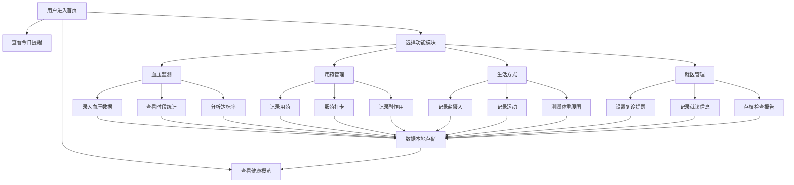

## 1. 产品概述

本产品是一款面向高血压及慢性病患者的在线自我管理追踪工具，旨在帮助用户系统化地监测健康数据、管理用药、改善生活方式、记录就医信息，从而实现疾病的科学管理和预防并发症。通过直观的数据可视化和智能提醒功能，为用户提供全方位的健康管理支持。

## 2. 核心功能

### 2.1 用户角色

| 角色 | 注册方式 | 核心权限 |
|------|----------|----------|
| 普通用户 | 直接使用（本地存储） | 录入、查看、分析所有健康数据 |

### 2.2 功能模块

1. **首页仪表盘**：健康概览、核心指标卡片、趋势图表、今日提醒
2. **血压监测**：血压数据录入、早晚时段统计、控制达标率分析
3. **用药管理**：用药记录、依从性追踪、副作用记录
4. **生活方式**：盐摄入记录、运动追踪、体重腰围管理
5. **就医管理**：复诊提醒、就诊记录、检查报告存档

### 2.3 页面详情

| 页面名称 | 模块名称 | 功能描述 |
|----------|----------|----------|
| 首页仪表盘 | 健康概览卡片 | 最新血压、今日用药、本周运动、BMI指数 |
| 首页仪表盘 | 趋势图表 | 血压趋势折线图、体重变化趋势、用药依从率 |
| 首页仪表盘 | 今日提醒 | 待服药提醒、复诊预约提醒、测量提醒 |
| 血压监测 | 数据录入表单 | 收缩压/舒张压/心率/测量时间/测量条件/使用设备 |
| 血压监测 | 时段统计 | 清晨血压统计、睡前血压统计、分时段平均值对比 |
| 血压监测 | 达标率分析 | 目标范围设置、达标次数统计、达标率百分比展示 |
| 血压监测 | 历史记录 | 按日期筛选、数据列表、支持编辑删除 |
| 用药管理 | 用药记录 | 药名/剂量/服药时间/处方医生录入 |
| 用药管理 | 依从性追踪 | 每日服药打卡、按时/漏服/延迟服药状态记录、周/月依从率统计 |
| 用药管理 | 副作用记录 | 症状描述、发生时间、严重程度、是否就医反映 |
| 生活方式 | 盐摄入记录 | 每日食盐估算、高盐食物标记、周平均摄入统计 |
| 生活方式 | 运动追踪 | 步数、有氧运动时间、运动强度、周运动时长统计 |
| 生活方式 | 体重腰围 | 体重、腰围录入、BMI自动计算、变化趋势图 |
| 就医管理 | 复诊提醒 | 设置复诊日期、倒计时提醒、可重复周期设置 |
| 就医管理 | 就诊记录 | 就诊日期、医院科室、医生诊断、用药调整方案 |
| 就医管理 | 检查报告 | 尿检/肾功能/心电图等检查结果存档、附件上传占位 |

## 3. 核心流程

用户打开应用后，首先在首页仪表盘查看健康概览和今日提醒；通过导航栏进入各功能模块进行数据录入或查看统计分析。系统将所有数据存储在本地，确保隐私安全。

## 4. 用户界面设计

### 4.1 设计风格

- **主色调**：医疗蓝 (#2563EB) 作为主色，搭配清新青绿 (#10B981) 作为辅助色，传达专业、可信、健康的品牌形象
- **背景**：渐变浅蓝灰底色，搭配柔和的磨砂玻璃质感卡片
- **按钮风格**：圆角胶囊形按钮，带微阴影和悬停浮起效果
- **字体**：展示字体使用"Noto Sans SC"，标题粗体，正文常规，保证中文可读性
- **布局风格**：左侧导航栏 + 右侧内容区的经典管理后台布局，卡片式内容分组
- **图标风格**：线性简洁图标，使用 Lucide React 图标库
- **整体氛围**：专业医疗感 + 温暖关怀，避免冰冷的医疗界面，增加柔和渐变和细腻动效

### 4.2 页面设计概览

| 页面名称 | 模块名称 | UI元素 |
|----------|----------|--------|
| 首页仪表盘 | 健康概览卡片 | 渐变背景卡片、大字号数据展示、趋势小箭头指示、色彩区分指标状态 |
| 首页仪表盘 | 趋势图表 | 平滑折线图、区域渐变填充、悬浮数据提示、时间切换标签 |
| 血压监测 | 数据录入表单 | 两列网格布局、大号数字输入框、时段自动检测、设备选择下拉 |
| 血压监测 | 达标率分析 | 环形进度图、目标范围对比柱状图、时段对比卡片 |
| 用药管理 | 依从性追踪 | 日历式打卡视图、绿色/黄色/红色状态标识、周/月统计百分比 |
| 生活方式 | 体重趋势 | BMI自动计算、进度条指示健康范围、趋势面积图 |
| 就医管理 | 复诊提醒 | 倒计时组件、彩色优先级标识、日历标记 |

### 4.3 响应式

- 桌面端优先设计（1280px及以上）
- 平板端（768px-1279px）：左侧导航栏收起为图标模式，内容区自适应
- 移动端（<768px）：底部Tab导航，内容区单列布局，表单优化为单列，图表简化展示
- 所有交互元素支持触摸操作，确保最小点击区域44x44px

