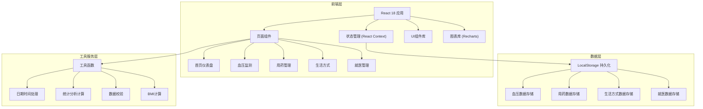

## 1. 架构设计



## 2. 技术说明

- **前端框架**：React 18 + TypeScript
- **构建工具**：Vite 5
- **样式方案**：TailwindCSS 3
- **状态管理**：React Context + useReducer
- **图表库**：Recharts 2
- **图标库**：Lucide React
- **后端**：无（纯前端应用）
- **数据存储**：浏览器 LocalStorage（数据加密存储）
- **Mock数据**：内置示例数据，首次访问自动生成

## 3. 路由定义

| 路由 | 页面用途 |
|------|----------|
| / | 首页仪表盘 - 健康概览、核心指标、趋势图表、今日提醒 |
| /blood-pressure | 血压监测 - 数据录入、时段统计、达标率分析、历史记录 |
| /medication | 用药管理 - 用药记录、依从性追踪、副作用记录 |
| /lifestyle | 生活方式 - 盐摄入、运动追踪、体重腰围管理 |
| /medical | 就医管理 - 复诊提醒、就诊记录、检查报告存档 |

## 4. 数据模型

### 4.1 数据模型定义

```mermaid
erDiagram
    BLOOD_PRESSURE {
        string id PK
        number systolic
        number diastolic
        number heartRate
        string measureTime
        string period
        string condition
        string device
        string createdAt
    }
    
    MEDICATION {
        string id PK
        string name
        string dosage
        string time
        string doctor
        string createdAt
    }
    
    MEDICATION_ADHERENCE {
        string id PK
        string medicationId FK
        string date
        string status
        string timeTaken
        string note
    }
    
    SIDE_EFFECT {
        string id PK
        string medicationId FK
        string symptom
        string occurDate
        string severity
        boolean reportedToDoctor
        string note
    }
    
    SALT_INTAKE {
        string id PK
        string date
        number amount
        string note
    }
    
    EXERCISE {
        string id PK
        string date
        number steps
        number aerobicMinutes
        string intensity
        string note
    }
    
    BODY_MEASUREMENT {
        string id PK
        string date
        number weight
        number height
        number waist
        number bmi
    }
    
    APPOINTMENT {
        string id PK
        string date
        string hospital
        string department
        string doctor
        string purpose
        string repeatCycle
        boolean reminded
    }
    
    VISIT_RECORD {
        string id PK
        string date
        string hospital
        string department
        string doctor
        string diagnosis
        string medicationChange
        string note
    }
    
    EXAM_REPORT {
        string id PK
        string date
        string examType
        string hospital
        string result
        string note
    }
```



### 4.2 TypeScript 类型定义

```typescript
// 血压记录
interface BloodPressureRecord {
  id: string;
  systolic: number;
  diastolic: number;
  heartRate: number;
  measureTime: string;
  period: 'morning' | 'evening' | 'other';
  condition: string;
  device: string;
  createdAt: string;
}

// 用药记录
interface MedicationRecord {
  id: string;
  name: string;
  dosage: string;
  time: string;
  doctor: string;
  createdAt: string;
}

// 用药依从性
interface MedicationAdherence {
  id: string;
  medicationId: string;
  date: string;
  status: 'taken_on_time' | 'taken_late' | 'missed';
  timeTaken?: string;
  note?: string;
}

// 副作用记录
interface SideEffectRecord {
  id: string;
  medicationId?: string;
  symptom: string;
  occurDate: string;
  severity: 'mild' | 'moderate' | 'severe';
  reportedToDoctor: boolean;
  note?: string;
}

// 盐摄入记录
interface SaltIntakeRecord {
  id: string;
  date: string;
  amount: number;
  note?: string;
}

// 运动记录
interface ExerciseRecord {
  id: string;
  date: string;
  steps: number;
  aerobicMinutes: number;
  intensity: 'low' | 'medium' | 'high';
  note?: string;
}

// 身体测量
interface BodyMeasurementRecord {
  id: string;
  date: string;
  weight: number;
  height: number;
  waist: number;
  bmi: number;
}

// 复诊提醒
interface AppointmentRecord {
  id: string;
  date: string;
  hospital: string;
  department: string;
  doctor: string;
  purpose: string;
  repeatCycle: 'none' | 'monthly' | 'quarterly' | 'yearly';
  reminded: boolean;
}

// 就诊记录
interface VisitRecord {
  id: string;
  date: string;
  hospital: string;
  department: string;
  doctor: string;
  diagnosis: string;
  medicationChange: string;
  note?: string;
}

// 检查报告
interface ExamReportRecord {
  id: string;
  date: string;
  examType: string;
  hospital: string;
  result: string;
  note?: string;
}
```

## 5. 项目目录结构

```
src/
├── components/          # 通用组件
│   ├── Layout/         # 布局组件
│   ├── Charts/         # 图表组件
│   ├── Forms/          # 表单组件
│   └── Cards/          # 卡片组件
├── pages/              # 页面组件
│   ├── Dashboard/      # 首页仪表盘
│   ├── BloodPressure/  # 血压监测
│   ├── Medication/     # 用药管理
│   ├── Lifestyle/      # 生活方式
│   └── Medical/        # 就医管理
├── context/            # React Context
├── hooks/              # 自定义Hooks
├── utils/              # 工具函数
├── types/              # TypeScript类型定义
├── data/               # Mock数据
├── App.tsx
├── main.tsx
└── index.css
```

