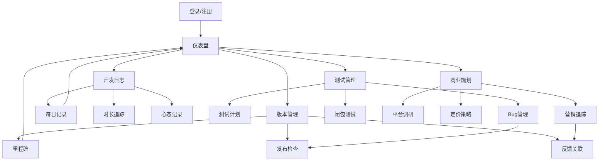

## 1. 产品概述

独立游戏开发项目日志与迭代管理工具 —— 为独立游戏开发者打造的一站式项目管理平台，集成开发日志、版本管理、测试管理和商业规划四大核心模块，帮助开发者系统化追踪开发进度、管理版本迭代、协调测试流程并规划商业策略。

- 解决独立游戏开发过程中缺乏系统化管理工具的痛点，将散落在各处的开发记录、版本信息、测试反馈和商业决策统一管理
- 目标用户为独立游戏开发者和小型游戏开发团队，提供从创意到发布的全流程管理能力

## 2. 核心功能

### 2.1 用户角色

| 角色 | 注册方式 | 核心权限 |
|------|----------|----------|
| 独立开发者 | 邮箱注册 | 完整使用所有功能模块 |
| 团队成员 | 邀请加入 | 查看/编辑分配的项目模块 |
| 测试者 | 邀请链接 | 提交Bug反馈和体验评价 |

### 2.2 功能模块

1. **仪表盘页面**：项目概览、近期活动流、关键指标卡片、快捷入口
2. **开发日志页面**：每日开发记录、时长追踪日历、心态曲线图、日志时间线
3. **版本管理页面**：里程碑时间线、版本发布检查清单、用户反馈关联
4. **测试管理页面**：测试计划看板、Bug分级列表、闭包测试记录
5. **商业规划页面**：平台调研对比、定价策略分析、营销活动追踪
6. **设置页面**：项目基本信息、团队成员管理、数据导入导出

### 2.3 页面详情

| 页面名称 | 模块名称 | 功能描述 |
|----------|----------|----------|
| 仪表盘 | 项目概览卡片 | 显示项目名称、当前版本、开发天数、距下个里程碑倒计时 |
| 仪表盘 | 开发统计面板 | 本周开发时长、本月日志条数、Bug修复率、心态趋势 |
| 仪表盘 | 近期活动流 | 最新日志、最新版本、最新Bug、最新反馈的聚合时间线 |
| 仪表盘 | 快捷操作区 | 快速新增日志、创建版本、提交Bug、添加营销活动 |
| 开发日志 | 日志列表 | 按日期倒序展示所有开发日志，支持筛选和搜索 |
| 开发日志 | 新增/编辑日志 | 记录日期、完成功能、技术难题、解决方案、开发时长、心态指数 |
| 开发日志 | 时长追踪日历 | 热力图展示每日开发时长，按月切换查看 |
| 开发日志 | 心态曲线图 | 基于心态指数绘制的时间趋势折线图，标注关键事件 |
| 开发日志 | 日志详情弹窗 | 完整展示单条日志的所有信息，支持编辑和删除 |
| 版本管理 | 里程碑时间线 | 可视化展示版本迭代历程，每个里程碑展示关键信息 |
| 版本管理 | 新增/编辑版本 | 版本号、发布日期、新增功能列表、修复Bug清单、里程碑标签 |
| 版本管理 | 发布检查清单 | 每个版本关联的发布前检查项，支持勾选和自定义模板 |
| 版本管理 | 用户反馈关联 | 按版本分组展示用户评价，支持评分和评论 |
| 版本管理 | 版本对比 | 选择两个版本进行功能/Bug/评价的对比分析 |
| 测试管理 | 测试计划列表 | 展示所有测试计划及其执行状态（待开始/进行中/已完成） |
| 测试管理 | 新增/编辑测试计划 | 测试场景、测试用例、负责人、截止日期 |
| 测试管理 | Bug分级看板 | 按严重程度（崩溃/体验/瑕疵）分列的看板视图 |
| 测试管理 | Bug详情编辑 | Bug描述、复现步骤、严重程度、指派人、状态、关联版本 |
| 测试管理 | 闭包测试记录 | 测试者列表、邀请状态、反馈汇总、评分统计 |
| 商业规划 | 平台调研表 | 各平台（Steam/Epic/App Store等）的上架要求、分成比例、用户群体对比 |
| 商业规划 | 定价策略面板 | 定价方案对比、竞品定价参考、决策记录 |
| 商业规划 | 营销活动日历 | 按时间线展示营销活动，标注效果指标 |
| 商业规划 | 营销活动详情 | 活动名称、平台、预算、执行时间、效果数据（曝光/转化/收益） |
| 设置 | 项目信息 | 项目名称、描述、Logo、开发引擎、目标平台 |
| 设置 | 团队管理 | 成员列表、角色分配、邀请链接生成 |
| 设置 | 数据管理 | 导出项目数据（JSON/CSV）、导入历史项目 |

## 3. 核心流程

**主流程**：开发者登录后进入仪表盘 → 查看项目概览和近期动态 → 根据当前阶段进入不同模块：
- 开发阶段：记录每日开发日志，追踪时长和心态
- 发布阶段：管理版本里程碑，执行发布检查清单
- 测试阶段：创建测试计划，管理Bug和测试者反馈
- 商业阶段：调研平台，制定定价，规划营销活动

## 4. 用户界面设计

### 4.1 设计风格

- **主色调**：深色主题，以暗青色（#0F1923）为基底，搭配荧光绿（#00FF88）作为强调色，营造游戏开发的极客氛围
- **辅助色**：深灰（#1A2332）用于卡片背景，橙色（#FF6B35）用于警告/紧急状态，蓝色（#4A9EFF）用于信息提示
- **按钮风格**：圆角矩形，微弱的发光边框效果，hover时荧光绿发光增强
- **字体**：标题使用 JetBrains Mono（等宽字体，体现代码/开发感），正文使用 Noto Sans SC
- **布局风格**：左侧固定导航栏 + 右侧内容区，卡片式布局，玻璃拟态效果
- **图标风格**：线性图标搭配偶尔的像素风格装饰元素，致敬游戏文化
- **整体氛围**：赛博朋克风格的独立开发者工作室，暗色调中点缀荧光色，像深夜编码时显示器的光

### 4.2 页面设计概览

| 页面名称 | 模块名称 | UI元素 |
|----------|----------|--------|
| 仪表盘 | 项目概览卡片 | 暗色玻璃卡片，左上角项目Logo，右侧显示版本号和开发天数，底部进度条 |
| 仪表盘 | 开发统计面板 | 4个指标卡片横排，每个带小图标和数值，hover时轻微上浮 |
| 仪表盘 | 近期活动流 | 左侧时间轴线，右侧活动条目，不同模块用不同颜色标记 |
| 仪表盘 | 快捷操作区 | 4个操作按钮，荧光绿边框，点击时发光脉冲动画 |
| 开发日志 | 日志列表 | 卡片列表，每张卡片显示日期标签、功能摘要、时长标签、心态表情 |
| 开发日志 | 时长追踪日历 | GitHub贡献图风格的热力图，绿色深浅表示时长 |
| 开发日志 | 心态曲线图 | 暗色背景折线图，线条荧光绿色，关键点悬浮标注 |
| 版本管理 | 里程碑时间线 | 垂直时间线，节点为版本号标签，展开显示功能/Bug列表 |
| 版本管理 | 发布检查清单 | 进度环+检查项列表，完成项打勾带绿色脉冲 |
| 版本管理 | 用户反馈关联 | 按版本分组的评分条形图，hover显示评论摘要 |
| 测试管理 | Bug分级看板 | 三列看板，每列头部带严重程度颜色标识（红/橙/黄） |
| 测试管理 | 闭包测试记录 | 测试者头像网格，点击展开反馈详情面板 |
| 商业规划 | 平台调研表 | 对比表格，带平台Logo和评分雷达图 |
| 商业规划 | 营销活动日历 | 甘特图风格时间线，活动条带渐变色 |

### 4.3 响应式设计

- 桌面优先设计，主要适配1920x1080和1440x900分辨率
- 平板端（768px-1024px）：导航栏折叠为图标模式，卡片从多列变为双列
- 移动端（<768px）：导航栏变为底部标签栏，卡片单列堆叠，表格变为卡片列表

### 4.4 无3D场景
