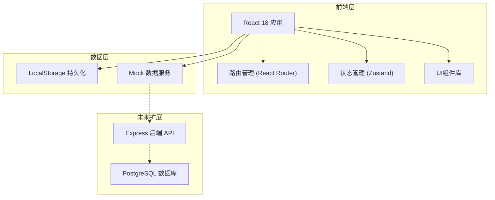
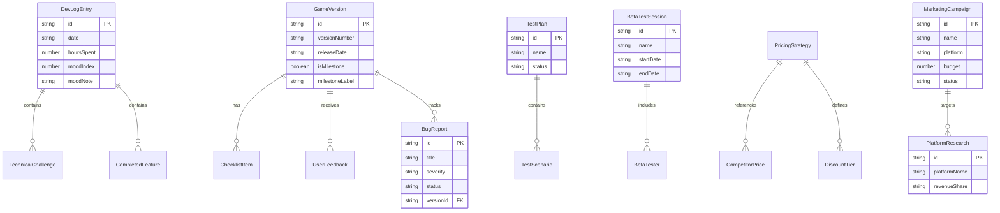

## 1. 架构设计



## 2. 技术说明

- **前端框架**：React@18 + TypeScript
- **样式方案**：Tailwind CSS@3 + CSS Variables（主题色管理）
- **构建工具**：Vite
- **路由管理**：React Router@6
- **状态管理**：Zustand（轻量级，适合中小型应用）
- **图表库**：Recharts（用于心态曲线、评分统计等图表）
- **日期处理**：date-fns
- **图标库**：Lucide React
- **数据持久化**：LocalStorage（当前阶段，无后端依赖）
- **后端**：无（纯前端应用，数据存储在浏览器本地）
- **数据库**：无（使用 LocalStorage 模拟持久化）

## 3. 路由定义

| 路由 | 用途 |
|------|------|
| `/` | 仪表盘 - 项目概览与近期动态 |
| `/devlog` | 开发日志 - 日志列表与追踪 |
| `/devlog/new` | 新增开发日志 |
| `/devlog/:id` | 查看日志详情 |
| `/versions` | 版本管理 - 里程碑与发布管理 |
| `/versions/new` | 新增版本 |
| `/versions/:id` | 版本详情与检查清单 |
| `/testing` | 测试管理 - 测试计划与Bug |
| `/testing/bugs` | Bug分级看板 |
| `/testing/beta` | 闭包测试记录 |
| `/business` | 商业规划 - 平台与定价 |
| `/business/platforms` | 平台调研详情 |
| `/business/pricing` | 定价策略详情 |
| `/business/marketing` | 营销活动追踪 |
| `/settings` | 项目设置 |

## 4. API定义（无后端，使用Mock数据服务）

### 4.1 数据服务接口

```typescript
interface DevLogEntry {
  id: string;
  date: string;
  completedFeatures: string[];
  technicalChallenges: string[];
  solutions: string[];
  hoursSpent: number;
  moodIndex: number; // 1-5
  moodNote: string;
  createdAt: string;
  updatedAt: string;
}

interface GameVersion {
  id: string;
  versionNumber: string;
  releaseDate: string;
  isMilestone: boolean;
  milestoneLabel: string;
  newFeatures: string[];
  fixedBugs: string[];
  releaseChecklist: ChecklistItem[];
  userFeedbacks: UserFeedback[];
  createdAt: string;
}

interface ChecklistItem {
  id: string;
  text: string;
  completed: boolean;
  category: "testing" | "submission" | "marketing" | "other";
}

interface UserFeedback {
  id: string;
  versionId: string;
  rating: number; // 1-5
  comment: string;
  source: string;
  date: string;
}

interface TestPlan {
  id: string;
  name: string;
  description: string;
  scenarios: TestScenario[];
  status: "pending" | "in_progress" | "completed";
  assignee: string;
  deadline: string;
  createdAt: string;
}

interface TestScenario {
  id: string;
  name: string;
  steps: string[];
  expectedResult: string;
  status: "pass" | "fail" | "skip";
}

interface BugReport {
  id: string;
  title: string;
  description: string;
  reproductionSteps: string[];
  severity: "crash" | "experience" | "cosmetic";
  status: "open" | "in_progress" | "resolved" | "wont_fix";
  assignee: string;
  versionId: string;
  createdAt: string;
  resolvedAt: string | null;
}

interface BetaTestSession {
  id: string;
  name: string;
  testers: BetaTester[];
  startDate: string;
  endDate: string;
  summaryNotes: string;
}

interface BetaTester {
  id: string;
  name: string;
  email: string;
  invitationStatus: "pending" | "accepted" | "declined";
  feedback: string;
  rating: number;
}

interface PlatformResearch {
  id: string;
  platformName: string;
  logoUrl: string;
  listingRequirements: string[];
  revenueShare: string;
  userDemographics: string;
  feeStructure: string;
  rating: number;
  notes: string;
}

interface PricingStrategy {
  id: string;
  name: string;
  basePrice: number;
  discountTiers: DiscountTier[];
  competitorPrices: CompetitorPrice[];
  decisionNotes: string;
  decidedAt: string;
}

interface DiscountTier {
  label: string;
  percentage: number;
  condition: string;
}

interface CompetitorPrice {
  gameName: string;
  price: number;
  platform: string;
}

interface MarketingCampaign {
  id: string;
  name: string;
  platform: string;
  budget: number;
  startDate: string;
  endDate: string;
  impressions: number;
  conversions: number;
  revenue: number;
  status: "planned" | "active" | "completed";
  notes: string;
}

interface ProjectSettings {
  projectName: string;
  description: string;
  engine: string;
  targetPlatforms: string[];
  teamMembers: TeamMember[];
}

interface TeamMember {
  id: string;
  name: string;
  email: string;
  role: string;
  avatarUrl: string;
}
```

## 5. 服务端架构（无后端）

当前为纯前端应用，数据通过 LocalStorage 持久化。未来可扩展为前后端分离架构。

## 6. 数据模型

### 6.1 数据模型定义



### 6.2 数据存储结构

LocalStorage 键值设计：

```
gamedev_project_settings    → ProjectSettings
gamedev_dev_logs            → DevLogEntry[]
gamedev_versions            → GameVersion[]
gamedev_test_plans          → TestPlan[]
gamedev_bugs                → BugReport[]
gamedev_beta_sessions       → BetaTestSession[]
gamedev_platform_research   → PlatformResearch[]
gamedev_pricing_strategies  → PricingStrategy[]
gamedev_marketing_campaigns → MarketingCampaign[]
```

每个键对应一个 JSON 序列化的数组或对象，应用启动时从 LocalStorage 读取，状态变更时同步写回。
