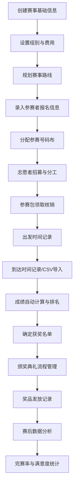

## 1. 产品概述

自行车赛事组织与管理平台，为赛事组织者提供一站式的赛事全流程管理工具，涵盖赛事规划、报名登记、成绩计时、奖项颁发和赛后分析等核心环节。

- 主要解决赛事组织者在赛事运营过程中信息分散、人工统计效率低下、数据管理混乱等问题
- 目标用户为自行车赛事组委会、赛事运营公司、体育赛事管理机构
- 产品价值：提升赛事组织效率，降低运营成本，提供专业化的赛事数据管理与分析能力

## 2. 核心功能

### 2.1 用户角色

| 角色 | 注册方式 | 核心权限 |
|------|----------|----------|
| 赛事管理员 | 系统初始化 | 拥有所有模块的完全管理权限 |
| 赛事工作人员 | 管理员创建 | 可操作报名、计时、物资发放等功能 |
| 志愿者 | 自主注册/管理员录入 | 查看个人分工、任务信息 |

### 2.2 功能模块

1. **首页仪表盘**：赛事概览、关键数据指标、快捷操作入口
2. **赛事管理**：赛事基础信息设置、路线规划、志愿者招募与分工
3. **报名管理**：参赛者信息录入、号码布分配、参赛包领取核销
4. **计时成绩**：出发/到达时间记录、CSV导入、成绩计算与排名
5. **奖项管理**：奖项设置、获奖者记录、颁奖流程、奖品发放
6. **赛后分析**：完赛率统计、完赛时间分布、满意度调查分析

### 2.3 页面详情

| 页面名称 | 模块名称 | 功能描述 |
|----------|----------|----------|
| 首页仪表盘 | 赛事概览卡片 | 展示当前赛事名称、日期、报名人数、完赛率等关键指标 |
| 首页仪表盘 | 数据统计图表 | 报名趋势、组别分布、实时进度等可视化图表 |
| 首页仪表盘 | 快捷操作入口 | 常用功能快速跳转按钮 |
| 赛事管理 | 基础信息设置 | 编辑赛事名称、日期、地点、距离、组别、费用等 |
| 赛事管理 | 路线规划 | 地图标注起终点、补给站、关门时间点，支持拖拽编辑 |
| 赛事管理 | 志愿者管理 | 招募名单、岗位分工、联系信息、到岗状态 |
| 报名管理 | 参赛者列表 | 报名信息展示、筛选、搜索、新增、编辑、删除 |
| 报名管理 | 号码布分配 | 按组别和报名顺序自动分配，支持手动调整 |
| 报名管理 | 参赛包领取 | 核销记录、领取状态筛选、批量操作 |
| 计时成绩 | 计时记录 | 出发/到达时间录入、芯片计时CSV数据导入 |
| 计时成绩 | 成绩计算 | 自动计算净成绩、枪成绩、平均速度 |
| 计时成绩 | 成绩榜单 | 分组成绩榜、总成绩榜，支持导出 |
| 奖项管理 | 奖项设置 | 各组别奖项配置、特设奖项定义 |
| 奖项管理 | 获奖名单 | 自动匹配获奖者、支持手动调整 |
| 奖项管理 | 颁奖流程 | 颁奖顺序安排、流程状态追踪 |
| 奖项管理 | 奖品管理 | 奖品清单、发放记录、库存管理 |
| 赛后分析 | 完赛率统计 | 总体完赛率、各组别完赛率、退赛原因分析 |
| 赛后分析 | 时间分布 | 各组别完赛时间直方图、分段成绩分析 |
| 赛后分析 | 满意度调查 | 调查结果统计、评分分布、意见收集 |

## 3. 核心流程

主要用户流程：赛事管理员创建赛事→设置组别和费用→开放报名（录入参赛者信息）→分配号码布→赛前志愿者分工→参赛者领取参赛包→赛事当日出发计时→终点到达计时→成绩自动计算与排名→确定获奖名单→举办颁奖典礼→赛后数据分析。

## 4. 用户界面设计

### 4.1 设计风格

- **主色调**：深黑色 (#0a0a0a) 背景配合竞速绿 (#00d26a) 作为主强调色，辅以警示橙 (#ff6b35) 用于重要提醒
- **辅助色**：石墨灰 (#1a1a1a) 作为卡片背景，银灰色 (#8a8a8a) 作为次要文字
- **按钮风格**：直角硬边设计，轻微阴影，悬停时边框发光效果
- **字体**：标题使用 "Space Grotesk" 现代几何无衬线字体，正文使用 "IBM Plex Sans" 提升可读性
- **布局风格**：侧边栏导航 + 主内容区的经典管理后台布局，卡片式内容容器
- **图标风格**：线性图标配合竞速绿填充，使用 Tabler Icons 库
- **整体美学**：运动科技感、数据仪表盘风格、深色主题、高对比度、数字显示使用等宽字体

### 4.2 页面设计概述

| 页面名称 | 模块名称 | UI元素 |
|----------|----------|--------|
| 首页仪表盘 | 数据指标卡片 | 竞速绿边框发光、数字使用等宽字体、实时刷新动画 |
| 首页仪表盘 | 统计图表 | 深色渐变背景、绿色数据线、悬浮数据提示 |
| 赛事管理 | 表单输入 | 深色输入框、绿色聚焦边框、标签式组别切换 |
| 赛事管理 | 路线规划 | 仿地图网格背景、可拖拽节点、连线动画 |
| 报名管理 | 数据表格 | 斑马纹行、悬停高亮、绿色状态标签 |
| 计时成绩 | 计时面板 | 大号数字时钟显示、毫秒精度、按钮发光效果 |
| 计时成绩 | 成绩榜单 | 金银铜奖牌图标、排名发光、可切换视图 |
| 奖项管理 | 奖项卡片 | 金银铜渐变边框、奖杯图标、获奖者头像占位 |
| 赛后分析 | 分析图表 | 多种图表类型（柱状/折线/饼图）、可交互筛选 |

### 4.3 响应式设计

- 采用桌面端优先设计，最小支持 1280px 宽度
- 平板端（768px-1280px）：侧边栏自动折叠为图标模式，内容区自适应
- 移动端（<768px）：顶部导航栏替代侧边栏，表格转为卡片式布局，图表区域可横向滚动
- 触控优化：所有可点击区域 ≥ 44px，手势支持表格横向滚动、图表缩放

