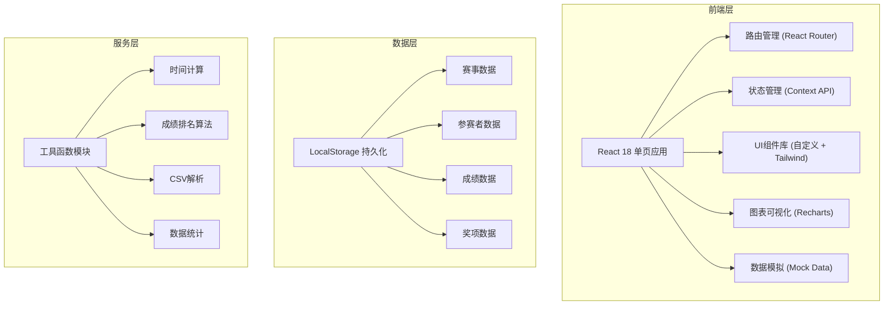
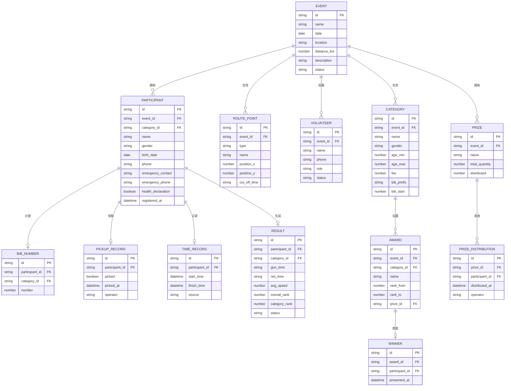

## 1. 架构设计

## 2. 技术描述

- **前端框架**：React@18 + Vite@5 + TypeScript
- **样式方案**：TailwindCSS@3 + 自定义CSS变量主题系统
- **状态管理**：React Context API + useReducer 实现集中状态管理
- **路由管理**：React Router DOM@6
- **图表库**：Recharts@2（柱状图、折线图、饼图等）
- **图标库**：@tabler/icons-react
- **数据持久化**：LocalStorage + 内置完整Mock数据
- **构建工具**：Vite@5
- **代码规范**：ESLint + TypeScript 严格模式

## 3. 路由定义

| 路由 | 用途 |
|------|------|
| /dashboard | 首页仪表盘，展示赛事概览和数据指标 |
| /event/info | 赛事管理-基础信息设置 |
| /event/route | 赛事管理-路线规划 |
| /event/volunteers | 赛事管理-志愿者管理 |
| /registration/list | 报名管理-参赛者列表 |
| /registration/bibs | 报名管理-号码布分配 |
| /registration/pickup | 报名管理-参赛包领取 |
| /timing/record | 计时成绩-计时记录 |
| /timing/results | 计时成绩-成绩榜单 |
| /awards/settings | 奖项管理-奖项设置 |
| /awards/winners | 奖项管理-获奖名单与颁奖流程 |
| /awards/prizes | 奖项管理-奖品发放 |
| /analysis/finish | 赛后分析-完赛率统计 |
| /analysis/timing | 赛后分析-完赛时间分布 |
| /analysis/survey | 赛后分析-满意度调查 |

## 4. 数据模型

### 4.1 数据模型定义

### 4.2 数据初始化

应用内置完整的Mock数据，包括：
- 1个示例赛事（2026环湖自行车挑战赛）
- 4个参赛组别（男子精英组、男子公开组、女子组、体验组）
- 路线节点数据（起点、3个补给站、终点）
- 50+名参赛者报名数据
- 15名志愿者信息
- 号码布分配记录
- 参赛包领取记录
- 完整的计时成绩数据
- 奖项设置与获奖名单
- 奖品发放记录
- 满意度调查样本数据

