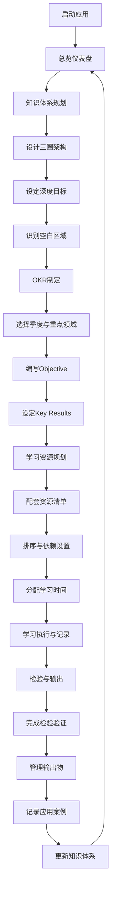

## 1. 产品概述
在线学习目标OKR与知识体系构建工具，帮助学习者系统化规划学习路径、设定可量化目标、管理学习资源，并通过多种方式检验学习成果。
- 解决学习者缺乏系统性规划、目标模糊、学习进度难以追踪的问题
- 面向终身学习者、职场人士、学生群体，提供从知识架构到成果输出的全流程管理

## 2. 核心功能

### 2.1 用户角色
| 角色 | 注册方式 | 核心权限 |
|------|----------|----------|
| 普通用户 | 本地使用，无需注册 | 全部功能使用、数据本地持久化存储 |

### 2.2 功能模块
1. **知识体系规划模块**: 三圈架构设计（核心专业/辅助技能/通识素养）、知识深度分级（了解/熟悉/精通）、空白区域识别
2. **OKR制定模块**: 季度OKR设置、Objective定性描述、Key Results量化指标
3. **学习资源规划模块**: 学习资源清单管理、优先级排序与依赖关系、学习时间分配
4. **检验和输出模块**: 知识掌握检验方式设计、学习输出物管理、知识应用案例记录

### 2.3 页面详情
| 页面名称 | 模块名称 | 功能描述 |
|----------|----------|----------|
| 总览仪表盘 | 数据概览 | 整体学习进度、OKR完成率、知识体系覆盖度可视化展示 |
| 知识体系规划 | 三圈架构 | 核心专业/辅助技能/通识素养的环形可视化，支持拖拽编辑领域节点 |
| 知识体系规划 | 深度分级 | 每个领域的知识深度目标设置（了解/熟悉/精通），展示当前水平与目标差距 |
| 知识体系规划 | 空白识别 | 自动识别并高亮展示知识体系中的空白区域与薄弱环节 |
| OKR制定 | 季度管理 | 季度切换与创建，每个季度关联重点突破的知识领域 |
| OKR制定 | Objective | 目标定性描述编辑，愿景与境界描述 |
| OKR制定 | Key Results | 量化指标管理：读书数量、课程完成、文章输出等可测量目标 |
| 学习资源规划 | 资源清单 | 书籍/课程/实践项目分类管理，学习路径可视化 |
| 学习资源规划 | 优先级排序 | 基于依赖关系的资源排序，拖拽调整学习顺序 |
| 学习资源规划 | 时间分配 | 每周学习时间饼图与分配表，支持领域间时间调配 |
| 检验和输出 | 检验方式 | 笔试/项目实践/教授他人三种验证方式的配置与进度 |
| 检验和输出 | 输出物管理 | 文章、项目、教学材料等输出物的归档与关联 |
| 检验和输出 | 应用案例 | 知识在实际场景中应用的案例记录与复盘 |

## 3. 核心流程

### 3.1 主要用户流程
用户启动应用后，首先在总览仪表盘查看整体学习状态。新用户从知识体系规划开始，设计三圈结构并设定各领域深度目标。接着在OKR制定模块选择当季重点领域，设定定性目标与量化KR。随后为每个目标配套学习资源，安排优先级与时间分配。学习过程中记录检验进度与输出物，完成后记录应用案例，最终闭环反馈到知识体系更新。

## 4. 用户界面设计

### 4.1 设计风格
- **主色调**: 深邃靛蓝 (#1e3a5f) 作为主色，搭配琥珀金 (#d4a857) 作为强调色
- **辅助色**: 翡翠绿 (#2d6a4f) 表示进度/完成，珊瑚橙 (#e07a5f) 表示警示/待完成
- **背景色**: 温润象牙白 (#f8f5f0) 基底，搭配微妙的纸质纹理
- **按钮风格**: 圆角矩形，微立体阴影，悬浮时上浮效果
- **字体**: 标题使用"思源宋体"体现知识厚重感，正文使用"Noto Sans SC"保证可读性
- **布局风格**: 侧边栏导航 + 卡片式内容区，强调层次结构
- **图标风格**: 线性+填充混合风格图标，搭配emoji增强表达

### 4.2 页面设计概览
| 页面名称 | 模块名称 | UI元素 |
|----------|----------|--------|
| 总览仪表盘 | 数据概览 | 环形进度图、卡片指标、OKR进度条、热力图日历，优雅的卡片悬浮效果 |
| 知识体系规划 | 三圈架构 | 三同心圆交互式SVG图表，节点可点击编辑，空白区域半透明灰色标识 |
| 知识体系规划 | 深度分级 | 三级进度条（了解/熟悉/精通），色阶从浅到深，目标线标记 |
| OKR制定 | 季度管理 | 时间轴式季度切换器，当前季度高亮卡片式Objective编辑区 |
| OKR制定 | Key Results | KR列表卡片，进度环形指示器，量化目标输入框带单位选择 |
| 学习资源规划 | 资源清单 | 分类Tab切换（书籍/课程/项目），卡片式资源项带完成状态 |
| 学习资源规划 | 时间分配 | 交互式饼图，拖拽调整各领域时间占比，周时间表网格 |
| 检验和输出 | 检验方式 | 三栏式布局（笔试/项目/教授），每栏独立进度与任务列表 |
| 检验和输出 | 输出物管理 | 瀑布流式卡片布局，标签筛选，关联知识领域标签 |

### 4.3 响应式设计
- 桌面端优先（>1280px）：完整四栏侧边导航 + 主内容区
- 平板端（768px-1280px）：折叠式侧边栏 + 双列内容布局
- 移动端（<768px）：底部Tab导航 + 单列流式布局，图表简化为竖向列表
- 触摸优化：所有可交互元素最小44x44px触控区域，滑动手势支持侧边栏

### 4.4 动效与交互
- 页面加载：卡片级联淡入（stagger 80ms），侧边导航滑入
- 环形图：绘制动画从0%到当前值（1.2s ease-out）
- 悬浮：卡片微上浮（translateY -4px）+ 阴影加深
- 切换：Tab切换带横向滑动过渡，季度切换时间轴滚动动画
- 拖拽：资源排序时半透明虚影跟随，放置位置高亮提示
