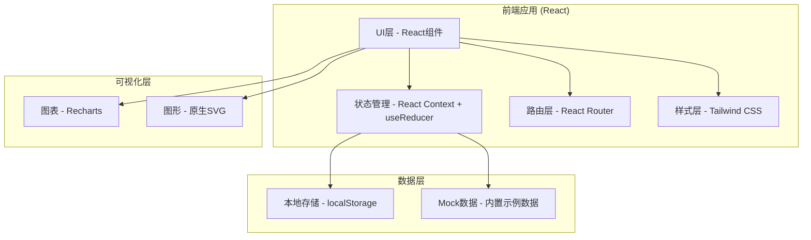
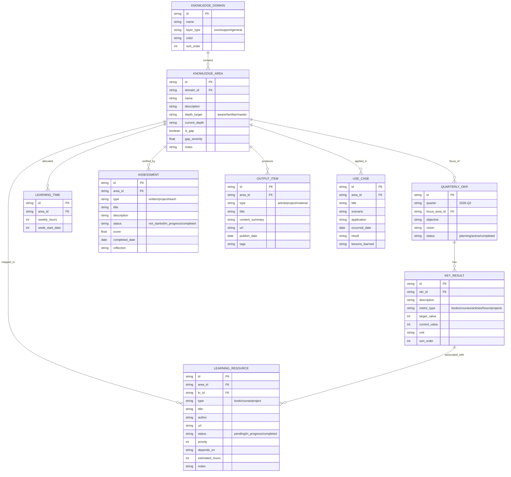

## 1. 架构设计



## 2. 技术说明

- **前端框架**: React@18 + TypeScript@5
- **构建工具**: Vite@5
- **样式方案**: Tailwind CSS@3 + CSS Variables主题系统
- **路由管理**: React Router@6
- **图表库**: Recharts@2
- **图标库**: Lucide React
- **状态管理**: React Context + useReducer（轻量级全局状态）
- **数据持久化**: localStorage（JSON序列化）
- **初始化方式**: npm create vite@latest
- **后端服务**: 无（纯前端应用，数据本地存储）
- **数据库**: localStorage + 内置Mock示例数据

## 3. 路由定义

| 路由 | 用途 |
|------|------|
| / | 总览仪表盘，整体学习进度与OKR概览 |
| /knowledge | 知识体系规划，三圈架构、深度分级、空白识别 |
| /okr | OKR制定，季度管理、Objective、Key Results |
| /resources | 学习资源规划，资源清单、优先级排序、时间分配 |
| /output | 检验和输出，检验方式、输出物管理、应用案例 |

## 4. 数据模型

### 4.1 实体关系图



### 4.2 核心数据结构TypeScript定义

```typescript
// 知识体系
type LayerType = 'core' | 'support' | 'general';
type DepthLevel = 'aware' | 'familiar' | 'master';

interface KnowledgeDomain {
  id: string;
  name: string;
  layerType: LayerType;
  color: string;
  sortOrder: number;
}

interface KnowledgeArea {
  id: string;
  domainId: string;
  name: string;
  description: string;
  depthTarget: DepthLevel;
  currentDepth: DepthLevel;
  isGap: boolean;
  gapSeverity: number;
  notes: string;
}

// OKR
interface QuarterlyOKR {
  id: string;
  quarter: string;
  focusAreaId: string;
  objective: string;
  vision: string;
  status: 'planning' | 'active' | 'completed';
}

type MetricType = 'books' | 'courses' | 'articles' | 'hours' | 'projects';

interface KeyResult {
  id: string;
  okrId: string;
  description: string;
  metricType: MetricType;
  targetValue: number;
  currentValue: number;
  unit: string;
  sortOrder: number;
}

// 学习资源
type ResourceType = 'book' | 'course' | 'project';
type ResourceStatus = 'pending' | 'in_progress' | 'completed';

interface LearningResource {
  id: string;
  areaId: string;
  krId: string | null;
  type: ResourceType;
  title: string;
  author: string;
  url: string;
  status: ResourceStatus;
  priority: number;
  dependsOn: string | null;
  estimatedHours: number;
  notes: string;
}

interface LearningTime {
  id: string;
  areaId: string;
  weeklyHours: number;
  weekStartDate: string;
}

// 检验与输出
type AssessmentType = 'written' | 'project' | 'teach';
type AssessmentStatus = 'not_started' | 'in_progress' | 'completed';

interface Assessment {
  id: string;
  areaId: string;
  type: AssessmentType;
  title: string;
  description: string;
  status: AssessmentStatus;
  score: number | null;
  completedDate: string | null;
  reflection: string;
}

type OutputType = 'article' | 'project' | 'material';

interface OutputItem {
  id: string;
  areaId: string;
  type: OutputType;
  title: string;
  contentSummary: string;
  url: string;
  publishDate: string;
  tags: string[];
}

interface UseCase {
  id: string;
  areaId: string;
  title: string;
  scenario: string;
  application: string;
  occurredDate: string;
  result: string;
  lessonsLearned: string;
}
```

## 5. 组件结构

```
src/
├── App.tsx                      # 根组件，路由配置
├── main.tsx                     # 入口文件
├── index.css                    # 全局样式 + Tailwind
├── types/
│   └── index.ts                 # TypeScript类型定义
├── data/
│   └── mockData.ts              # 内置示例数据
├── context/
│   └── AppContext.tsx           # 全局状态管理Context
├── hooks/
│   └── useLocalStorage.ts       # localStorage持久化Hook
├── components/
│   ├── layout/
│   │   ├── Sidebar.tsx          # 侧边导航栏
│   │   ├── Header.tsx           # 顶部标题栏
│   │   └── Layout.tsx           # 布局容器
│   ├── dashboard/
│   │   ├── OverviewCards.tsx    # 总览指标卡片
│   │   ├── OKRProgress.tsx      # OKR进度概览
│   │   ├── KnowledgeCoverage.tsx# 知识覆盖度图表
│   │   └── WeeklyHeatmap.tsx    # 学习热力图
│   ├── knowledge/
│   │   ├── ThreeRingChart.tsx   # 三圈架构SVG图
│   │   ├── DepthProgress.tsx    # 深度分级进度条
│   │   ├── GapAnalysis.tsx      # 空白区域分析
│   │   └── AreaEditor.tsx       # 知识领域编辑器
│   ├── okr/
│   │   ├── QuarterTimeline.tsx  # 季度时间轴
│   │   ├── ObjectiveCard.tsx    # Objective卡片
│   │   ├── KRList.tsx           # Key Results列表
│   │   └── KREditor.tsx         # KR编辑器
│   ├── resources/
│   │   ├── ResourceTabs.tsx     # 资源分类Tab
│   │   ├── ResourceCard.tsx     # 资源卡片
│   │   ├── ResourceSortable.tsx # 可拖拽排序资源列表
│   │   └── TimeAllocation.tsx   # 时间分配饼图与表格
│   └── output/
│       ├── AssessmentPanels.tsx # 三种检验方式面板
│       ├── OutputGallery.tsx    # 输出物瀑布流
│       ├── OutputCard.tsx       # 输出物卡片
│       └── CaseTimeline.tsx     # 应用案例时间线
└── pages/
    ├── Dashboard.tsx            # 总览仪表盘页
    ├── KnowledgePlanning.tsx    # 知识体系规划页
    ├── OKRPlanning.tsx          # OKR制定页
    ├── ResourcePlanning.tsx     # 学习资源规划页
    └── OutputTracking.tsx       # 检验和输出页
```

## 6. 设计系统常量

```typescript
// 主题色
const COLORS = {
  primary: '#1e3a5f',      // 深邃靛蓝
  accent: '#d4a857',       // 琥珀金
  success: '#2d6a4f',      // 翡翠绿
  warning: '#e07a5f',      // 珊瑚橙
  background: '#f8f5f0',   // 象牙白
  surface: '#ffffff',
  text: {
    primary: '#1a1a2e',
    secondary: '#4a4a68',
    muted: '#8a8aa0',
  },
  layers: {
    core: '#1e3a5f',       // 核心专业
    support: '#2d6a4f',    // 辅助技能
    general: '#7b68ee',    // 通识素养
  },
  depths: {
    aware: '#c5d5e5',      // 了解
    familiar: '#6b95c0',   // 熟悉
    master: '#1e3a5f',     // 精通
  }
};

// 深度等级定义
const DEPTH_DEFINITIONS = {
  aware: {
    name: '了解',
    description: '知道基本概念与术语，能识别相关内容，具备入门认知',
    criteria: ['能解释核心概念', '了解发展历史', '识别典型应用场景']
  },
  familiar: {
    name: '熟悉',
    description: '系统掌握知识体系，能独立解决常见问题，具备实际应用能力',
    criteria: ['完整知识框架', '独立解决常规问题', '熟练使用工具/方法']
  },
  master: {
    name: '精通',
    description: '深入理解底层原理，能创新性解决复杂问题，可指导他人学习',
    criteria: ['掌握底层原理', '解决复杂疑难问题', '能教授他人']
  }
};

// 检验方式定义
const ASSESSMENT_TYPES = {
  written: {
    name: '笔试测验',
    icon: 'FileText',
    description: '通过试题测试检验知识点掌握程度'
  },
  project: {
    name: '项目实践',
    icon: 'FolderGit2',
    description: '通过完成实际项目来综合应用所学知识'
  },
  teach: {
    name: '教授他人',
    icon: 'Users',
    description: '通过向他人讲解来验证自身理解深度'
  }
};
```
