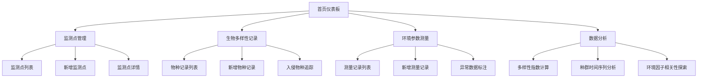

## 1. 产品概述

本产品是一个面向生态研究人员和环境监测工作者的在线数据收集与记录工具，提供监测点管理、生物多样性记录、环境参数测量和数据分析四大核心功能模块，帮助用户系统化地收集、管理和分析生态环境数据。

- 主要用途：环境监测数据收集、生物多样性记录、生态研究数据管理
- 目标用户：生态研究人员、环境监测工作者、自然保护工作者
- 产品价值：提供一体化的生态数据管理平台，提升野外调查效率，支持科学决策

## 2. 核心功能

### 2.1 用户角色

| 角色 | 注册方式 | 核心权限 |
|------|----------|----------|
| 研究人员 | 默认用户 | 全部功能访问、数据录入与分析 |

### 2.2 功能模块

1. **监测点管理模块**：监测点地理信息录入、照片存档、历史沿革记录
2. **生物多样性记录模块**：物种记录、照片音频存档、入侵物种追踪
3. **环境参数测量模块**：非生物因素测量、测量方法记录、异常数据标注
4. **数据分析模块**：多样性指数计算、种群时间序列分析、环境因子相关性探索

### 2.3 页面详情

| 页面名称 | 模块名称 | 功能描述 |
|----------|----------|----------|
| 首页仪表板 | 数据概览 | 关键指标卡片、最近记录、快捷操作入口 |
| 监测点管理 | 监测点列表 | 监测点卡片展示、搜索筛选、新增监测点 |
| 监测点详情 | 信息管理 | 地理信息、照片档案、历史沿革三个标签页 |
| 生物多样性 | 物种记录 | 物种列表、分类筛选、新增物种记录 |
| 物种详情 | 信息管理 | 基本信息、照片音频、分布位置 |
| 入侵物种 | 专项追踪 | 入侵物种列表、扩散范围可视化 |
| 环境参数 | 测量记录 | 参数测量列表、按监测点筛选、新增记录 |
| 测量方法 | 标准化记录 | 仪器信息、校准方式、测量规范 |
| 异常数据 | 标注分析 | 异常数据列表、标注原因、统计分析 |
| 数据分析 | 多样性指数 | 香农指数/辛普森指数计算与历史趋势图 |
| 种群分析 | 时间序列 | 种群数量变化趋势图、多物种对比 |
| 相关性分析 | 因子探索 | 环境因子与生物多样性的相关性散点图 |

## 3. 核心流程

用户进入系统后，首先在仪表板查看数据概览。可通过导航栏进入各功能模块：在监测点管理中创建和管理监测点；在生物多样性模块记录物种发现和入侵物种追踪；在环境参数模块录入测量数据和异常标注；在数据分析模块进行多样性指数计算和相关性探索。所有数据支持增删改查操作，并以可视化图表展示分析结果。

## 4. 用户界面设计

### 4.1 设计风格

- 主色调：森林绿 (#2D6A4F)，象征自然与生态
- 辅助色：大地棕 (#8B7355)、湖水蓝 (#40916C)、阳光黄 (#D4A373)
- 中性色：深灰 (#1B1B1B)、中灰 (#6B7280)、浅灰 (#F3F4F6)、白色 (#FFFFFF)
- 按钮风格：圆角矩形，悬停时有微上浮效果和阴影变化
- 字体：标题使用 Lora 衬线字体体现学术感，正文使用 Inter 无衬线字体保证可读性
- 布局风格：卡片式布局，侧边导航 + 主内容区，清晰的信息层级
- 图标风格：使用 lucide-react 线性图标，统一描边宽度

### 4.2 页面设计概览

| 页面名称 | 模块名称 | UI元素 |
|----------|----------|--------|
| 首页仪表板 | 数据概览 | 渐变顶部横幅、统计数据卡片网格、最近记录时间线、快捷操作区 |
| 监测点管理 | 列表页 | 搜索筛选栏、监测点卡片网格、卡片悬停动画、浮动新增按钮 |
| 监测点详情 | 详情页 | 顶部信息横幅、标签页切换、照片画廊、时间线记录 |
| 生物多样性 | 列表页 | 分类筛选侧边栏、物种卡片列表、标签标识系统 |
| 环境参数 | 记录页 | 参数分类标签、数据表格、趋势迷你图、异常高亮标识 |
| 数据分析 | 图表页 | 图表选择器、交互式图表、数据表格、导出按钮 |

### 4.3 响应式设计

- 桌面端优先设计（≥1280px）
- 平板端适配（768px-1279px）：侧边栏折叠为图标模式
- 移动端适配（<768px）：底部导航栏、卡片单列布局、表单简化

### 4.4 视觉细节

- 背景：使用浅绿渐变和微妙的叶脉纹理作为装饰
- 卡片：白色背景 + 柔和阴影 + 细微边框，悬停时阴影加深
- 数据可视化：使用自然色系的图表配色，渐变填充
- 动效：页面切换淡入淡出、卡片悬停微上浮、图表数据渐进加载
