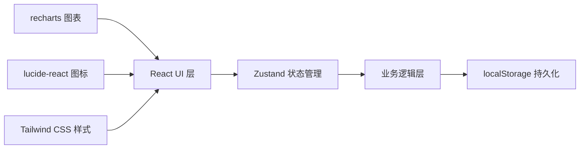
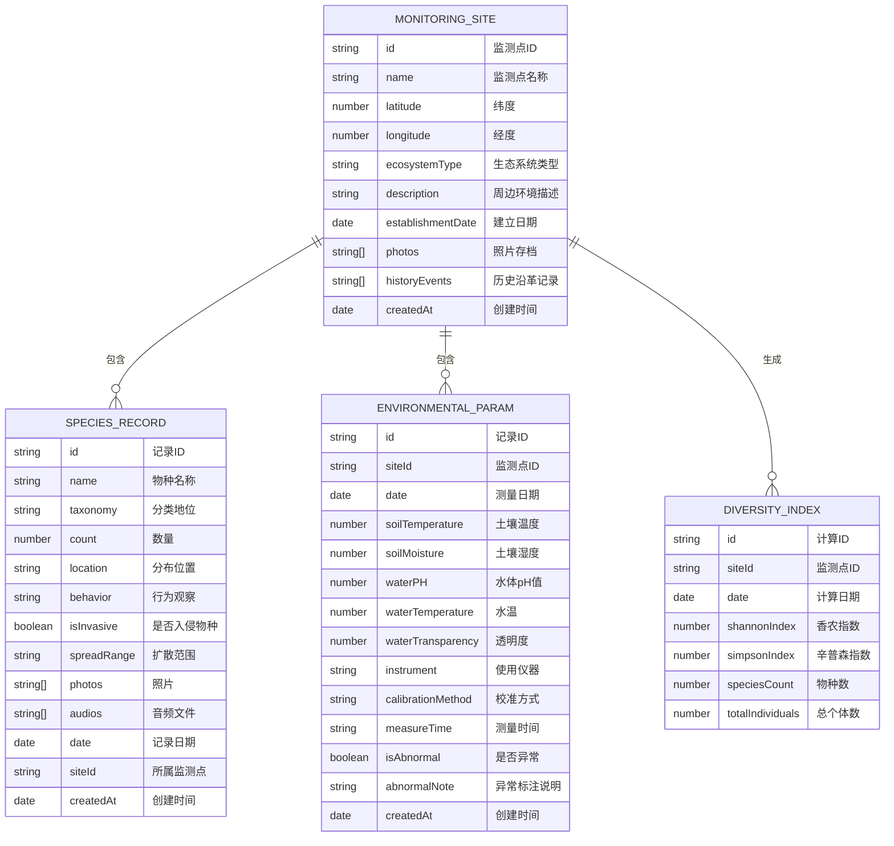

## 1. 架构设计

本项目采用纯前端单页应用架构，使用 React + TypeScript + Vite 构建，数据通过 localStorage 持久化存储，使用 Zustand 进行状态管理，图表使用 recharts 库实现可视化。



## 2. 技术描述

- 前端框架：React@18 + TypeScript
- 构建工具：Vite@5
- 样式方案：Tailwind CSS@3
- 状态管理：Zustand@4
- 路由管理：react-router-dom@6
- 图表库：recharts@2
- 图标库：lucide-react@0.344
- 数据持久化：localStorage + 自定义 mock 数据
- 初始化工具：vite-init

## 3. 路由定义

| 路由 | 页面 | 用途 |
|------|------|------|
| / | 首页仪表板 | 数据概览、快捷操作 |
| /monitoring-sites | 监测点列表 | 监测点管理主页面 |
| /monitoring-sites/:id | 监测点详情 | 单个监测点的详细信息 |
| /biodiversity | 生物多样性 | 物种记录列表 |
| /biodiversity/invasive | 入侵物种 | 入侵物种专项追踪 |
| /environmental-params | 环境参数 | 测量记录与异常标注 |
| /data-analysis | 数据分析 | 多样性指数与相关性分析 |

## 4. 数据模型

### 4.1 数据模型定义



### 4.2 状态结构

```typescript
// Zustand store 状态定义
interface AppState {
  monitoringSites: MonitoringSite[];
  speciesRecords: SpeciesRecord[];
  environmentalParams: EnvironmentalParam[];
  diversityIndices: DiversityIndex[];
  
  // 监测点操作
  addMonitoringSite: (site: Omit<MonitoringSite, 'id' | 'createdAt'>) => void;
  updateMonitoringSite: (id: string, site: Partial<MonitoringSite>) => void;
  deleteMonitoringSite: (id: string) => void;
  
  // 物种记录操作
  addSpeciesRecord: (record: Omit<SpeciesRecord, 'id' | 'createdAt'>) => void;
  updateSpeciesRecord: (id: string, record: Partial<SpeciesRecord>) => void;
  deleteSpeciesRecord: (id: string) => void;
  
  // 环境参数操作
  addEnvironmentalParam: (param: Omit<EnvironmentalParam, 'id' | 'createdAt'>) => void;
  updateEnvironmentalParam: (id: string, param: Partial<EnvironmentalParam>) => void;
  markAsAbnormal: (id: string, note: string) => void;
  
  // 数据分析
  calculateDiversityIndex: (siteId: string, date: Date) => DiversityIndex;
  getPopulationTimeSeries: (speciesId: string) => TimeSeriesPoint[];
  getCorrelationData: (paramKey: string, indexKey: string) => CorrelationPoint[];
}
```

## 5. 项目结构

```
src/
├── components/          # 可复用组件
│   ├── layout/         # 布局组件
│   │   ├── Sidebar.tsx
│   │   ├── Header.tsx
│   │   └── Card.tsx
│   ├── charts/         # 图表组件
│   │   ├── LineChart.tsx
│   │   ├── BarChart.tsx
│   │   └── ScatterChart.tsx
│   └── ui/             # 基础UI组件
│       ├── Button.tsx
│       ├── Input.tsx
│       ├── Tabs.tsx
│       ├── Modal.tsx
│       └── Badge.tsx
├── pages/              # 页面组件
│   ├── Dashboard.tsx
│   ├── monitoringSites/
│   │   ├── SiteList.tsx
│   │   └── SiteDetail.tsx
│   ├── biodiversity/
│   │   ├── SpeciesList.tsx
│   │   └── InvasiveSpecies.tsx
│   ├── environmental/
│   │   ├── ParamList.tsx
│   │   └── AbnormalData.tsx
│   └── analysis/
│       ├── DiversityIndex.tsx
│       ├── PopulationAnalysis.tsx
│       └── CorrelationAnalysis.tsx
├── store/              # 状态管理
│   └── useAppStore.ts
├── types/              # 类型定义
│   └── index.ts
├── utils/              # 工具函数
│   ├── calculations.ts # 多样性指数计算等
│   └── mockData.ts     # 模拟数据
├── App.tsx
├── main.tsx
└── index.css
```

## 6. 核心算法

### 6.1 香农-维纳指数 (Shannon-Wiener Index)
$$
H' = -\sum_{i=1}^{S} p_i \ln(p_i)
$$
其中 S 为物种数，p_i 为第 i 个物种的个体数占总个体数的比例。

### 6.2 辛普森指数 (Simpson's Index)
$$
D = 1 - \sum_{i=1}^{S} \frac{n_i(n_i-1)}{N(N-1)}
$$
其中 n_i 为第 i 个物种的个体数，N 为总个体数。

### 6.3 皮尔逊相关系数
用于环境因子与生物多样性指数的相关性分析。
