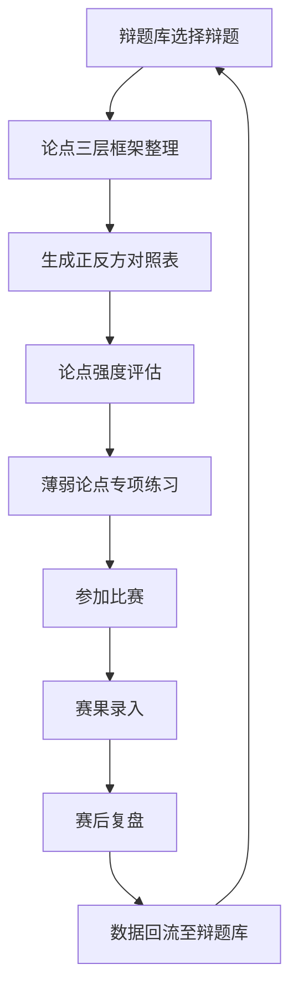

## 1. 产品概述

在线学生辩论队管理和论点整理工具，面向高校/中学辩论队，提供辩题库管理、论点结构化整理、比赛日程管理及赛后复盘、队员能力评估与训练跟踪的一站式平台，帮助辩论队系统化备战、提升竞技水平。

- 目标用户：学生辩论队成员、教练、队长
- 核心价值：将零散的辩论准备流程数字化、结构化，从辩题研究到赛后复盘形成完整闭环

## 2. 核心功能

### 2.1 用户角色

| 角色 | 注册方式 | 核心权限 |
|------|----------|----------|
| 队长 | 邀请码注册 | 全部功能，含队员管理、赛事安排 |
| 队员 | 邀请码注册 | 辩题浏览、论点整理、训练记录、比赛查看 |
| 教练 | 邀请码注册 | 全队数据查看、评估打分、复盘点评 |

### 2.2 功能模块

1. **仪表盘页面**：关键数据概览、近期赛事提醒、待办事项
2. **辩题库页面**：辩题分类浏览、搜索筛选、辩题CRUD
3. **辩题详情页面**：常见论点库（正方/反方）、历史比赛结果、论点强度评估
4. **论点整理页面**：三层框架结构化整理、正反方对照表、论点强度评估
5. **比赛管理页面**：赛事日程、对阵安排、赛果记录、赛后复盘
6. **队员训练页面**：个人能力雷达图、专项练习记录、优秀发言片段库

### 2.3 页面详情

| 页面名称 | 模块名称 | 功能描述 |
|----------|----------|----------|
| 仪表盘 | 数据概览 | 辩题总数、近期比赛数、队员平均能力评分 |
| 仪表盘 | 近期赛事 | 显示未来7天比赛日程卡片 |
| 仪表盘 | 待办事项 | 需要准备的辩题、未完成的复盘等 |
| 辩题库 | 筛选导航 | 按辩题类型（政策性/价值性/事实性）、难度、话题领域筛选 |
| 辩题库 | 辩题列表 | 卡片式展示辩题，显示类型标签、难度星级、论点数量 |
| 辩题库 | 新增辩题 | 表单录入辩题信息、分类标签 |
| 辩题详情 | 常见论点库 | 正方/反方论点Tab切换，每个论点含主要论据 |
| 辩题详情 | 历史战绩 | 该辩题历史比赛列表，胜方、关键论点标注 |
| 辩题详情 | 论点强度 | 可视化展示论点说服力评级 |
| 论点整理 | 三层框架 | 价值判断/事实依据/逻辑推理三层结构化编辑 |
| 论点整理 | 正反对照表 | 左右对照：正方论点 ↔ 反方反驳 ↔ 正方回应 |
| 论点整理 | 强度评估 | 每个论点的说服力/脆弱性评分，热力图可视化 |
| 比赛管理 | 赛事日程 | 日历视图+列表视图，比赛场次/对阵/场地 |
| 比赛管理 | 赛果记录 | 录入胜负、最佳辩手、关键论点 |
| 比赛管理 | 赛后复盘 | 标记有效论点/失误应对，生成复盘报告 |
| 队员训练 | 能力雷达图 | 立论/盘问/陈词/即兴应对四维能力可视化 |
| 队员训练 | 专项练习 | 针对薄弱环节的练习记录和进度追踪 |
| 队员训练 | 发言片段 | 优秀发言的文本收录、标签分类、学习笔记 |

## 3. 核心流程

**辩题备战流程**：队长/教练从辩题库选择辩题 → 队员在论点整理模块中构建三层框架 → 系统自动生成正反对照表 → 团队评估论点强度 → 针对薄弱论点进行专项练习 → 赛后复盘记录有效/失误论点 → 数据回流至辩题库丰富论点库

**比赛管理流程**：创建赛事（日期/对阵/场地）→ 赛前准备（关联辩题/分配角色）→ 赛果录入（胜负/最佳辩手）→ 赛后复盘（论点有效性/应对失误）→ 复盘报告生成

**队员成长流程**：初始能力评估 → 识别薄弱环节 → 制定专项练习计划 → 练习记录与反馈 → 阶段性再评估 → 能力趋势追踪

## 4. 用户界面设计

### 4.1 设计风格

- **主色调**：深墨蓝色 (#1B2A4A) 作为主色，搭配琥珀金 (#D4A843) 作为强调色，营造沉稳学术氛围
- **辅助色**：象牙白 (#F5F0E8) 背景，深炭灰 (#2D2D2D) 文字，正方绿 (#2E7D32) / 反方红 (#C62828) 用于正反方标识
- **按钮风格**：圆角矩形（8px），微阴影悬浮效果，琥珀金按钮用于主要操作
- **字体**：标题使用 Noto Serif SC（衬线体，学术感），正文使用 Noto Sans SC（清晰易读）
- **布局风格**：左侧导航栏 + 右侧内容区，卡片式模块布局
- **图标**：Lucide 图标库，线描风格

### 4.2 页面设计概览

| 页面名称 | 模块名称 | UI元素 |
|----------|----------|--------|
| 仪表盘 | 数据概览 | 3列统计卡片（墨蓝底+金色数字），图标+数字+标签 |
| 仪表盘 | 近期赛事 | 横向时间轴卡片，悬浮展开详情 |
| 仪表盘 | 待办事项 | 列表项带优先级色条，复选框交互 |
| 辩题库 | 筛选导航 | 顶部筛选栏（下拉+标签+搜索），面包屑 |
| 辩题库 | 辩题列表 | 网格卡片，悬浮微抬升，类型色标+难度星级 |
| 辩题库 | 新增辩题 | 右侧滑出面板，表单+标签输入 |
| 辩题详情 | 常见论点库 | Tab切换正反方，论点卡片含论据折叠区 |
| 辩题详情 | 历史战绩 | 时间线布局，胜方高亮，关键论点标签 |
| 辩题详情 | 论点强度 | 水平条形图，说服力评级色阶 |
| 论点整理 | 三层框架 | 垂直三层折叠面板，每层可添加/编辑论点 |
| 论点整理 | 正反对照表 | 双栏对照布局，中间箭头连接反驳关系 |
| 论点整理 | 强度评估 | 热力图矩阵，颜色深浅表示说服力 |
| 比赛管理 | 赛事日程 | 月历视图+列表切换，赛事色标 |
| 比赛管理 | 赛果记录 | 对阵卡片，录入弹窗 |
| 比赛管理 | 赛后复盘 | 复盘表单，有效/失误论点标签拖拽分类 |
| 队员训练 | 能力雷达图 | 四维雷达图（SVG），悬浮显示分值 |
| 队员训练 | 专项练习 | 练习卡片列表，进度条 |
| 队员训练 | 发言片段 | 瀑布流卡片，标签+笔记摘要 |

### 4.3 响应式设计

- 桌面优先设计，最小宽度1024px
- 平板端（768-1024px）：侧边栏折叠为图标模式，卡片网格从3列变2列
- 移动端（<768px）：底部Tab导航，单列卡片布局，对照表改为上下堆叠

### 4.4 3D场景指引

不适用
