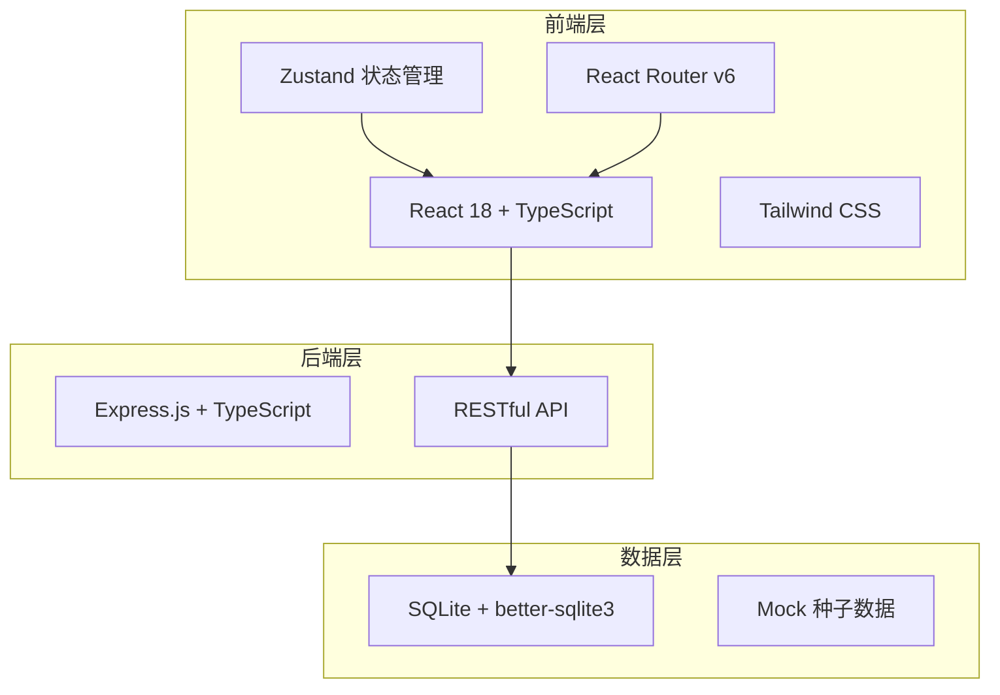
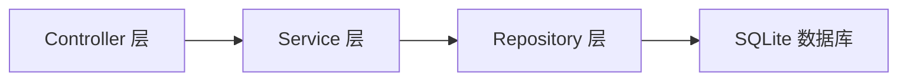
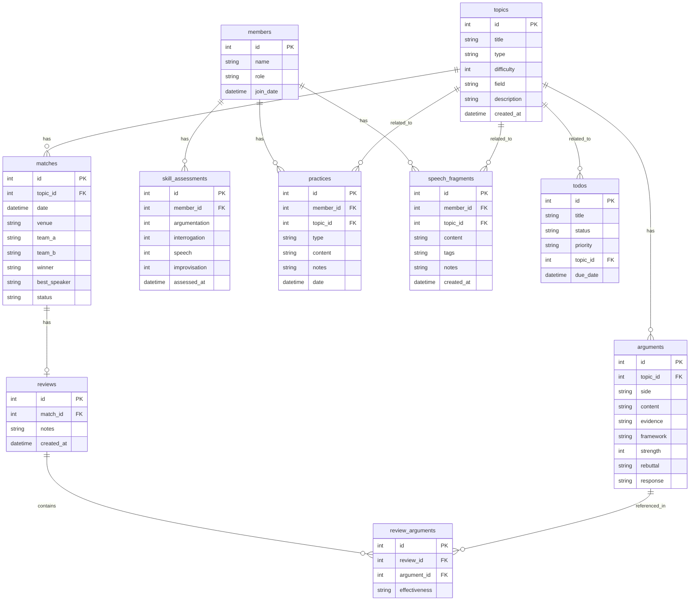

## 1. 架构设计



## 2. 技术说明

- **前端**：React@18 + TailwindCSS@3 + Vite + Zustand + React Router v6
- **初始化工具**：vite-init（react-express-ts 模板）
- **后端**：Express@4 + TypeScript（ESM）
- **数据库**：SQLite（better-sqlite3），含种子数据
- **图表**：纯 SVG 自绘雷达图 + CSS 实现热力图

## 3. 路由定义

| 路由 | 用途 |
|------|------|
| `/` | 仪表盘 - 数据概览、近期赛事、待办事项 |
| `/topics` | 辩题库 - 辩题列表、筛选、新增 |
| `/topics/:id` | 辩题详情 - 论点库、历史战绩、强度评估 |
| `/arguments` | 论点整理 - 三层框架、对照表、强度评估 |
| `/arguments/:topicId` | 特定辩题的论点整理 |
| `/matches` | 比赛管理 - 赛事日程、赛果记录 |
| `/matches/:id/review` | 赛后复盘 |
| `/training` | 队员训练 - 能力评估、练习记录 |
| `/training/:memberId` | 队员个人训练详情 |

## 4. API 定义

### 辩题相关

```typescript
// GET /api/topics - 获取辩题列表
interface GetTopicsQuery {
  type?: 'policy' | 'value' | 'fact'
  difficulty?: 1 | 2 | 3 | 4 | 5
  field?: string
  search?: string
}
interface Topic {
  id: number
  title: string
  type: 'policy' | 'value' | 'fact'
  difficulty: number
  field: string
  description: string
  createdAt: string
  argumentCount: number
  matchCount: number
}

// POST /api/topics - 创建辩题
interface CreateTopicBody {
  title: string
  type: 'policy' | 'value' | 'fact'
  difficulty: number
  field: string
  description: string
}

// GET /api/topics/:id - 获取辩题详情
interface TopicDetail extends Topic {
  proArguments: Argument[]
  conArguments: Argument[]
  matchHistory: MatchResult[]
}

// 论点
interface Argument {
  id: number
  topicId: number
  side: 'pro' | 'con'
  content: string
  evidence: string
  framework: 'value' | 'fact' | 'logic'
  strength: number
  rebuttal?: string
  response?: string
}
```

### 比赛相关

```typescript
// GET /api/matches - 获取比赛列表
interface Match {
  id: number
  topicId: number
  date: string
  venue: string
  teamA: string
  teamB: string
  winner?: string
  bestSpeaker?: string
  status: 'upcoming' | 'completed'
}

// POST /api/matches - 创建比赛
interface CreateMatchBody {
  topicId: number
  date: string
  venue: string
  teamA: string
  teamB: string
}

// POST /api/matches/:id/result - 录入赛果
interface MatchResultBody {
  winner: string
  bestSpeaker: string
  keyArguments: number[]
  failedResponses: number[]
}

// 复盘
interface Review {
  id: number
  matchId: number
  effectiveArguments: number[]
  failedResponses: number[]
  notes: string
  createdAt: string
}
```

### 队员训练相关

```typescript
// GET /api/members - 获取队员列表
interface Member {
  id: number
  name: string
  role: 'captain' | 'member' | 'coach'
  joinDate: string
}

// GET /api/members/:id/skills - 获取队员能力评分
interface SkillAssessment {
  memberId: number
  argumentation: number
  interrogation: number
  speech: number
  improvisation: number
  assessedAt: string
}

// GET /api/members/:id/practices - 获取练习记录
interface Practice {
  id: number
  memberId: number
  type: 'argumentation' | 'interrogation' | 'speech' | 'improvisation'
  topicId?: number
  content: string
  notes: string
  date: string
}

// 优秀发言片段
interface SpeechFragment {
  id: number
  memberId: number
  topicId: number
  content: string
  tags: string[]
  notes: string
  createdAt: string
}
```

## 5. 服务器架构图



## 6. 数据模型

### 6.1 数据模型定义



### 6.2 数据定义语言

```sql
CREATE TABLE topics (
    id INTEGER PRIMARY KEY AUTOINCREMENT,
    title TEXT NOT NULL,
    type TEXT NOT NULL CHECK(type IN ('policy', 'value', 'fact')),
    difficulty INTEGER NOT NULL CHECK(difficulty BETWEEN 1 AND 5),
    field TEXT NOT NULL,
    description TEXT,
    created_at TEXT DEFAULT (datetime('now'))
);

CREATE TABLE arguments (
    id INTEGER PRIMARY KEY AUTOINCREMENT,
    topic_id INTEGER NOT NULL,
    side TEXT NOT NULL CHECK(side IN ('pro', 'con')),
    content TEXT NOT NULL,
    evidence TEXT,
    framework TEXT NOT NULL CHECK(framework IN ('value', 'fact', 'logic')),
    strength INTEGER DEFAULT 5 CHECK(strength BETWEEN 1 AND 10),
    rebuttal TEXT,
    response TEXT,
    FOREIGN KEY (topic_id) REFERENCES topics(id) ON DELETE CASCADE
);

CREATE TABLE matches (
    id INTEGER PRIMARY KEY AUTOINCREMENT,
    topic_id INTEGER NOT NULL,
    date TEXT NOT NULL,
    venue TEXT,
    team_a TEXT NOT NULL,
    team_b TEXT NOT NULL,
    winner TEXT,
    best_speaker TEXT,
    status TEXT DEFAULT 'upcoming' CHECK(status IN ('upcoming', 'completed')),
    FOREIGN KEY (topic_id) REFERENCES topics(id)
);

CREATE TABLE reviews (
    id INTEGER PRIMARY KEY AUTOINCREMENT,
    match_id INTEGER NOT NULL,
    notes TEXT,
    created_at TEXT DEFAULT (datetime('now')),
    FOREIGN KEY (match_id) REFERENCES matches(id) ON DELETE CASCADE
);

CREATE TABLE review_arguments (
    id INTEGER PRIMARY KEY AUTOINCREMENT,
    review_id INTEGER NOT NULL,
    argument_id INTEGER NOT NULL,
    effectiveness TEXT NOT NULL CHECK(effectiveness IN ('effective', 'failed')),
    FOREIGN KEY (review_id) REFERENCES reviews(id) ON DELETE CASCADE,
    FOREIGN KEY (argument_id) REFERENCES arguments(id)
);

CREATE TABLE members (
    id INTEGER PRIMARY KEY AUTOINCREMENT,
    name TEXT NOT NULL,
    role TEXT DEFAULT 'member' CHECK(role IN ('captain', 'member', 'coach')),
    join_date TEXT DEFAULT (datetime('now'))
);

CREATE TABLE skill_assessments (
    id INTEGER PRIMARY KEY AUTOINCREMENT,
    member_id INTEGER NOT NULL,
    argumentation INTEGER DEFAULT 5 CHECK(argumentation BETWEEN 1 AND 10),
    interrogation INTEGER DEFAULT 5 CHECK(interrogation BETWEEN 1 AND 10),
    speech INTEGER DEFAULT 5 CHECK(speech BETWEEN 1 AND 10),
    improvisation INTEGER DEFAULT 5 CHECK(improvisation BETWEEN 1 AND 10),
    assessed_at TEXT DEFAULT (datetime('now')),
    FOREIGN KEY (member_id) REFERENCES members(id) ON DELETE CASCADE
);

CREATE TABLE practices (
    id INTEGER PRIMARY KEY AUTOINCREMENT,
    member_id INTEGER NOT NULL,
    topic_id INTEGER,
    type TEXT NOT NULL CHECK(type IN ('argumentation', 'interrogation', 'speech', 'improvisation')),
    content TEXT NOT NULL,
    notes TEXT,
    date TEXT DEFAULT (datetime('now')),
    FOREIGN KEY (member_id) REFERENCES members(id) ON DELETE CASCADE,
    FOREIGN KEY (topic_id) REFERENCES topics(id)
);

CREATE TABLE speech_fragments (
    id INTEGER PRIMARY KEY AUTOINCREMENT,
    member_id INTEGER NOT NULL,
    topic_id INTEGER,
    content TEXT NOT NULL,
    tags TEXT,
    notes TEXT,
    created_at TEXT DEFAULT (datetime('now')),
    FOREIGN KEY (member_id) REFERENCES members(id) ON DELETE CASCADE,
    FOREIGN KEY (topic_id) REFERENCES topics(id)
);

CREATE TABLE todos (
    id INTEGER PRIMARY KEY AUTOINCREMENT,
    title TEXT NOT NULL,
    status TEXT DEFAULT 'pending' CHECK(status IN ('pending', 'completed')),
    priority TEXT DEFAULT 'medium' CHECK(priority IN ('low', 'medium', 'high')),
    topic_id INTEGER,
    due_date TEXT,
    FOREIGN KEY (topic_id) REFERENCES topics(id)
);

CREATE INDEX idx_arguments_topic ON arguments(topic_id);
CREATE INDEX idx_arguments_side ON arguments(side);
CREATE INDEX idx_matches_topic ON matches(topic_id);
CREATE INDEX idx_matches_date ON matches(date);
CREATE INDEX idx_practices_member ON practices(member_id);
CREATE INDEX idx_speech_fragments_member ON speech_fragments(member_id);
CREATE INDEX idx_skill_assessments_member ON skill_assessments(member_id);
```
