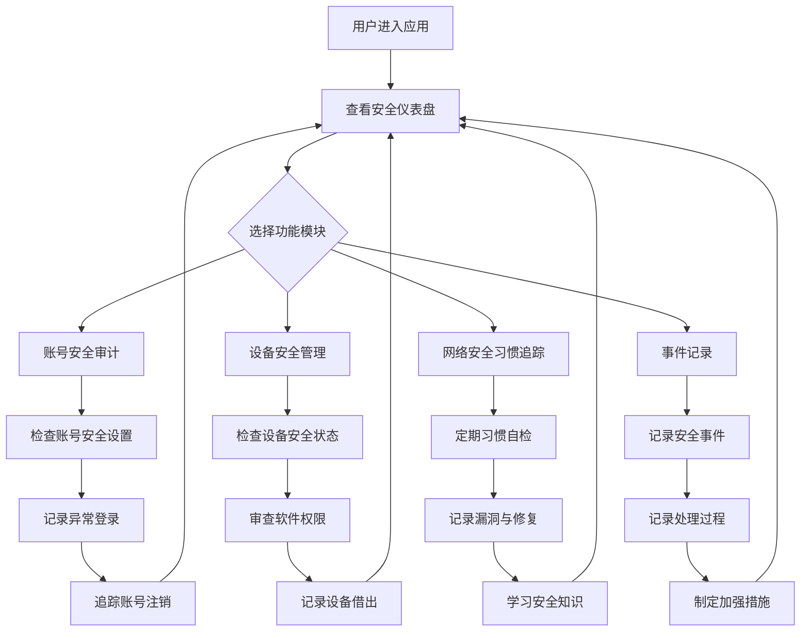

## 1. 产品概述

个人网络安全健康检查与修复追踪工具——一款面向个人用户的在线安全健康管理平台，帮助用户系统性地审计账号安全、管理设备风险、追踪安全习惯、记录安全事件，通过量化的安全评分和清晰的修复指引，让网络安全变得可衡量、可追踪、可改善。

- 解决个人用户网络安全意识薄弱、安全设置分散难以统一管理的痛点
- 目标用户：关注个人网络安全的普通互联网用户、安全从业者、隐私敏感人群

## 2. 核心功能

### 2.1 用户角色
| 角色 | 注册方式 | 核心权限 |
|------|----------|----------|
| 个人用户 | 本地数据存储（无需注册） | 查看和管理所有安全数据 |

### 2.2 功能模块
1. **安全仪表盘**：综合安全评分、各模块风险概览、待处理事项提醒、安全趋势变化
2. **账号安全审计**：重要账号安全设置检查、异常登录记录、不再使用账号的注销追踪
3. **设备安全管理**：设备安全状态检查清单、软件权限审查、设备借出记录
4. **网络安全习惯追踪**：安全习惯定期自检、漏洞记录与修复追踪、安全知识学习记录
5. **事件记录**：安全事件记录、处理过程与教训、后续加强措施

### 2.3 页面详情
| 页面名称 | 模块名称 | 功能描述 |
|----------|----------|----------|
| 安全仪表盘 | 综合评分卡 | 展示整体安全健康评分（0-100），按四大模块分别评分 |
| 安全仪表盘 | 风险概览 | 展示各模块的高风险项数量和待处理事项列表 |
| 安全仪表盘 | 安全趋势 | 以时间线展示安全评分的变化趋势 |
| 账号安全审计 | 账号清单 | 管理重要账号列表，添加/编辑/删除账号 |
| 账号安全审计 | 安全设置检查 | 逐项检查双因素认证、密码强度、密码更新时间、绑定信息有效性 |
| 账号安全审计 | 异常登录记录 | 记录和查看异常登录事件（时间、地点、设备） |
| 账号安全审计 | 注销追踪 | 追踪不再使用账号的注销状态，减少暴露面 |
| 设备安全管理 | 设备清单 | 管理个人设备列表，添加/编辑/删除设备 |
| 设备安全管理 | 安全检查清单 | 检查操作系统更新、杀毒软件、屏幕锁定、全盘加密等 |
| 设备安全管理 | 软件权限审查 | 审查已安装软件的权限，标记不必要权限 |
| 设备安全管理 | 借出记录 | 记录设备借出事件，追踪归还状态 |
| 网络安全习惯追踪 | 习惯自检 | 定期自检安全习惯（密码更换、公共WiFi使用等） |
| 网络安全习惯追踪 | 漏洞追踪 | 记录发现的安全漏洞及修复状态 |
| 网络安全习惯追踪 | 学习记录 | 记录安全知识学习内容和进度 |
| 事件记录 | 事件列表 | 记录经历的安全事件（账号被盗、信息泄露、钓鱼攻击等） |
| 事件记录 | 处理过程 | 记录事件的处理步骤、教训和后续加强措施 |

## 3. 核心流程

用户首次进入应用后，通过安全仪表盘查看整体安全状况。点击各模块可深入查看详情，根据系统提示逐项完成安全检查和修复。定期自检习惯和更新状态，持续提升安全评分。发现安全事件时及时记录并追踪处理过程。

## 4. 用户界面设计

### 4.1 设计风格
- **主色调**：深色背景（#0a0e1a）配合终端绿（#00ff88）和电光蓝（#00d4ff）霓虹强调色，营造网络安全监控中心氛围
- **辅助色**：琥珀黄（#ffb800）用于警告，红色（#ff3366）用于高危，灰色（#1a1f2e）用于卡片背景
- **按钮风格**：圆角按钮，带微妙霓虹发光效果，hover时发光增强
- **字体**：标题使用 JetBrains Mono（等宽技术风），正文使用 Noto Sans SC（中文友好）
- **布局风格**：左侧固定导航栏 + 右侧内容区，卡片式布局，数据密集展示
- **图标风格**：线性科技风图标（Lucide），配合霓虹色强调
- **动效**：数据加载时的扫描线效果，评分变化时的数字滚动动画，卡片hover时的边框发光

### 4.2 页面设计概览
| 页面名称 | 模块名称 | UI元素 |
|----------|----------|--------|
| 安全仪表盘 | 综合评分卡 | 大号圆形评分仪表盘、四模块迷你评分卡、霓虹发光边框 |
| 安全仪表盘 | 风险概览 | 风险等级标签（红/黄/绿）、待处理事项列表、扫描线背景 |
| 安全仪表盘 | 安全趋势 | 折线图趋势、时间轴选择器 |
| 账号安全审计 | 账号清单 | 账号卡片网格、安全状态指示灯、添加按钮 |
| 账号安全审计 | 安全设置检查 | 检查项列表、状态开关、进度条 |
| 账号安全审计 | 异常登录记录 | 时间线列表、地理位置标签、风险等级 |
| 账号安全审计 | 注销追踪 | 看板式状态列（待注销/进行中/已完成） |
| 设备安全管理 | 设备清单 | 设备图标卡片、在线/离线状态、安全评分 |
| 设备安全管理 | 安全检查清单 | 分组检查项、勾选状态、进度指示 |
| 设备安全管理 | 软件权限审查 | 权限矩阵表格、风险标记 |
| 设备安全管理 | 借出记录 | 借出记录卡片、归还状态追踪 |
| 网络安全习惯追踪 | 习惯自检 | 习惯清单、完成打卡、连续天数 |
| 网络安全习惯追踪 | 漏洞追踪 | 漏洞严重等级标签、修复进度条 |
| 网络安全习惯追踪 | 学习记录 | 学习日志卡片、知识点标签 |
| 事件记录 | 事件列表 | 事件时间线、严重等级颜色编码 |
| 事件记录 | 处理过程 | 步骤式流程图、教训摘要卡片 |

### 4.3 响应式设计
- 桌面优先设计，在大屏上展示完整仪表盘和数据面板
- 平板端导航栏折叠为底部标签栏
- 移动端单列布局，卡片全宽展示，关键操作固定底部

### 4.4 3D场景指导
- 不适用
