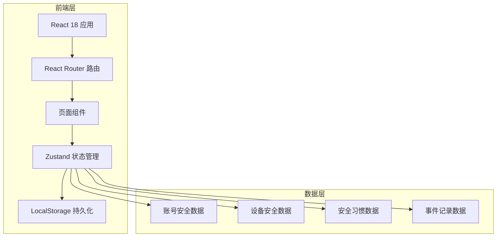
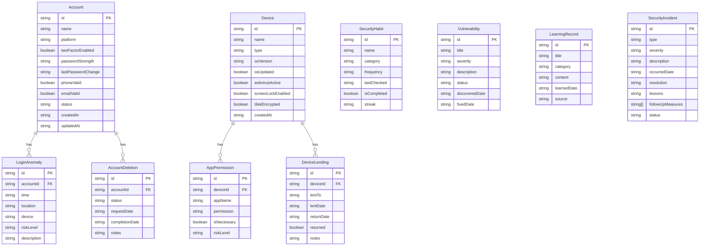

## 1. 架构设计

## 2. 技术说明
- 前端：React@18 + Tailwind CSS@3 + Vite + TypeScript
- 初始化工具：vite-init (react-ts 模板)
- 后端：无（纯前端应用，数据存储于浏览器 LocalStorage）
- 数据库：LocalStorage（通过 Zustand persist 中间件自动持久化）
- 图表：recharts（轻量级React图表库）

## 3. 路由定义
| 路由 | 用途 |
|------|------|
| / | 安全仪表盘首页，展示综合评分和风险概览 |
| /accounts | 账号安全审计模块主页 |
| /devices | 设备安全管理模块主页 |
| /habits | 网络安全习惯追踪模块主页 |
| /incidents | 事件记录模块主页 |

## 4. API定义
无后端API，所有数据通过 Zustand store 管理，使用 persist 中间件自动同步到 LocalStorage。

## 5. 数据模型

### 6.1 数据模型定义

### 6.2 数据定义语言
使用 TypeScript 接口定义数据结构，通过 Zustand store 管理状态，persist 中间件自动序列化到 LocalStorage。无需SQL DDL。
