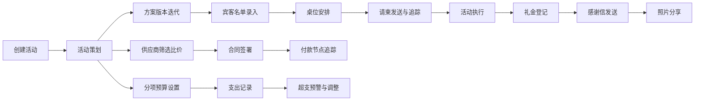

## 1. 产品概述
一站式婚礼与大型家庭活动筹备管理平台，帮助用户高效管理活动策划、宾客、供应商、预算等全流程。
- 主要解决活动筹备过程中信息分散、协调困难、预算失控等痛点，目标用户为准新人、家庭活动组织者、活动策划师
- 市场价值：填补家庭活动精细化管理工具空白，提升筹备效率，降低沟通成本

## 2. 核心功能

### 2.1 用户角色
| 角色 | 注册方式 | 核心权限 |
|------|----------|----------|
| 活动组织者 | 直接使用（本地存储） | 完整功能使用权限，创建和管理所有活动数据 |

### 2.2 功能模块
1. **首页仪表盘**: 活动概览、倒计时、待办提醒、关键数据统计
2. **活动策划模块**: 策划文档管理、日程精细化排期、方案版本迭代
3. **宾客管理模块**: 宾客名单管理、可视化桌位安排、请柬发送与回复追踪
4. **供应商管理模块**: 供应商比价、合同与付款追踪、服务评价
5. **预算控制模块**: 分项预算设置、实时支出对比、超支预警
6. **后续管理模块**: 感谢信记录、礼金收支明细、照片分享计划

### 2.3 页面详情
| 页面名称 | 模块名称 | 功能描述 |
|-----------|-------------|---------------------|
| 首页仪表盘 | 概览卡片 | 活动倒计时、预算使用进度、宾客确认率、待办事项列表 |
| 活动策划 | 策划文档 | 编辑活动主题、风格、规模、预算、时间地点等基本信息 |
| 活动策划 | 日程排期 | 分钟级别的活动时间轴，支持添加、编辑、拖拽调整时间项 |
| 活动策划 | 版本管理 | 方案版本快照、对比、回滚功能 |
| 宾客管理 | 宾客名单 | 增删改查宾客信息，包括姓名、关系、联系方式、饮食禁忌、桌位、出席状态 |
| 宾客管理 | 桌位安排 | 可视化拖拽式座位图，支持圆桌/方桌布局调整 |
| 宾客管理 | 请柬追踪 | 记录请柬发送状态、回复状态、发送时间 |
| 供应商管理 | 比价记录 | 多家供应商报价对比表格，支持按类别筛选 |
| 供应商管理 | 合同付款 | 合同签署状态追踪、付款节点提醒、付款记录 |
| 供应商管理 | 服务评价 | 评分系统、评价内容记录 |
| 预算控制 | 预算设置 | 分项预算分配，支持服装、场地、餐饮、摄影、鲜花、布置等类别 |
| 预算控制 | 支出对比 | 预算与实际支出对比图表、超支预警标识 |
| 预算控制 | 调整记录 | 预算变更历史记录 |
| 后续管理 | 感谢信 | 发送记录、模板管理 |
| 后续管理 | 礼金管理 | 收支明细、分类统计 |
| 后续管理 | 照片分享 | 分享计划、相册管理 |

## 3. 核心流程
用户创建活动后，依次完成策划方案制定、宾客邀请与确认、供应商筛选签约、预算分配与执行，活动结束后进行礼金登记和感谢信发送。

## 4. 用户界面设计

### 4.1 设计风格
- **主色调**: 暖玫瑰金 #E8B4A0，优雅浪漫，契合婚礼氛围
- **辅助色**: 深酒红 #8B2635，象牙白 #FFF8F0，香槟金 #D4AF37
- **中性色**: 暖灰系列，确保内容可读性
- **按钮风格**: 圆润边角，微渐变，悬停时有轻微上浮和阴影变化
- **字体**: 标题使用 Playfair Display（优雅衬线），正文使用 Lato（清晰无衬线）
- **布局风格**: 卡片式布局，侧边导航 + 主内容区，柔和阴影，充足留白
- **图标风格**: 线性图标，统一24px尺寸，柔和圆角

### 4.2 页面设计概述
| 页面名称 | 模块名称 | UI元素 |
|-----------|-------------|-------------|
| 首页仪表盘 | 概览卡片 | 网格布局、渐变色卡片、统计图表、倒计时动画 |
| 活动策划 | 策划文档 | 表单分组、富文本编辑、标签系统 |
| 活动策划 | 日程排期 | 垂直时间轴、拖拽交互、时间刻度标记 |
| 活动策划 | 版本管理 | 版本卡片、对比视图、时间线 |
| 宾客管理 | 宾客名单 | 数据表格、筛选器、批量操作、分页 |
| 宾客管理 | 桌位安排 | 画布区域、可拖拽元素、网格对齐 |
| 宾客管理 | 请柬追踪 | 状态标签、进度条、发送队列 |
| 供应商管理 | 比价记录 | 对比表格、价格高亮、星级评分 |
| 供应商管理 | 合同付款 | 时间节点、状态徽章、提醒标识 |
| 预算控制 | 支出对比 | 柱状图、环形图、进度条、预警标识 |
| 后续管理 | 礼金管理 | 分类卡片、流水明细、汇总统计 |

### 4.3 响应性
- 桌面优先设计，主内容区最小宽度1200px
- 平板端适配：侧边栏可折叠，表格支持横向滚动
- 移动端适配：底部导航栏，卡片堆叠布局，简化表单

### 4.4 动画与交互
- 页面加载：元素渐入 + 轻微位移
- 卡片悬停：上浮2px + 阴影加深
- 表单提交：按钮加载动画 + 成功提示
- 模态框：背景模糊 + 缩放动画
- 拖拽操作：半透明跟随元素 + 放置区域高亮
