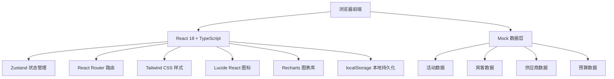
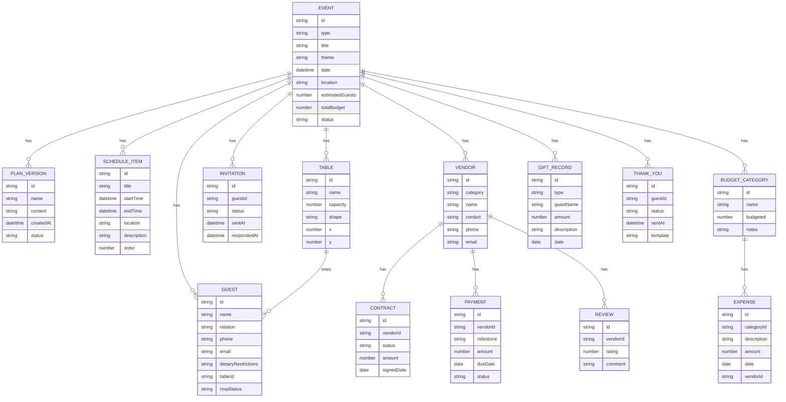

## 1. 架构设计



## 2. 技术描述
- 前端：React@18 + TypeScript + Vite@5
- 样式：TailwindCSS@3
- 状态管理：Zustand
- 路由：React Router DOM@6
- 图表：Recharts@2
- 图标：Lucide React
- 数据持久化：localStorage + Mock数据
- 构建工具：Vite@5

## 3. 路由定义
| 路由 | 页面 | 用途 |
|-------|------|------|
| / | Dashboard | 首页仪表盘，活动概览与统计 |
| /planning | EventPlanning | 活动策划模块 |
| /planning/schedule | EventSchedule | 日程精细化排期 |
| /planning/versions | PlanVersions | 方案版本管理 |
| /guests | GuestManagement | 宾客名单管理 |
| /guests/seating | SeatingArrangement | 可视化桌位安排 |
| /guests/invitations | InvitationTracking | 请柬发送与追踪 |
| /vendors | VendorManagement | 供应商管理 |
| /vendors/comparison | VendorComparison | 供应商比价 |
| /budget | BudgetControl | 预算控制模块 |
| /post-event | PostEventManagement | 后续管理模块 |

## 4. 数据模型

### 4.1 数据模型定义



## 5. 项目结构

```
src/
├── components/          # 可复用组件
│   ├── layout/       # 布局组件
│   ├── ui/           # 基础UI组件
│   └── forms/        # 表单组件
│   └── charts/       # 图表组件
├── pages/               # 页面组件
├── store/              # Zustand状态管理
├── types/              # TypeScript类型定义
├── utils/              # 工具函数
├── data/               # Mock数据
├── hooks/              # 自定义Hooks
├── App.tsx
└── main.tsx
```
