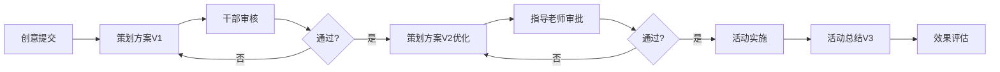
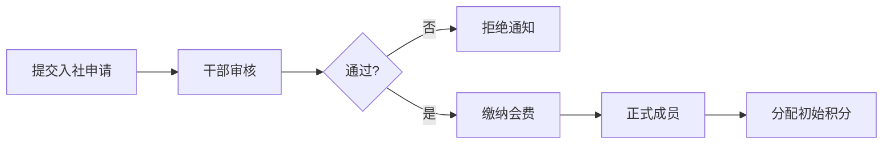
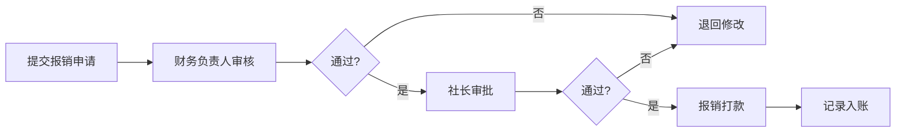

# 学生社团管理系统 - 产品需求文档

## 1. 产品概述

本系统是一套面向高校学生社团的综合管理与活动策划平台，旨在解决社团运营中信息分散、管理效率低下、档案追溯困难等问题。系统覆盖社团全生命周期管理，包括社团档案、成员管理、活动策划、财务管控和评优申报五大核心模块。

- 目标用户：社团负责人、社团干部、指导老师、社团成员
- 核心价值：数字化社团管理流程，提升运营效率，沉淀社团历史资产
- 产品定位：一站式社团数字化管理解决方案

## 2. 核心功能

### 2.1 用户角色

| 角色 | 说明 | 核心权限 |
|------|------|----------|
| 社团负责人 | 社长/副社长 | 全部模块管理权限、数据导出、审批权限 |
| 社团干部 | 各部门部长/干事 | 对应模块的操作权限、数据录入 |
| 普通成员 | 社团成员 | 查看活动、个人积分、社团信息浏览 |
| 指导老师 | 指导教师 | 查看社团概况、活动审批、财务审核 |

### 2.2 功能模块

1. **社团档案模块**：社团基本信息管理、历届干部名单、章程版本管理
2. **成员管理模块**：成员档案、积分系统、入退社记录
3. **活动管理模块**：活动档案、策划方案版本管理、活动效果评估
4. **财务管理模块**：收支记录、财务报告、预算规划
5. **评优申报模块**：优秀事迹记录、荣誉材料整理

### 2.3 页面详情

| 页面名称 | 模块名称 | 功能描述 |
|----------|----------|----------|
| 仪表盘 | 总览 | 社团概览数据、待办事项、最近活动、成员动态 |
| 社团档案 | 基本信息 | 社团名称、成立时间、宗旨、指导老师、会费制度的增删改查 |
| 社团档案 | 历届干部 | 按届次展示干部名单、任期记录、职务信息 |
| 社团档案 | 章程管理 | 章程版本历史、版本对比、回滚功能 |
| 成员管理 | 成员列表 | 成员档案信息、年级专业、职务、加入时间 |
| 成员管理 | 积分系统 | 积分获取规则、积分流水、积分排行榜 |
| 成员管理 | 入退社记录 | 新成员招募申请、退出记录、审批流程 |
| 活动管理 | 活动列表 | 活动名称、时间地点、负责人、预算、参与人数 |
| 活动管理 | 策划方案 | 方案版本迭代、从创意到实施的版本追踪 |
| 活动管理 | 效果评估 | 参与率统计、满意度调查、目标达成度分析 |
| 财务管理 | 收支记录 | 收入明细（会费/拨款/赞助）、支出明细（活动/办公） |
| 财务管理 | 财务报告 | 学期财务报表、收支分析图表、导出功能 |
| 财务管理 | 预算规划 | 下学期预算编制、预算项分类、预算执行对比 |
| 评优申报 | 事迹记录 | 成员优秀事迹录入、事迹分类、附件上传 |
| 评优申报 | 荣誉档案 | 奖学金/荣誉评定材料整理、申报记录追踪 |

## 3. 核心流程

### 3.1 活动策划流程

### 3.2 成员入社流程

### 3.3 经费报销流程

## 4. 用户界面设计

### 4.1 设计风格

- **主色调**：深海蓝 (#1e40af) - 体现学术与稳重
- **辅助色**：活力橙 (#f97316) - 突出交互与强调
- **中性色**：深灰 (#1f2937) / 中灰 (#6b7280) / 浅灰 (#f3f4f6)
- **按钮风格**：圆角设计 (8px)，微阴影，悬停有轻微上浮效果
- **字体体系**：
  - 标题：思源黑体 Bold，24-32px
  - 正文：思源黑体 Regular，14-16px
  - 辅助文字：思源黑体 Light，12px
- **布局风格**：卡片式布局，左侧导航 + 顶部标题 + 主内容区
- **图标风格**：线性图标 (Lucide)，统一 20px 尺寸

### 4.2 页面设计概览

| 页面名称 | 模块名称 | UI 元素 |
|----------|----------|---------|
| 仪表盘 | 总览 | 数据卡片网格、统计图表、最近动态列表、快捷操作按钮 |
| 社团档案 | 基本信息 | 信息卡片、编辑表单、头像上传、标签展示 |
| 成员管理 | 成员列表 | 表格视图、搜索筛选、分页、操作列 |
| 活动管理 | 活动列表 | 卡片瀑布流、状态标签、时间线视图切换 |
| 财务管理 | 收支记录 | 流水表格、分类筛选、收支概览卡片、趋势图 |
| 评优申报 | 事迹记录 | 时间线布局、事迹卡片、附件预览 |

### 4.3 响应式设计

- **桌面端优先** (1440px+)：完整侧边导航 + 多列布局
- **平板适配** (768-1440px)：收起式侧边栏 + 双列布局
- **移动端** (<768px)：底部 Tab 导航 + 单列卡片布局
- 所有表格支持横向滚动，触摸操作优化

### 4.4 动效与交互

- 页面切换：淡入淡出过渡 (300ms)
- 卡片悬停：轻微上浮 + 阴影加深
- 数据加载：骨架屏 + 脉冲动画
- 表单提交：按钮加载态 + 成功/失败反馈
- 模态框：缩放进入 + 背景模糊
