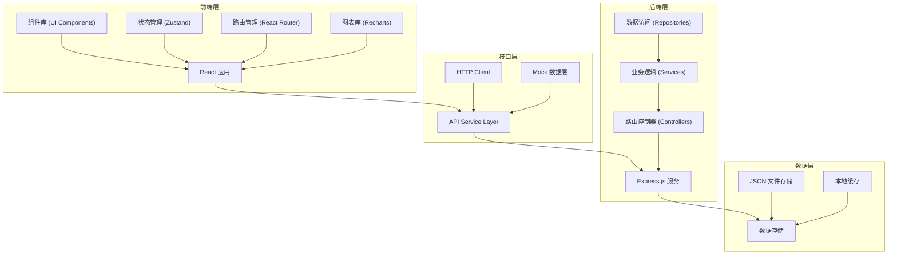
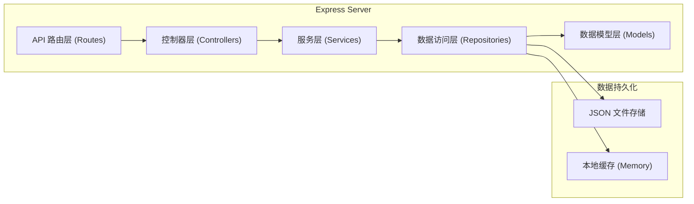

# 学生社团管理系统 - 技术架构文档

## 1. 架构设计



## 2. 技术描述

- **前端框架**: React 18 + TypeScript
- **构建工具**: Vite 5
- **样式方案**: TailwindCSS 3
- **状态管理**: Zustand
- **路由管理**: React Router v6
- **图标库**: Lucide React
- **图表库**: Recharts
- **后端框架**: Express 4 + TypeScript
- **数据存储**: JSON 文件 (开发阶段) + localStorage 前端持久化
- **包管理器**: npm

## 3. 路由定义

| 路由路径 | 页面名称 | 说明 |
|----------|----------|------|
| / | 仪表盘 | 系统首页，展示数据概览 |
| /club/info | 社团基本信息 | 社团档案 - 基本信息管理 |
| /club/cadres | 历届干部 | 社团档案 - 历届干部名单 |
| /club/constitution | 章程管理 | 社团档案 - 章程版本管理 |
| /members/list | 成员列表 | 成员管理 - 成员档案列表 |
| /members/points | 积分系统 | 成员管理 - 积分排行与流水 |
| /members/records | 入退社记录 | 成员管理 - 入社申请与退社记录 |
| /activities/list | 活动列表 | 活动管理 - 活动档案列表 |
| /activities/plans | 策划方案 | 活动管理 - 策划方案版本管理 |
| /activities/evaluation | 效果评估 | 活动管理 - 活动效果评估分析 |
| /finance/records | 收支记录 | 财务管理 - 收支明细流水 |
| /finance/reports | 财务报告 | 财务管理 - 学期财务报表 |
| /finance/budget | 预算规划 | 财务管理 - 下学期预算编制 |
| /honors/achievements | 事迹记录 | 评优申报 - 优秀事迹管理 |
| /honors/applications | 荣誉申报 | 评优申报 - 荣誉档案与申报记录 |

## 4. API 接口定义

### 4.1 社团档案接口

```typescript
// 社团基本信息
interface ClubInfo {
  id: string;
  name: string;
  foundedDate: string;
  purpose: string;
  advisor: string;
  feePolicy: string;
  logo?: string;
  description?: string;
}

// GET /api/club/info - 获取社团基本信息
// PUT /api/club/info - 更新社团基本信息

// 干部记录
interface Cadre {
  id: string;
  name: string;
  position: string;
  term: string;
  startDate: string;
  endDate?: string;
  department?: string;
}

// GET /api/club/cadres - 获取历届干部列表
// POST /api/club/cadres - 新增干部记录
// PUT /api/club/cadres/:id - 更新干部记录
// DELETE /api/club/cadres/:id - 删除干部记录

// 章程版本
interface ConstitutionVersion {
  id: string;
  version: string;
  content: string;
  createdAt: string;
  createdBy: string;
  description?: string;
}

// GET /api/club/constitutions - 获取章程版本列表
// GET /api/club/constitutions/:id - 获取章程详情
// POST /api/club/constitutions - 新增章程版本
```

### 4.2 成员管理接口

```typescript
// 成员档案
interface Member {
  id: string;
  name: string;
  grade: string;
  major: string;
  joinDate: string;
  position: string;
  phone?: string;
  email?: string;
  points: number;
  status: 'active' | 'inactive' | 'graduated';
  avatar?: string;
}

// GET /api/members - 获取成员列表
// GET /api/members/:id - 获取成员详情
// POST /api/members - 新增成员
// PUT /api/members/:id - 更新成员信息
// DELETE /api/members/:id - 删除成员

// 积分记录
interface PointRecord {
  id: string;
  memberId: string;
  memberName: string;
  points: number;
  reason: string;
  activityId?: string;
  createdAt: string;
}

// GET /api/members/points - 获取积分排行
// GET /api/members/points/records - 获取积分流水
// POST /api/members/points - 增加/扣减积分

// 入退社记录
interface MemberRecord {
  id: string;
  name: string;
  type: 'join' | 'leave';
  date: string;
  status: 'pending' | 'approved' | 'rejected';
  reason?: string;
}

// GET /api/members/records - 获取入退社记录
// POST /api/members/records - 提交申请
// PUT /api/members/records/:id - 审批申请
```

### 4.3 活动管理接口

```typescript
// 活动档案
interface Activity {
  id: string;
  name: string;
  date: string;
  location: string;
  organizer: string;
  budget: number;
  participantCount: number;
  status: 'planning' | 'ongoing' | 'completed' | 'cancelled';
  description?: string;
  photos?: string[];
}

// GET /api/activities - 获取活动列表
// GET /api/activities/:id - 获取活动详情
// POST /api/activities - 创建活动
// PUT /api/activities/:id - 更新活动
// DELETE /api/activities/:id - 删除活动

// 策划方案版本
interface PlanVersion {
  id: string;
  activityId: string;
  version: string;
  title: string;
  content: string;
  status: 'draft' | 'reviewing' | 'approved' | 'rejected';
  createdAt: string;
  createdBy: string;
}

// GET /api/activities/:id/plans - 获取策划方案版本列表
// POST /api/activities/:id/plans - 新增策划版本
// PUT /api/activities/plans/:id - 更新策划方案

// 活动评估
interface ActivityEvaluation {
  id: string;
  activityId: string;
  participationRate: number;
  satisfactionScore: number;
  goalAchievement: number;
  summary: string;
  createdAt: string;
}

// GET /api/activities/:id/evaluation - 获取活动评估
// POST /api/activities/:id/evaluation - 提交活动评估
```

### 4.4 财务管理接口

```typescript
// 财务记录
interface FinanceRecord {
  id: string;
  type: 'income' | 'expense';
  category: string;
  amount: number;
  date: string;
  description: string;
  relatedActivityId?: string;
  createdAt: string;
}

// 收入分类: membership_fee (会费), school_grant (学校拨款), sponsorship (赞助)
// 支出分类: activity (活动支出), office (办公采购), other (其他)

// GET /api/finance/records - 获取收支记录
// POST /api/finance/records - 新增财务记录
// PUT /api/finance/records/:id - 更新财务记录
// DELETE /api/finance/records/:id - 删除财务记录
// GET /api/finance/summary - 获取财务概览

// 财务报告
interface FinanceReport {
  id: string;
  title: string;
  period: string;
  totalIncome: number;
  totalExpense: number;
  balance: number;
  details: string;
  createdAt: string;
}

// GET /api/finance/reports - 获取财务报告列表
// POST /api/finance/reports/generate - 生成学期报告

// 预算规划
interface BudgetItem {
  id: string;
  category: string;
  plannedAmount: number;
  actualAmount?: number;
  description: string;
  semester: string;
}

// GET /api/finance/budget - 获取预算列表
// POST /api/finance/budget - 新增预算项
// PUT /api/finance/budget/:id - 更新预算项
```

### 4.5 评优申报接口

```typescript
// 优秀事迹
interface Achievement {
  id: string;
  memberId: string;
  memberName: string;
  title: string;
  category: string;
  date: string;
  description: string;
  attachments?: string[];
  createdAt: string;
}

// 事迹分类: scholarship (奖学金), honor (荣誉称号), competition (竞赛获奖), volunteer (志愿服务)

// GET /api/honors/achievements - 获取事迹列表
// GET /api/honors/achievements/:id - 获取事迹详情
// POST /api/honors/achievements - 新增事迹
// PUT /api/honors/achievements/:id - 更新事迹
// DELETE /api/honors/achievements/:id - 删除事迹

// 荣誉申报
interface HonorApplication {
  id: string;
  memberId: string;
  memberName: string;
  honorName: string;
  applicationDate: string;
  status: 'draft' | 'submitted' | 'reviewing' | 'approved' | 'rejected';
  materials: string[];
  remarks?: string;
}

// GET /api/honors/applications - 获取申报列表
// POST /api/honors/applications - 提交申报
// PUT /api/honors/applications/:id - 更新申报
```

## 5. 后端架构图



## 6. 项目目录结构

```
project184/
├── src/                          # 前端源码
│   ├── components/               # 公共组件
│   │   ├── layout/              # 布局组件
│   │   ├── ui/                  # 基础 UI 组件
│   │   └── charts/              # 图表组件
│   ├── pages/                   # 页面组件
│   │   ├── dashboard/           # 仪表盘
│   │   ├── club/                # 社团档案
│   │   ├── members/             # 成员管理
│   │   ├── activities/          # 活动管理
│   │   ├── finance/             # 财务管理
│   │   └── honors/              # 评优申报
│   ├── store/                   # 状态管理 (Zustand)
│   ├── hooks/                   # 自定义 Hooks
│   ├── utils/                   # 工具函数
│   ├── types/                   # TypeScript 类型定义
│   ├── services/                # API 服务
│   ├── mock/                    # Mock 数据
│   ├── App.tsx
│   ├── main.tsx
│   └── index.css
├── api/                          # 后端源码
│   ├── routes/                  # 路由定义
│   ├── controllers/             # 控制器
│   ├── services/                # 业务逻辑
│   ├── models/                  # 数据模型
│   ├── data/                    # JSON 数据文件
│   ├── utils/                   # 工具函数
│   └── index.ts
├── public/                       # 静态资源
├── .trae/
│   └── documents/               # 项目文档
├── package.json
├── tsconfig.json
├── vite.config.ts
├── tailwind.config.js
└── postcss.config.js
```

## 7. 前端状态管理

使用 Zustand 管理全局状态，按模块划分 store：

```typescript
// store/clubStore.ts - 社团档案状态
// store/memberStore.ts - 成员管理状态
// store/activityStore.ts - 活动管理状态
// store/financeStore.ts - 财务管理状态
// store/honorStore.ts - 评优申报状态
// store/uiStore.ts - UI 交互状态
```
