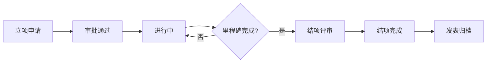

## 1. Product Overview
课题组/研究小组项目协作工具是一个综合性的在线平台，旨在提升科研团队的协作效率，涵盖项目管理、实验记录、文献共享、成果管理和组内沟通五大核心模块。
- 解决科研团队协作痛点：信息分散、版本混乱、沟通低效
- 目标用户：高校科研团队、企业研发部门、学术研究小组

## 2. Core Features

### 2.1 User Roles
| Role | Registration Method | Core Permissions |
|------|---------------------|------------------|
| 管理员 | 邮箱注册+审批 | 管理用户、配置系统、全局权限 |
| 组长 | 管理员分配 | 创建项目、分配任务、审批成果 |
| 成员 | 邮箱注册/邀请 | 参与项目、记录实验、分享文献 |

### 2.2 Feature Module
1. **项目管理**：项目生命周期管理、里程碑追踪、任务分工
2. **实验记录**：数字化实验记录本、数据版本管理、实验条件记录
3. **文献共享**：文献库共建、阅读进度共享、阅读报告分享
4. **成果管理**：论文写作进度、专利申请管理、学术报告归档
5. **组内沟通**：组会纪要、技术讨论板

### 2.3 Page Details
| Page Name | Module Name | Feature description |
|-----------|-------------|---------------------|
| Dashboard | 首页仪表盘 | 项目状态概览、待办任务、最新动态 |
| Projects | 项目管理 | 项目列表、创建/编辑项目、阶段追踪 |
| Milestones | 里程碑管理 | 设置关键节点、追踪进度 |
| Tasks | 任务管理 | 任务分配、进度更新、优先级设置 |
| LabRecords | 实验记录 | 结构化记录实验、数据版本管理 |
| Literature | 文献共享 | 文献库、阅读状态、阅读报告 |
| Achievements | 成果管理 | 论文/专利/报告的进度追踪 |
| Meetings | 组会管理 | 纪要记录、行动项追踪 |
| Discussions | 技术讨论 | 讨论板、历史记录 |

## 3. Core Process

### 项目管理流程

### 实验记录流程

## 4. User Interface Design

### 4.1 Design Style
- **主色调**：深蓝色(#1e3a5f)配合青色(#00d4aa)作为强调色
- **辅助色**：浅灰(#f5f7fa)作为背景，深灰(#333)作为文字
- **按钮样式**：圆角矩形，hover状态有轻微缩放和阴影变化
- **字体**：Inter字体，标题18-24px，正文14px，小字12px
- **布局**：左侧侧边栏导航 + 右侧主内容区的经典仪表板布局
- **图标**：使用Lucide图标库，线性风格

### 4.2 Page Design Overview
| Page Name | Module Name | UI Elements |
|-----------|-------------|-------------|
| Dashboard | 卡片概览 | 项目进度环形图、任务统计卡片、近期活动时间线 |
| Projects | 项目列表 | 卡片式布局、状态标签、操作按钮组 |
| LabRecords | 实验表单 | 日期选择器、文本域、文件上传、版本时间线 |
| Literature | 文献列表 | 卡片悬停效果、阅读状态徽章、推荐人标识 |
| Achievements | 成果追踪 | 进度条、状态标签、版本历史 |

### 4.3 Responsiveness
- **桌面端**：完整侧边栏 + 多列布局
- **平板端**：折叠侧边栏图标 + 自适应列数
- **移动端**：底部导航栏 + 单列堆叠布局

### 4.4 交互设计
- 表单提交时有loading状态提示
- 成功/失败操作有Toast通知
- 卡片hover有阴影和位移效果
- 模态框使用半透明背景遮罩
