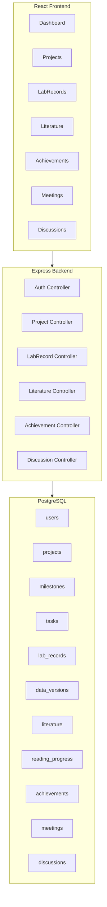
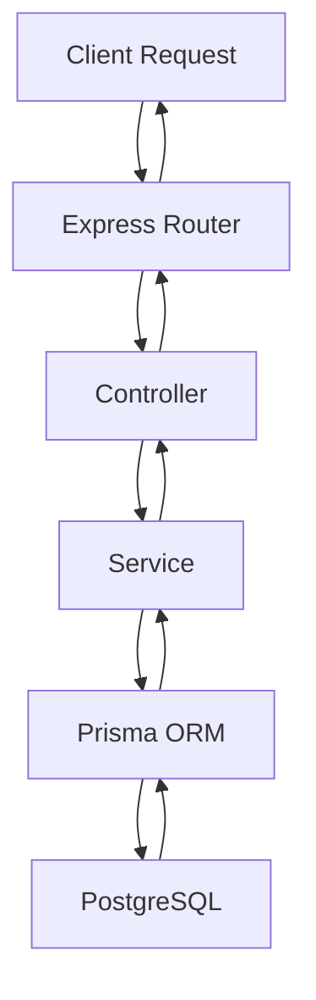
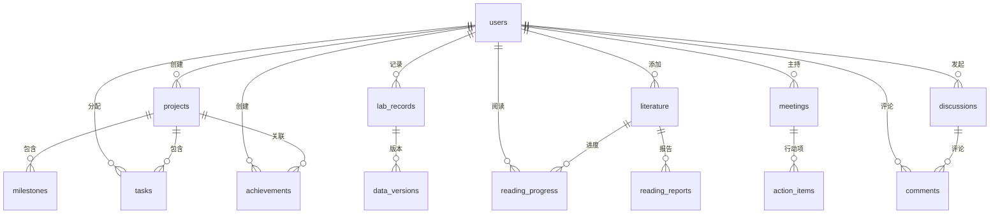

## 1. Architecture Design



## 2. Technology Description
- **Frontend**: React@18 + TypeScript + TailwindCSS@3 + Vite
- **Initialization Tool**: vite-init
- **Backend**: Express@4 + TypeScript
- **Database**: PostgreSQL (via Prisma ORM)
- **State Management**: Zustand
- **Routing**: React Router DOM
- **Icons**: Lucide React
- **UI Components**: Custom components with Tailwind

## 3. Route Definitions
| Route | Purpose | Component |
|-------|---------|-----------|
| / | Dashboard首页 | Dashboard |
| /projects | 项目列表 | ProjectList |
| /projects/:id | 项目详情 | ProjectDetail |
| /projects/new | 创建项目 | ProjectForm |
| /lab-records | 实验记录列表 | LabRecordList |
| /lab-records/:id | 实验记录详情 | LabRecordDetail |
| /lab-records/new | 创建实验记录 | LabRecordForm |
| /literature | 文献库 | LiteratureList |
| /literature/:id | 文献详情 | LiteratureDetail |
| /literature/new | 添加文献 | LiteratureForm |
| /achievements | 成果管理 | AchievementList |
| /achievements/:id | 成果详情 | AchievementDetail |
| /meetings | 组会列表 | MeetingList |
| /meetings/:id | 组会详情 | MeetingDetail |
| /meetings/new | 新建组会 | MeetingForm |
| /discussions | 技术讨论板 | DiscussionList |
| /discussions/:id | 讨论详情 | DiscussionDetail |

## 4. API Definitions

### 4.1 项目管理 API
| Endpoint | Method | Description |
|----------|--------|-------------|
| /api/projects | GET | 获取项目列表 |
| /api/projects | POST | 创建新项目 |
| /api/projects/:id | GET | 获取项目详情 |
| /api/projects/:id | PUT | 更新项目 |
| /api/projects/:id | DELETE | 删除项目 |
| /api/projects/:id/milestones | GET | 获取项目里程碑 |
| /api/projects/:id/tasks | GET | 获取项目任务 |

### 4.2 实验记录 API
| Endpoint | Method | Description |
|----------|--------|-------------|
| /api/lab-records | GET | 获取实验记录列表 |
| /api/lab-records | POST | 创建实验记录 |
| /api/lab-records/:id | GET | 获取实验记录详情 |
| /api/lab-records/:id | PUT | 更新实验记录 |
| /api/lab-records/:id/versions | GET | 获取数据版本历史 |

### 4.3 文献共享 API
| Endpoint | Method | Description |
|----------|--------|-------------|
| /api/literature | GET | 获取文献列表 |
| /api/literature | POST | 添加新文献 |
| /api/literature/:id | GET | 获取文献详情 |
| /api/literature/:id/reading-progress | PUT | 更新阅读进度 |
| /api/literature/:id/report | POST | 添加阅读报告 |

### 4.4 成果管理 API
| Endpoint | Method | Description |
|----------|--------|-------------|
| /api/achievements | GET | 获取成果列表 |
| /api/achievements | POST | 创建成果 |
| /api/achievements/:id | GET | 获取成果详情 |
| /api/achievements/:id | PUT | 更新成果状态 |

### 4.5 组内沟通 API
| Endpoint | Method | Description |
|----------|--------|-------------|
| /api/meetings | GET | 获取组会列表 |
| /api/meetings | POST | 创建组会 |
| /api/meetings/:id | GET | 获取组会详情 |
| /api/meetings/:id/actions | POST | 添加行动项 |
| /api/discussions | GET | 获取讨论列表 |
| /api/discussions | POST | 创建讨论 |
| /api/discussions/:id/comments | POST | 添加评论 |

## 5. Server Architecture Diagram



## 6. Data Model

### 6.1 Data Model Definition



### 6.2 Data Definition Language

#### users 表
```sql
CREATE TABLE users (
    id SERIAL PRIMARY KEY,
    email VARCHAR(255) UNIQUE NOT NULL,
    name VARCHAR(100) NOT NULL,
    role VARCHAR(20) DEFAULT 'member',
    created_at TIMESTAMP DEFAULT CURRENT_TIMESTAMP,
    updated_at TIMESTAMP DEFAULT CURRENT_TIMESTAMP
);
```

#### projects 表
```sql
CREATE TABLE projects (
    id SERIAL PRIMARY KEY,
    name VARCHAR(200) NOT NULL,
    description TEXT,
    status VARCHAR(20) DEFAULT 'proposed',
    created_by INTEGER REFERENCES users(id),
    created_at TIMESTAMP DEFAULT CURRENT_TIMESTAMP,
    updated_at TIMESTAMP DEFAULT CURRENT_TIMESTAMP
);
```

#### milestones 表
```sql
CREATE TABLE milestones (
    id SERIAL PRIMARY KEY,
    project_id INTEGER REFERENCES projects(id),
    name VARCHAR(200) NOT NULL,
    description TEXT,
    target_date DATE,
    status VARCHAR(20) DEFAULT 'pending',
    created_at TIMESTAMP DEFAULT CURRENT_TIMESTAMP
);
```

#### tasks 表
```sql
CREATE TABLE tasks (
    id SERIAL PRIMARY KEY,
    project_id INTEGER REFERENCES projects(id),
    milestone_id INTEGER REFERENCES milestones(id),
    title VARCHAR(200) NOT NULL,
    description TEXT,
    assignee_id INTEGER REFERENCES users(id),
    priority VARCHAR(20) DEFAULT 'medium',
    status VARCHAR(20) DEFAULT 'todo',
    due_date DATE,
    created_at TIMESTAMP DEFAULT CURRENT_TIMESTAMP,
    updated_at TIMESTAMP DEFAULT CURRENT_TIMESTAMP
);
```

#### lab_records 表
```sql
CREATE TABLE lab_records (
    id SERIAL PRIMARY KEY,
    user_id INTEGER REFERENCES users(id),
    project_id INTEGER REFERENCES projects(id),
    experiment_date DATE NOT NULL,
    purpose TEXT NOT NULL,
    method TEXT NOT NULL,
    results TEXT,
    conclusion TEXT,
    created_at TIMESTAMP DEFAULT CURRENT_TIMESTAMP,
    updated_at TIMESTAMP DEFAULT CURRENT_TIMESTAMP
);
```

#### data_versions 表
```sql
CREATE TABLE data_versions (
    id SERIAL PRIMARY KEY,
    lab_record_id INTEGER REFERENCES lab_records(id),
    version_number INTEGER NOT NULL,
    file_name VARCHAR(255),
    file_path VARCHAR(500),
    data_type VARCHAR(50),
    description TEXT,
    created_at TIMESTAMP DEFAULT CURRENT_TIMESTAMP
);
```

#### literature 表
```sql
CREATE TABLE literature (
    id SERIAL PRIMARY KEY,
    title VARCHAR(500) NOT NULL,
    authors TEXT,
    journal VARCHAR(200),
    year INTEGER,
    doi VARCHAR(200),
    url VARCHAR(500),
    added_by INTEGER REFERENCES users(id),
    created_at TIMESTAMP DEFAULT CURRENT_TIMESTAMP
);
```

#### reading_progress 表
```sql
CREATE TABLE reading_progress (
    id SERIAL PRIMARY KEY,
    literature_id INTEGER REFERENCES literature(id),
    user_id INTEGER REFERENCES users(id),
    status VARCHAR(20) DEFAULT 'unread',
    progress INTEGER DEFAULT 0,
    recommended BOOLEAN DEFAULT false,
    created_at TIMESTAMP DEFAULT CURRENT_TIMESTAMP,
    updated_at TIMESTAMP DEFAULT CURRENT_TIMESTAMP
);
```

#### achievements 表
```sql
CREATE TABLE achievements (
    id SERIAL PRIMARY KEY,
    project_id INTEGER REFERENCES projects(id),
    title VARCHAR(200) NOT NULL,
    type VARCHAR(20) DEFAULT 'paper',
    status VARCHAR(20) DEFAULT 'draft',
    details TEXT,
    created_by INTEGER REFERENCES users(id),
    created_at TIMESTAMP DEFAULT CURRENT_TIMESTAMP,
    updated_at TIMESTAMP DEFAULT CURRENT_TIMESTAMP
);
```

#### meetings 表
```sql
CREATE TABLE meetings (
    id SERIAL PRIMARY KEY,
    title VARCHAR(200) NOT NULL,
    date DATE NOT NULL,
    time TIME NOT NULL,
    location VARCHAR(200),
    minutes TEXT,
    hosted_by INTEGER REFERENCES users(id),
    created_at TIMESTAMP DEFAULT CURRENT_TIMESTAMP
);
```

#### action_items 表
```sql
CREATE TABLE action_items (
    id SERIAL PRIMARY KEY,
    meeting_id INTEGER REFERENCES meetings(id),
    description TEXT NOT NULL,
    assignee_id INTEGER REFERENCES users(id),
    due_date DATE,
    status VARCHAR(20) DEFAULT 'pending',
    created_at TIMESTAMP DEFAULT CURRENT_TIMESTAMP
);
```

#### discussions 表
```sql
CREATE TABLE discussions (
    id SERIAL PRIMARY KEY,
    title VARCHAR(200) NOT NULL,
    content TEXT NOT NULL,
    author_id INTEGER REFERENCES users(id),
    project_id INTEGER REFERENCES projects(id),
    created_at TIMESTAMP DEFAULT CURRENT_TIMESTAMP
);
```

#### comments 表
```sql
CREATE TABLE comments (
    id SERIAL PRIMARY KEY,
    discussion_id INTEGER REFERENCES discussions(id),
    content TEXT NOT NULL,
    author_id INTEGER REFERENCES users(id),
    created_at TIMESTAMP DEFAULT CURRENT_TIMESTAMP
);
```
