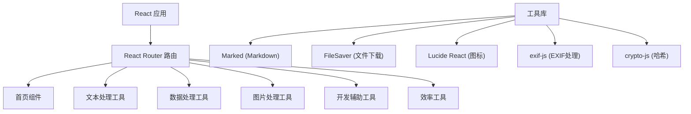

## 1. 架构设计



## 2. 技术描述

- **前端**: React@18 + TypeScript + Vite + Tailwind CSS
- **路由**: React Router DOM
- **状态管理**: Zustand
- **图标库**: Lucide React
- **第三方库**:
  - marked: Markdown 解析
  - file-saver: 文件下载
  - exif-js: EXIF 信息读取
  - crypto-js: 哈希计算
- **后端**: 无（纯前端应用）

## 3. 路由定义

| 路由 | 用途 |
|-----|------|
| / | 首页 |
| /text | 文本处理工具 |
| /data | 数据处理工具 |
| /image | 图片处理工具 |
| /dev | 开发辅助工具 |
| /productivity | 效率工具 |

## 4. 项目结构

```
src/
├── components/
│   ├── Layout.tsx          # 布局组件
│   ├── ToolCard.tsx        # 工具卡片组件
│   └── NavSidebar.tsx      # 导航侧边栏
├── pages/
│   ├── Home.tsx            # 首页
│   ├── TextTools.tsx       # 文本处理工具
│   ├── DataTools.tsx       # 数据处理工具
│   ├── ImageTools.tsx      # 图片处理工具
│   ├── DevTools.tsx        # 开发辅助工具
│   └── ProductivityTools.tsx # 效率工具
├── utils/
│   ├── text.ts             # 文本处理工具函数
│   ├── data.ts             # 数据处理工具函数
│   ├── image.ts            # 图片处理工具函数
│   ├── dev.ts              # 开发辅助工具函数
│   └── productivity.ts     # 效率工具函数
├── App.tsx
├── main.tsx
└── index.css
```

