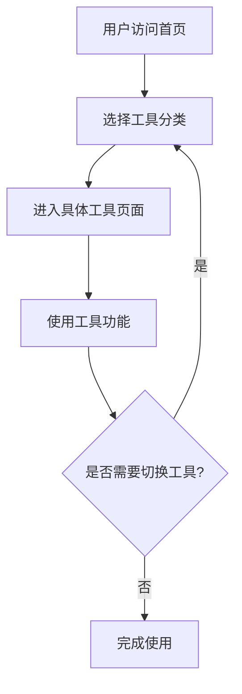

## 1. 产品概述

在线工具箱平台是一个集成多种日常效率工具的 Web 应用，旨在为开发者、学生和办公人员提供一站式工具服务。所有工具均在浏览器端完成处理，无需上传数据到服务器，确保用户隐私安全。

## 2. 核心功能

### 2.1 功能模块

1. **首页**: 工具导航、工具分类展示
2. **文本处理工具**: Markdown 预览转换、文本格式转换、文字统计
3. **数据处理工具**: CSV/JSON 可视化、数据过滤排序、格式互转
4. **图片处理工具**: 压缩格式转换、裁剪缩放、EXIF 信息处理
5. **开发辅助工具**: 颜色选择器、时间戳转换、哈希计算
6. **效率工具**: 番茄钟、密码生成器、单位换算

### 2.2 页面详情

| 页面名称 | 模块名称 | 功能描述 |
|---------|---------|---------|
| 首页 | 工具分类导航 | 卡片式展示所有工具分类，点击进入对应工具 |
| 文本处理 | Markdown 工具 | 实时预览、转 HTML、转 Word |
| 文本处理 | 格式转换 | JSON 格式化、Base64 编解码、URL 编解码、正则测试 |
| 文本处理 | 文字统计 | 字数、词数、行数、字符频率统计 |
| 数据处理 | 数据预览 | 表格形式展示 JSON 数组和 CSV 数据 |
| 数据处理 | 数据操作 | 数据过滤、排序 |
| 数据处理 | 格式转换 | CSV 与 JSON 互转 |
| 图片处理 | 格式转换 | JPEG/PNG/WebP 互转，浏览器端压缩 |
| 图片处理 | 裁剪缩放 | Canvas 实现图片裁剪和缩放 |
| 图片处理 | 元数据处理 | EXIF 信息读取和清除 |
| 开发辅助 | 颜色工具 | HEX/RGB/HSL 格式互转，颜色选择器 |
| 开发辅助 | 时间戳转换 | Unix 时间戳与日期时间互转 |
| 开发辅助 | 哈希计算 | MD5/SHA1/SHA256 哈希值计算 |
| 效率工具 | 番茄钟 | 番茄工作法计时器 |
| 效率工具 | 密码生成 | 可配置长度和字符集的随机密码生成器 |
| 效率工具 | 单位换算 | 重量、长度、温度、货币等常用单位换算 |

## 3. 核心流程

## 4. 用户界面设计

### 4.1 设计风格

- **主色调**: 深蓝色 (#1e40af) 配合天蓝色 (#60a5fa)
- **按钮风格**: 圆角矩形，带悬停效果和轻微阴影
- **字体**: 采用 Inter 和 JetBrains Mono 组合，现代简洁
- **布局风格**: 卡片式布局，左侧导航栏，右侧内容区
- **图标风格**: 使用 Lucide React 图标库，线性简约风格

### 4.2 页面设计概述

| 页面名称 | 模块名称 | UI 元素 |
|---------|---------|---------|
| 首页 | 工具卡片网格 | 渐变背景，卡片悬停上浮动画，网格布局 |
| 工具页面 | 左侧导航 | 固定侧边栏，当前工具高亮，平滑滚动 |
| 工具页面 | 内容区域 | 白色背景卡片，分区展示输入输出区域 |
| 工具页面 | 操作按钮 | 主操作按钮高亮，次要按钮简洁 |

### 4.3 响应式设计

采用桌面优先设计，同时适配平板和移动设备。在小屏幕上左侧导航变为顶部导航或汉堡菜单。

