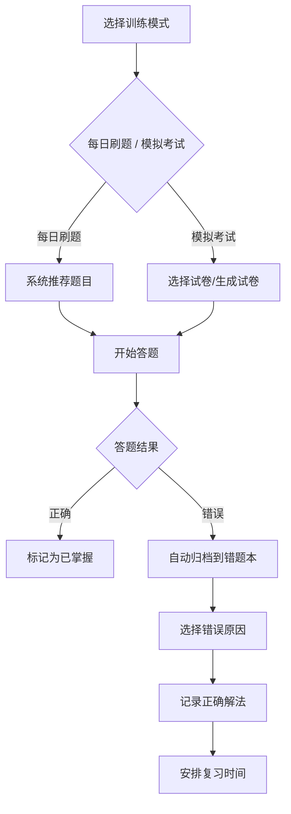
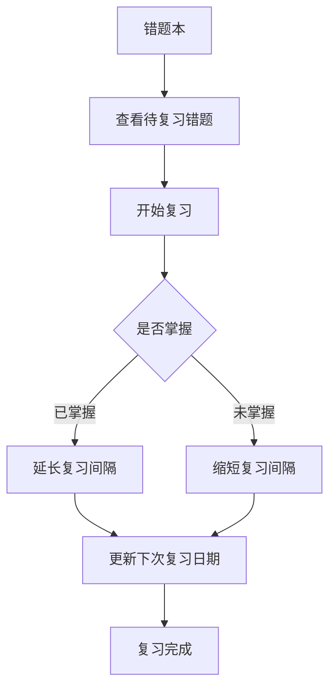

# 数学竞赛训练与错题管理系统 - 产品需求文档

## 1. 产品概述

**MathArena** 是一款面向数学竞赛参赛者的在线训练平台，帮助用户系统化管理竞赛题目、制定训练计划、整理错题本、记录学习笔记，并追踪学习进度。

核心价值：
- 整合数论、组合、代数、几何四大专题的竞赛题目库，支持 LaTeX 公式渲染
- 智能错题本自动归档，间隔重复复习机制提升学习效率
- 多维度进度分析，直观呈现知识点掌握程度与目标差距

目标用户：中学生、大学生数学竞赛参赛者（CMO、IMO、省赛、集训队选拔等）

## 2. 功能模块

### 2.1 用户角色

| 角色 | 注册方式 | 核心权限 |
|------|---------|----------|
| 普通用户 | 邮箱注册 | 使用全部训练功能 |
| 管理员 | 后台分配 | 题目管理、用户管理 |

### 2.2 功能模块

1. **首页仪表盘** - 今日任务概览、快速入口、学习数据摘要
2. **题目库管理** - 题目录入、题解管理、专题整理
3. **训练计划** - 每日刷题、模拟考试、知识强化
4. **错题本** - 错题归档、分类统计、定期复习
5. **学习笔记** - 知识梳理、方法归纳、参赛感悟
6. **进度分析** - 掌握热图、成绩趋势、差距分析

## 3. 页面详情

### 3.1 首页仪表盘

| 模块名称 | 功能描述 |
|---------|----------|
| 今日任务卡片 | 显示今日刷题目标、完成进度、剩余题目 |
| 错题提醒 | 需要复习的错题数量提醒 |
| 学习连续天数 | 连续打卡天数统计 |
| 最近模拟考 | 最近一次模拟考试成绩 |
| 快捷入口 | 一键进入刷题、错题本、笔记 |

### 3.2 题目库管理

| 模块名称 | 功能描述 |
|---------|----------|
| 题目录入表单 | 支持 LaTeX 的题目内容编辑器、来源、竞赛类型、知识点标签、难度选择 |
| 题目列表 | 筛选（竞赛类型/知识点/难度）、搜索、排序 |
| 题解管理 | 多解法对比展示，每种解法包含思路分析、关键步骤、适用场景 |
| 专题整理 | 四大专题（数论/组合/代数/几何）题目分类，专题内按难度排序 |

### 3.3 训练计划

| 模块名称 | 功能描述 |
|---------|----------|
| 每日刷题 | 设置每日目标数量和知识点覆盖，系统推荐题目 |
| 模拟考试 | 选择试卷、时间限制（90min/120min/150min），自动计时交卷 |
| 知识强化 | 薄弱知识点自动识别，生成专项训练计划 |
| 训练日历 | 月视图展示每日训练任务完成情况 |

### 3.4 错题本

| 模块名称 | 功能描述 |
|---------|----------|
| 错题列表 | 按错误原因分类（概念不清/计算失误/思路跑偏/粗心） |
| 错题详情 | 题目、错误原因、正确解法、关联知识点 |
| 分类统计 | 各知识点错误率图表、易错点排行 |
| 复习计划 | 基于间隔重复算法（SM-2）的复习时间安排 |

### 3.5 学习笔记

| 模块名称 | 功能描述 |
|---------|----------|
| 知识梳理 | 按专题整理的关键定理、证明思路、应用技巧 |
| 方法归纳 | 题型通用解题框架，如"抽屉原理三步法" |
| 参赛感悟 | 比赛总结、经验分享、教训记录 |
| 笔记编辑 | Markdown + LaTeX 支持，标签分类 |

### 3.6 进度分析

| 模块名称 | 功能描述 |
|---------|----------|
| 掌握程度热图 | 四大专题 × 难度级别的掌握程度矩阵 |
| 成绩趋势 | 模拟考试成绩折线图，标注关键节点 |
| 差距分析 | 与目标竞赛水平的对比，提示需强化领域 |
| 学习报告 | 周/月统计，生成可视化报告 |

## 4. 核心流程

### 4.1 刷题流程

### 4.2 错题复习流程

## 5. 用户界面设计

### 5.1 设计风格

- **主题**: 深色学术风 - 深夜学习的沉浸感
- **配色方案**:
  - 主色: `#6366F1` (靛蓝紫 - 智慧与专注)
  - 辅色: `#10B981` (翠绿 - 正确/成功)
  - 警示色: `#EF4444` (红色 - 错误/需强化)
  - 背景色: `#0F172A` (深蓝黑)
  - 卡片背景: `#1E293B` (浅深蓝)
  - 文字色: `#F8FAFC` (近白)
- **字体**: JetBrains Mono (代码/公式), Noto Sans SC (正文)
- **布局**: 侧边导航 + 主内容区，卡片式信息展示
- **图标**: Lucide Icons (简洁线性风格)

### 5.2 页面布局

| 页面 | 布局风格 |
|------|----------|
| 首页 | 三栏布局：侧边统计 + 中央任务 + 右侧快捷入口 |
| 题目库 | 左侧筛选器 + 中央题目列表 + 右侧题目详情 |
| 错题本 | 顶部统计卡片 + 中央错题卡片网格 |
| 笔记 | 双栏：笔记列表 + 编辑器 |
| 进度分析 | 顶部热图 + 下方图表区域 |

### 5.3 交互细节

- 题目卡片悬停: 微微上浮 + 阴影加深
- 答题正确: 绿色脉冲动画
- 答题错误: 红色震动 + 震动后显示正确答案
- 页面切换: 淡入淡出过渡 (300ms)
- 数据加载: 骨架屏占位

## 6. 数据统计

| 数据指标 | 描述 |
|---------|------|
| 题目总数 | 用户题库题目数量 |
| 刷题完成率 | 当日完成 / 当日目标 |
| 错题掌握率 | 已掌握错题 / 总错题 |
| 连续学习天数 | 每日有学习记录 |
| 模拟考平均分 | 所有模拟考的算术平均 |

## 7. 优先级

**P0 (必须实现)**
- 题目库基本增删改查
- 每日刷题功能
- 错题记录与查看
- 基础进度统计

**P1 (核心功能)**
- LaTeX 公式渲染
- 模拟考试计时
- 错题复习计划
- 多解法管理

**P2 (增强功能)**
- 间隔重复算法
- 掌握程度热图
- 成绩趋势分析
- 专题分类整理
