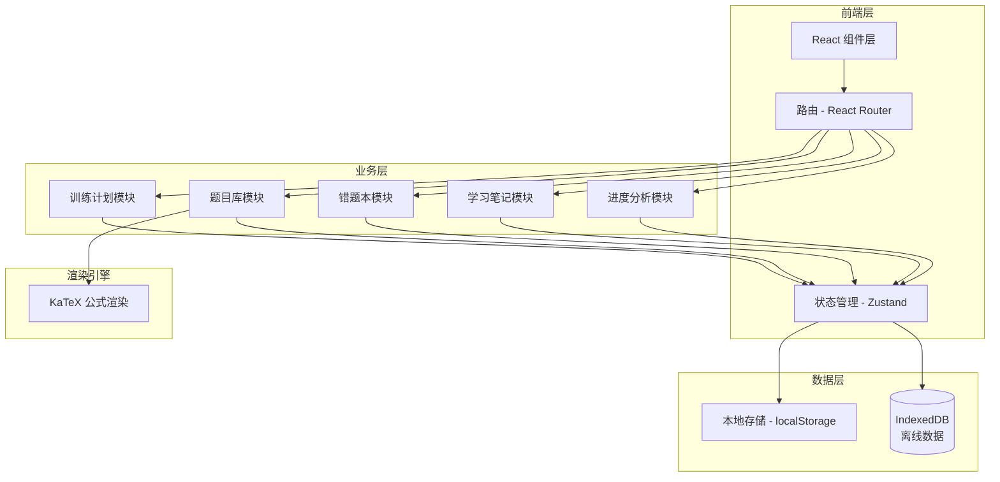

# 数学竞赛训练与错题管理系统 - 技术架构文档

## 1. 架构设计



## 2. 技术选型

| 类别 | 技术栈 |
|------|--------|
| 框架 | React@18 + Vite |
| 样式 | Tailwind CSS@3 |
| 状态管理 | Zustand |
| 路由 | React Router v6 |
| 公式渲染 | KaTeX |
| 图表 | Recharts |
| 本地存储 | localStorage + IndexedDB |
| 日期处理 | date-fns |
| UUID生成 | crypto.randomUUID |

## 3. 路由定义

| 路由 | 页面 | 描述 |
|------|------|------|
| `/` | Dashboard | 首页仪表盘 |
| `/questions` | QuestionBank | 题目库列表 |
| `/questions/:id` | QuestionDetail | 题目详情/答题 |
| `/questions/new` | QuestionForm | 录入新题目 |
| `/training` | Training | 训练计划总览 |
| `/training/daily` | DailyPractice | 每日刷题 |
| `/training/exam` | MockExam | 模拟考试 |
| `/training/reinforce` | KnowledgeReinforce | 知识强化 |
| `/errors` | WrongNotes | 错题本列表 |
| `/errors/:id` | WrongNoteDetail | 错题详情 |
| `/notes` | StudyNotes | 学习笔记列表 |
| `/notes/:id` | NoteEditor | 笔记编辑器 |
| `/notes/new` | NewNote | 新建笔记 |
| `/progress` | Progress | 进度分析 |

## 4. 数据模型

### 4.1 题目 (Question)

```typescript
interface Question {
  id: string;
  content: string;           // LaTeX 格式题目内容
  source: string;           // 题目来源 (如: 2023 CMO)
  competitionType: 'CMO' | 'IMO' | '省赛' | '集训队' | '其他';
  knowledgeTags: KnowledgeTag[];
  difficulty: 1 | 2 | 3 | 4 | 5;  // 1: 入门, 5: 竞赛级
  solutions: Solution[];
  topic: 'number_theory' | 'combinatorics' | 'algebra' | 'geometry';
  createdAt: string;
  updatedAt: string;
}

interface Solution {
  id: string;
  method: string;           // 解法名称 (如: 数学归纳法)
  content: string;         // LaTeX 格式解题过程
  idea: string;            // 思路分析
  applicableTo: string;    // 适用场景
}

type KnowledgeTag = '同余' | '抽屉原理' | '极值原理' | '不等式' | '函数方程' | ...;
```

### 4.2 错题记录 (WrongNote)

```typescript
interface WrongNote {
  id: string;
  questionId: string;
  errorReason: 'concept' | 'calculation' | 'approach' | 'careless';
  errorReasonText: string;  // 详细描述
  correctSolution: string;  // 正确解法备注
  reviewCount: number;      // 复习次数
  nextReviewDate: string;   // 下次复习日期 (SM-2算法)
  easeFactor: number;       // 难度系数
  interval: number;         // 间隔天数
  isMastered: boolean;      // 是否已掌握
  createdAt: string;
  updatedAt: string;
}
```

### 4.3 学习笔记 (StudyNote)

```typescript
interface StudyNote {
  id: string;
  title: string;
  content: string;          // Markdown + LaTeX
  type: 'knowledge' | 'method' | 'experience';
  tags: string[];
  topic?: 'number_theory' | 'combinatorics' | 'algebra' | 'geometry';
  createdAt: string;
  updatedAt: string;
}
```

### 4.4 训练记录 (TrainingRecord)

```typescript
interface TrainingRecord {
  id: string;
  type: 'daily' | 'exam' | 'reinforce';
  questionIds: string[];
  results: Record<string, boolean>;  // questionId -> 是否正确
  score?: number;                    // 模拟考得分
  duration?: number;                 // 用时(分钟)
  examDuration?: number;             // 考试限制时间
  createdAt: string;
}
```

### 4.5 每日目标 (DailyGoal)

```typescript
interface DailyGoal {
  id: string;
  date: string;             // YYYY-MM-DD
  targetCount: number;      // 目标题目数
  completedCount: number;   // 已完成数
  knowledgeCoverage: KnowledgeTag[];  // 目标覆盖知识点
  actualCoverage: KnowledgeTag[];    // 实际覆盖知识点
}
```

## 5. 间隔重复算法 (SM-2)

```typescript
function calculateNextReview(wrongNote: WrongNote, quality: 0 | 1 | 2 | 3 | 4 | 5) {
  // quality: 0-完全遗忘, 5-完美掌握
  let { easeFactor, interval, reviewCount } = wrongNote;

  if (quality < 3) {
    interval = 1;
  } else {
    if (reviewCount === 0) interval = 1;
    else if (reviewCount === 1) interval = 6;
    else interval = Math.round(interval * easeFactor);
  }

  easeFactor = easeFactor + (0.1 - (5 - quality) * (0.08 + (5 - quality) * 0.02));
  if (easeFactor < 1.3) easeFactor = 1.3;

  return {
    nextReviewDate: addDays(new Date(), interval),
    easeFactor,
    interval,
    reviewCount: reviewCount + 1
  };
}
```

## 6. 组件结构

```
src/
├── components/
│   ├── common/           # 通用组件
│   │   ├── Button.tsx
│   │   ├── Card.tsx
│   │   ├── Modal.tsx
│   │   ├── LatexRenderer.tsx
│   │   └── HeatMap.tsx
│   ├── layout/          # 布局组件
│   │   ├── Sidebar.tsx
│   │   ├── Header.tsx
│   │   └── Layout.tsx
│   ├── questions/        # 题目模块组件
│   │   ├── QuestionCard.tsx
│   │   ├── QuestionForm.tsx
│   │   ├── SolutionList.tsx
│   │   └── TopicFilter.tsx
│   ├── training/         # 训练模块组件
│   │   ├── DailyTask.tsx
│   │   ├── ExamTimer.tsx
│   │   └── TrainingCalendar.tsx
│   ├── errors/           # 错题模块组件
│   │   ├── WrongNoteCard.tsx
│   │   ├── ErrorReasonPicker.tsx
│   │   └── ReviewScheduler.tsx
│   ├── notes/            # 笔记模块组件
│   │   ├── NoteEditor.tsx
│   │   └── NoteList.tsx
│   └── progress/         # 进度模块组件
│       ├── MasteryHeatmap.tsx
│       └── ScoreTrendChart.tsx
├── pages/
│   ├── Dashboard.tsx
│   ├── QuestionBank.tsx
│   ├── QuestionDetail.tsx
│   ├── DailyPractice.tsx
│   ├── MockExam.tsx
│   ├── WrongNotes.tsx
│   ├── StudyNotes.tsx
│   └── Progress.tsx
├── stores/               # Zustand stores
│   ├── questionStore.ts
│   ├── wrongNoteStore.ts
│   ├── noteStore.ts
│   ├── trainingStore.ts
│   └── progressStore.ts
├── utils/
│   ├── sm2.ts            # 间隔重复算法
│   ├── storage.ts        # 本地存储封装
│   └── latex.ts          # LaTeX 工具
└── data/
    └── mockData.ts       # 初始模拟数据
```

## 7. 存储策略

| 数据类型 | 存储方式 | 同步策略 |
|---------|---------|---------|
| 题目数据 | IndexedDB | 实时写入 |
| 错题数据 | IndexedDB | 实时写入 |
| 笔记数据 | IndexedDB | 实时写入 |
| 用户偏好 | localStorage | 实时写入 |
| 训练历史 | IndexedDB | 批量写入 |

## 8. 性能优化

- 题目列表虚拟滚动 (react-virtual)
- LaTeX 公式按需渲染
- 图表懒加载
- 路由代码分割
