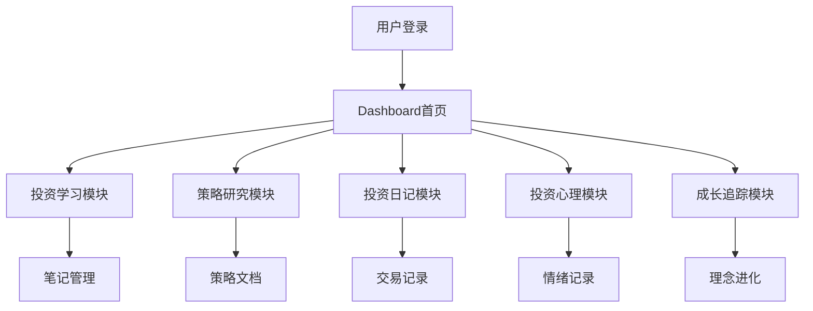

## 1. Product Overview
在线投资学习和策略回测记录工具，帮助投资者系统化学习投资知识、记录投资策略、追踪投资决策和心理状态。
- 核心功能包括投资学习笔记管理、策略研究与回测、投资日记记录、心理状态追踪和成长记录
- 目标用户：个人投资者、投资初学者、量化策略开发者

## 2. Core Features

### 2.1 User Roles
| Role | Registration Method | Core Permissions |
|------|---------------------|------------------|
| Normal User | Email registration | Create, read, update, delete own data |

### 2.2 Feature Modules
1. **投资学习模块**：投资知识笔记管理、经典书籍阅读笔记、投资大师研究记录
2. **策略研究模块**：策略文档化、历史验证记录、市场适用性分析
3. **投资日记模块**：交易决策记录、持仓跟踪、事后复盘
4. **投资心理模块**：情绪影响记录、行为偏差识别
5. **学习成长追踪**：投资理念进化记录

### 2.3 Page Details
| Page Name | Module Name | Feature description |
|-----------|-------------|---------------------|
| Dashboard | 首页仪表盘 | 概览各模块数据统计，快速访问各功能 |
| Learning | 投资学习 | 价值/成长/量化投资笔记、书籍阅读笔记、大师研究 |
| Strategy | 策略研究 | 策略文档管理、回测记录、适用性分析 |
| Diary | 投资日记 | 交易记录、持仓跟踪、复盘分析 |
| Psychology | 投资心理 | 情绪记录、行为偏差识别 |
| Growth | 成长追踪 | 投资理念进化记录 |

## 3. Core Process
用户注册登录后，可以：
1. 创建投资学习笔记，记录不同投资流派知识
2. 记录经典书籍阅读心得和金句
3. 编写投资策略文档并进行回测记录
4. 记录每次交易决策和持仓跟踪
5. 记录投资心理状态和行为偏差
6. 定期更新投资理念进化记录

## 4. User Interface Design

### 4.1 Design Style
- 主色调：深蓝色(#1e3a5f)代表专业和信任，辅助色：金色(#c9a227)代表财富和成功
- 按钮风格：圆角矩形，悬停有阴影效果
- 字体：Inter，清晰易读
- 布局风格：卡片式布局，侧边导航
- 图标：使用lucide-react图标库

### 4.2 Page Design Overview
| Page Name | Module Name | UI Elements |
|-----------|-------------|-------------|
| Dashboard | 统计卡片 | 展示各模块数据概览，图表展示 |
| Learning | 笔记列表 | 分类标签、搜索筛选、卡片展示 |
| Strategy | 策略卡片 | 策略状态标签、回测结果图表 |
| Diary | 交易记录 | 时间线展示、快速添加表单 |
| Psychology | 情绪记录 | 日历视图、情绪图表 |
| Growth | 理念进化 | 时间线展示、季度更新 |

### 4.3 Responsiveness
- 桌面端：完整侧边栏导航，多列布局
- 移动端：底部导航栏，单列布局，触控优化

### 4.4 3D Scene Guidance
- 暂不涉及3D场景