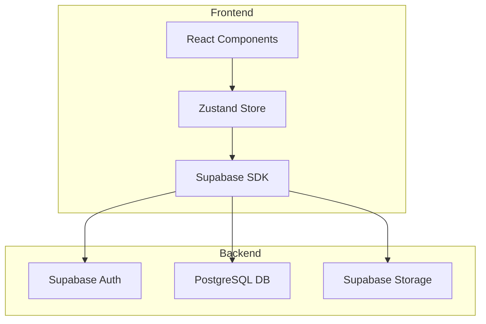
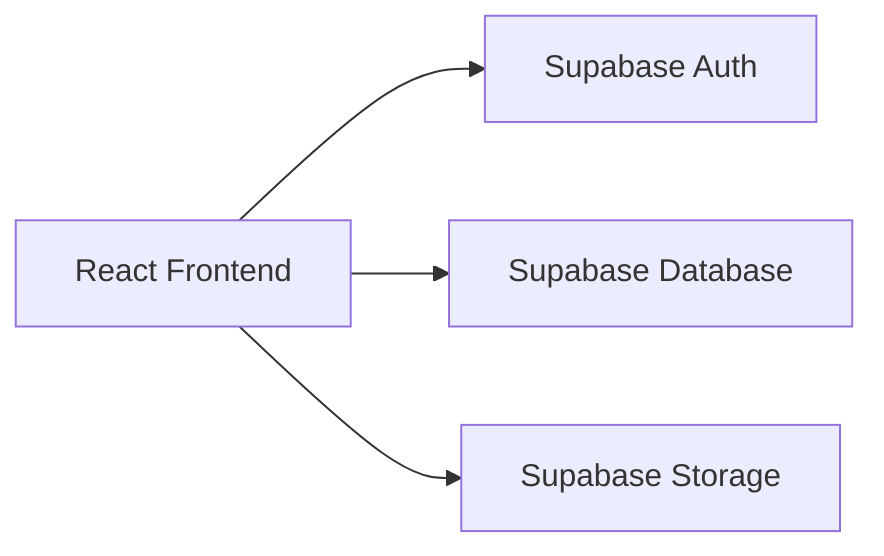

## 1. Architecture Design


## 2. Technology Description
- Frontend: React@18 + TypeScript + tailwindcss@3 + vite
- Initialization Tool: vite-init
- Backend: Supabase (Auth, Database, Storage)
- State Management: Zustand
- Icons: lucide-react
- Charts: chart.js + react-chartjs-2

## 3. Route Definitions
| Route | Purpose |
|-------|---------|
| / | Dashboard首页 |
| /learning | 投资学习模块 |
| /strategy | 策略研究模块 |
| /diary | 投资日记模块 |
| /psychology | 投资心理模块 |
| /growth | 成长追踪模块 |

## 4. API Definitions
使用Supabase客户端SDK进行数据操作，无需额外后端API

## 5. Server Architecture Diagram


## 6. Data Model

### 6.1 Data Model Definition

```mermaid
erDiagram
    USER ||--o{ INVESTMENT_NOTE : writes
    USER ||--o{ BOOK_NOTE : reads
    USER ||--o{ MASTER_RESEARCH : studies
    USER ||--o{ STRATEGY : creates
    USER ||--o{ BACKTEST_RECORD : tests
    USER ||--o{ TRADE_RECORD : makes
    USER ||--o{ POSITION_TRACK : tracks
    USER ||--o{ REVIEW_RECORD : reviews
    USER ||--o{ EMOTION_RECORD : records
    USER ||--o{ BIAS_RECOGNITION : identifies
    USER ||--o{ INVESTMENT_PHILOSOPHY : evolves

    INVESTMENT_NOTE {
        uuid id PK
        uuid user_id FK
        text title
        text content
        varchar(50) category "value/growth/quant"
        timestamp created_at
        timestamp updated_at
    }

    BOOK_NOTE {
        uuid id PK
        uuid user_id FK
        varchar(200) book_title
        text notes
        text quotes
        varchar(50) status "reading/completed"
        timestamp created_at
        timestamp updated_at
    }

    MASTER_RESEARCH {
        uuid id PK
        uuid user_id FK
        varchar(100) master_name
        text analysis
        text strategies
        timestamp created_at
        timestamp updated_at
    }

    STRATEGY {
        uuid id PK
        uuid user_id FK
        text name
        text logic
        text stock_selection
        text timing
        text position_management
        timestamp created_at
        timestamp updated_at
    }

    BACKTEST_RECORD {
        uuid id PK
        uuid user_id FK
        uuid strategy_id FK
        date start_date
        date end_date
        float return_rate
        float max_drawdown
        text notes
        timestamp created_at
    }

    TRADE_RECORD {
        uuid id PK
        uuid user_id FK
        varchar(50) stock_code
        varchar(100) stock_name
        varchar(10) action "buy/sell"
        float price
        int quantity
        text reason
        text logic
        timestamp trade_time
        timestamp created_at
    }

    POSITION_TRACK {
        uuid id PK
        uuid user_id FK
        varchar(50) stock_code
        varchar(100) stock_name
        float current_price
        float valuation
        text notes
        timestamp created_at
        timestamp updated_at
    }

    REVIEW_RECORD {
        uuid id PK
        uuid user_id FK
        varchar(50) stock_code
        varchar(100) stock_name
        boolean success
        text analysis
        text lessons_learned
        timestamp created_at
    }

    EMOTION_RECORD {
        uuid id PK
        uuid user_id FK
        varchar(20) emotion "fear/greed/calm"
        text context
        text impact
        timestamp created_at
    }

    BIAS_RECOGNITION {
        uuid id PK
        uuid user_id FK
        varchar(50) bias_type "confirmation/anchoring/overconfidence"
        text description
        text awareness
        timestamp created_at
    }

    INVESTMENT_PHILOSOPHY {
        uuid id PK
        uuid user_id FK
        text content
        varchar(7) quarter "YYYY-QN"
        timestamp created_at
    }
```


### 6.2 Data Definition Language

```sql
CREATE TABLE investment_notes (
    id UUID PRIMARY KEY DEFAULT uuid_generate_v4(),
    user_id UUID REFERENCES auth.users(id),
    title TEXT NOT NULL,
    content TEXT,
    category VARCHAR(50) CHECK (category IN ('value', 'growth', 'quant')),
    created_at TIMESTAMP DEFAULT CURRENT_TIMESTAMP,
    updated_at TIMESTAMP DEFAULT CURRENT_TIMESTAMP
);

CREATE TABLE book_notes (
    id UUID PRIMARY KEY DEFAULT uuid_generate_v4(),
    user_id UUID REFERENCES auth.users(id),
    book_title VARCHAR(200) NOT NULL,
    notes TEXT,
    quotes TEXT,
    status VARCHAR(50) CHECK (status IN ('reading', 'completed')) DEFAULT 'reading',
    created_at TIMESTAMP DEFAULT CURRENT_TIMESTAMP,
    updated_at TIMESTAMP DEFAULT CURRENT_TIMESTAMP
);

CREATE TABLE master_research (
    id UUID PRIMARY KEY DEFAULT uuid_generate_v4(),
    user_id UUID REFERENCES auth.users(id),
    master_name VARCHAR(100) NOT NULL,
    analysis TEXT,
    strategies TEXT,
    created_at TIMESTAMP DEFAULT CURRENT_TIMESTAMP,
    updated_at TIMESTAMP DEFAULT CURRENT_TIMESTAMP
);

CREATE TABLE strategies (
    id UUID PRIMARY KEY DEFAULT uuid_generate_v4(),
    user_id UUID REFERENCES auth.users(id),
    name TEXT NOT NULL,
    logic TEXT,
    stock_selection TEXT,
    timing TEXT,
    position_management TEXT,
    created_at TIMESTAMP DEFAULT CURRENT_TIMESTAMP,
    updated_at TIMESTAMP DEFAULT CURRENT_TIMESTAMP
);

CREATE TABLE backtest_records (
    id UUID PRIMARY KEY DEFAULT uuid_generate_v4(),
    user_id UUID REFERENCES auth.users(id),
    strategy_id UUID REFERENCES strategies(id),
    start_date DATE NOT NULL,
    end_date DATE NOT NULL,
    return_rate FLOAT,
    max_drawdown FLOAT,
    notes TEXT,
    created_at TIMESTAMP DEFAULT CURRENT_TIMESTAMP
);

CREATE TABLE trade_records (
    id UUID PRIMARY KEY DEFAULT uuid_generate_v4(),
    user_id UUID REFERENCES auth.users(id),
    stock_code VARCHAR(50) NOT NULL,
    stock_name VARCHAR(100),
    action VARCHAR(10) CHECK (action IN ('buy', 'sell')),
    price FLOAT NOT NULL,
    quantity INT NOT NULL,
    reason TEXT,
    logic TEXT,
    trade_time TIMESTAMP NOT NULL,
    created_at TIMESTAMP DEFAULT CURRENT_TIMESTAMP
);

CREATE TABLE position_tracks (
    id UUID PRIMARY KEY DEFAULT uuid_generate_v4(),
    user_id UUID REFERENCES auth.users(id),
    stock_code VARCHAR(50) NOT NULL,
    stock_name VARCHAR(100),
    current_price FLOAT,
    valuation FLOAT,
    notes TEXT,
    created_at TIMESTAMP DEFAULT CURRENT_TIMESTAMP,
    updated_at TIMESTAMP DEFAULT CURRENT_TIMESTAMP
);

CREATE TABLE review_records (
    id UUID PRIMARY KEY DEFAULT uuid_generate_v4(),
    user_id UUID REFERENCES auth.users(id),
    stock_code VARCHAR(50),
    stock_name VARCHAR(100),
    success BOOLEAN,
    analysis TEXT,
    lessons_learned TEXT,
    created_at TIMESTAMP DEFAULT CURRENT_TIMESTAMP
);

CREATE TABLE emotion_records (
    id UUID PRIMARY KEY DEFAULT uuid_generate_v4(),
    user_id UUID REFERENCES auth.users(id),
    emotion VARCHAR(20) CHECK (emotion IN ('fear', 'greed', 'calm')),
    context TEXT,
    impact TEXT,
    created_at TIMESTAMP DEFAULT CURRENT_TIMESTAMP
);

CREATE TABLE bias_recognitions (
    id UUID PRIMARY KEY DEFAULT uuid_generate_v4(),
    user_id UUID REFERENCES auth.users(id),
    bias_type VARCHAR(50) CHECK (bias_type IN ('confirmation', 'anchoring', 'overconfidence', 'loss_aversion', 'herding')),
    description TEXT,
    awareness TEXT,
    created_at TIMESTAMP DEFAULT CURRENT_TIMESTAMP
);

CREATE TABLE investment_philosophy (
    id UUID PRIMARY KEY DEFAULT uuid_generate_v4(),
    user_id UUID REFERENCES auth.users(id),
    content TEXT NOT NULL,
    quarter VARCHAR(7) NOT NULL,
    created_at TIMESTAMP DEFAULT CURRENT_TIMESTAMP
);

-- RLS Policies
ALTER TABLE investment_notes ENABLE ROW LEVEL SECURITY;
ALTER TABLE book_notes ENABLE ROW LEVEL SECURITY;
ALTER TABLE master_research ENABLE ROW LEVEL SECURITY;
ALTER TABLE strategies ENABLE ROW LEVEL SECURITY;
ALTER TABLE backtest_records ENABLE ROW LEVEL SECURITY;
ALTER TABLE trade_records ENABLE ROW LEVEL SECURITY;
ALTER TABLE position_tracks ENABLE ROW LEVEL SECURITY;
ALTER TABLE review_records ENABLE ROW LEVEL SECURITY;
ALTER TABLE emotion_records ENABLE ROW LEVEL SECURITY;
ALTER TABLE bias_recognitions ENABLE ROW LEVEL SECURITY;
ALTER TABLE investment_philosophy ENABLE ROW LEVEL SECURITY;

CREATE POLICY "Users can view their own notes" ON investment_notes FOR SELECT USING (auth.uid() = user_id);
CREATE POLICY "Users can insert their own notes" ON investment_notes FOR INSERT WITH CHECK (auth.uid() = user_id);
CREATE POLICY "Users can update their own notes" ON investment_notes FOR UPDATE USING (auth.uid() = user_id);
CREATE POLICY "Users can delete their own notes" ON investment_notes FOR DELETE USING (auth.uid() = user_id);

CREATE POLICY "Users can view their own book notes" ON book_notes FOR SELECT USING (auth.uid() = user_id);
CREATE POLICY "Users can insert their own book notes" ON book_notes FOR INSERT WITH CHECK (auth.uid() = user_id);
CREATE POLICY "Users can update their own book notes" ON book_notes FOR UPDATE USING (auth.uid() = user_id);
CREATE POLICY "Users can delete their own book notes" ON book_notes FOR DELETE USING (auth.uid() = user_id);

CREATE POLICY "Users can view their own master research" ON master_research FOR SELECT USING (auth.uid() = user_id);
CREATE POLICY "Users can insert their own master research" ON master_research FOR INSERT WITH CHECK (auth.uid() = user_id);
CREATE POLICY "Users can update their own master research" ON master_research FOR UPDATE USING (auth.uid() = user_id);
CREATE POLICY "Users can delete their own master research" ON master_research FOR DELETE USING (auth.uid() = user_id);

CREATE POLICY "Users can view their own strategies" ON strategies FOR SELECT USING (auth.uid() = user_id);
CREATE POLICY "Users can insert their own strategies" ON strategies FOR INSERT WITH CHECK (auth.uid() = user_id);
CREATE POLICY "Users can update their own strategies" ON strategies FOR UPDATE USING (auth.uid() = user_id);
CREATE POLICY "Users can delete their own strategies" ON strategies FOR DELETE USING (auth.uid() = user_id);

CREATE POLICY "Users can view their own backtest records" ON backtest_records FOR SELECT USING (auth.uid() = user_id);
CREATE POLICY "Users can insert their own backtest records" ON backtest_records FOR INSERT WITH CHECK (auth.uid() = user_id);
CREATE POLICY "Users can update their own backtest records" ON backtest_records FOR UPDATE USING (auth.uid() = user_id);
CREATE POLICY "Users can delete their own backtest records" ON backtest_records FOR DELETE USING (auth.uid() = user_id);

CREATE POLICY "Users can view their own trade records" ON trade_records FOR SELECT USING (auth.uid() = user_id);
CREATE POLICY "Users can insert their own trade records" ON trade_records FOR INSERT WITH CHECK (auth.uid() = user_id);
CREATE POLICY "Users can update their own trade records" ON trade_records FOR UPDATE USING (auth.uid() = user_id);
CREATE POLICY "Users can delete their own trade records" ON trade_records FOR DELETE USING (auth.uid() = user_id);

CREATE POLICY "Users can view their own position tracks" ON position_tracks FOR SELECT USING (auth.uid() = user_id);
CREATE POLICY "Users can insert their own position tracks" ON position_tracks FOR INSERT WITH CHECK (auth.uid() = user_id);
CREATE POLICY "Users can update their own position tracks" ON position_tracks FOR UPDATE USING (auth.uid() = user_id);
CREATE POLICY "Users can delete their own position tracks" ON position_tracks FOR DELETE USING (auth.uid() = user_id);

CREATE POLICY "Users can view their own review records" ON review_records FOR SELECT USING (auth.uid() = user_id);
CREATE POLICY "Users can insert their own review records" ON review_records FOR INSERT WITH CHECK (auth.uid() = user_id);
CREATE POLICY "Users can update their own review records" ON review_records FOR UPDATE USING (auth.uid() = user_id);
CREATE POLICY "Users can delete their own review records" ON review_records FOR DELETE USING (auth.uid() = user_id);

CREATE POLICY "Users can view their own emotion records" ON emotion_records FOR SELECT USING (auth.uid() = user_id);
CREATE POLICY "Users can insert their own emotion records" ON emotion_records FOR INSERT WITH CHECK (auth.uid() = user_id);
CREATE POLICY "Users can update their own emotion records" ON emotion_records FOR UPDATE USING (auth.uid() = user_id);
CREATE POLICY "Users can delete their own emotion records" ON emotion_records FOR DELETE USING (auth.uid() = user_id);

CREATE POLICY "Users can view their own bias recognitions" ON bias_recognitions FOR SELECT USING (auth.uid() = user_id);
CREATE POLICY "Users can insert their own bias recognitions" ON bias_recognitions FOR INSERT WITH CHECK (auth.uid() = user_id);
CREATE POLICY "Users can update their own bias recognitions" ON bias_recognitions FOR UPDATE USING (auth.uid() = user_id);
CREATE POLICY "Users can delete their own bias recognitions" ON bias_recognitions FOR DELETE USING (auth.uid() = user_id);

CREATE POLICY "Users can view their own investment philosophy" ON investment_philosophy FOR SELECT USING (auth.uid() = user_id);
CREATE POLICY "Users can insert their own investment philosophy" ON investment_philosophy FOR INSERT WITH CHECK (auth.uid() = user_id);
CREATE POLICY "Users can update their own investment philosophy" ON investment_philosophy FOR UPDATE USING (auth.uid() = user_id);
CREATE POLICY "Users can delete their own investment philosophy" ON investment_philosophy FOR DELETE USING (auth.uid() = user_id);
```