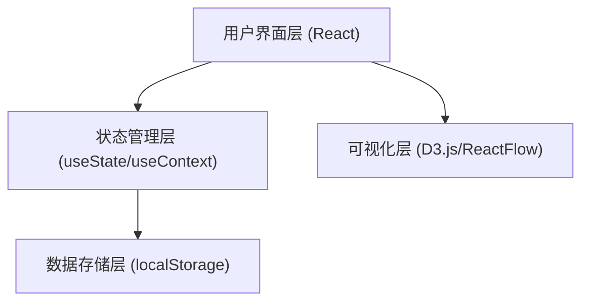
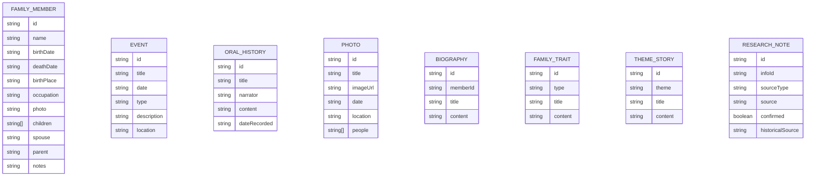

## 1. 架构设计


## 2. 技术描述
- 前端: React@18 + TypeScript + Tailwind CSS@3 + Vite
- 初始化工具: create-vite@latest
- 可视化库: D3.js/ReactFlow (力导向图)、react-d3-tree (树形图)
- UI 组件库: Headless UI + Heroicons
- 数据存储: localStorage (本地持久化)
- 后端: 无 (纯前端应用)
- 数据库: 无 (Mock 数据 + localStorage)

## 3. 路由定义
| 路由 | 用途 |
|------|------|
| / | 首页，功能导航和数据概览 |
| /family-tree | 家谱管理页面 |
| /history | 历史记录页面 |
| /stories | 故事整理页面 |
| /research | 数据考证页面 |
| /share | 分享页面 |

## 4. 数据模型
### 4.1 数据模型定义


### 4.2 数据定义语言
```typescript
interface FamilyMember {
  id: string;
  name: string;
  birthDate?: string;
  deathDate?: string;
  birthPlace?: string;
  occupation?: string;
  photo?: string;
  children: string[];
  spouse?: string;
  parent?: string;
  notes?: string;
}

interface Event {
  id: string;
  title: string;
  date: string;
  type: 'migration' | 'historical' | 'achievement' | 'tragedy';
  description: string;
  location?: string;
}

interface OralHistory {
  id: string;
  title: string;
  narrator: string;
  content: string;
  dateRecorded?: string;
}

interface Photo {
  id: string;
  title: string;
  imageUrl: string;
  date?: string;
  location?: string;
  people: string[];
}

interface Biography {
  id: string;
  memberId: string;
  title: string;
  content: string;
}

interface FamilyTrait {
  id: string;
  type: 'motto' | 'value' | 'custom';
  title: string;
  content: string;
}

interface ThemeStory {
  id: string;
  theme: 'struggle' | 'migration' | 'war';
  title: string;
  content: string;
}

interface ResearchNote {
  id: string;
  infoId: string;
  sourceType: 'elder' | 'document';
  source: string;
  confirmed: boolean;
  historicalSource?: string;
}
```
