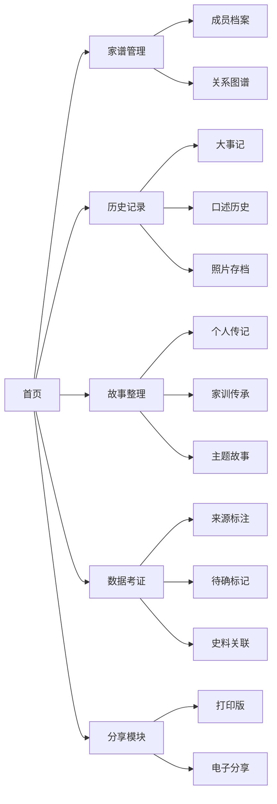

## 1. 产品概述
在线家谱和家族历史管理工具，帮助用户整理、记录和分享家族信息、传承家族精神。
- 主要功能包括：家谱管理、历史记录、故事整理、数据考证、分享五大核心模块
- 目标用户为希望记录家族历史的普通家庭用户

## 2. 核心功能

### 2.1 用户角色
| 角色 | 注册方式 | 核心权限 |
|------|----------|----------|
| 普通用户 | 本地存储使用 | 所有功能完整使用 |

### 2.2 功能模块
1. **首页**：导航、功能入口、数据概览
2. **家谱管理**：成员档案、关系图谱、亲属关系标注
3. **历史记录**：事件时间线、口述历史、照片存档
4. **故事整理**：个人传记、家训传承、主题故事
5. **数据考证**：来源标注、待确标记、史料关联
6. **分享**：打印版生成、电子分享链接

### 2.3 页面详情
| 页面名称 | 模块名称 | 功能描述 |
|----------|----------|----------|
| 首页 | 功能导航 | 展示各模块入口、数据统计卡片、快速操作按钮 |
| 家谱管理 | 成员档案管理 | 添加/编辑/删除成员信息（姓名、生卒年月、出生地、职业、照片） |
| 家谱管理 | 关系图谱展示 | 力导向图和传统树形图两种模式切换 |
| 家谱管理 | 亲属关系标注 | 显示直系/旁系亲属关系说明 |
| 历史记录 | 大事记时间线 | 按时间展示迁徙、历史事件、成就、变故 |
| 历史记录 | 口述历史 | 文字转写老人讲述的家族故事 |
| 历史记录 | 照片存档 | 老照片上传、时间地点标注 |
| 故事整理 | 个人传记 | 书写每位成员的生平故事 |
| 故事整理 | 家训传承 | 记录家训、价值观、传统习俗 |
| 故事整理 | 主题故事 | 按奋斗/迁徙/战争年代等主题归类整理故事 |
| 数据考证 | 信息来源标注 | 标注每条信息的来源（老人讲述/文件） |
| 数据考证 | 待确标记 | 存疑信息单独标注待核实 |
| 数据考证 | 史料关联 | 与地方志、史料的关联记录 |
| 分享 | 打印版生成 | 传统竖版家谱格式输出 |
| 分享 | 电子分享 | 生成分享链接/导出功能 |

## 3. 核心流程
用户启动应用后，可在家谱管理中添加成员，构建关系图谱，在历史记录中添加大事记、口述历史、照片存档，在故事整理中书写传记、记录家训，在数据考证中标注来源，最后通过分享模块打印或分享家谱。

## 4. 用户界面设计
### 4.1 设计风格
- 主色调：深棕色 (#5D4037、暖褐色 #8D6E63
- 辅助色：米色 #F5F1EB、金色 #D4AF37
- 按钮风格：圆角矩形，轻微阴影，木纹质感
- 字体：思源宋体（标题）、思源黑体（正文）
- 布局风格：卡片式布局，顶部导航栏
- 图标风格：简约中式传统元素结合现代设计

### 4.2 页面设计概述
| 页面名称 | 模块名称 | UI 元素 |
|----------|----------|---------|
| 首页 | 功能导航 | 温暖木质纹理背景、暖色调卡片、渐显动画 |
| 家谱管理 | 关系图谱 | 力导向图交互节点、传统树形图层级展示 |
| 历史记录 | 时间线 | 垂直时间线、事件卡片 |
| 故事整理 | 内容展示 | 卡片网格、流畅过渡动画 |

### 4.3 响应式设计
- 桌面端优先设计，支持移动端适配
- 触控交互优化

